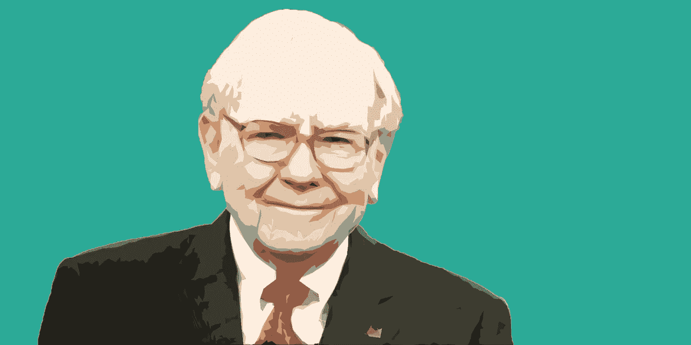

# 巴菲特下注和直接指数

> 原文：<https://medium.datadriveninvestor.com/the-buffett-bet-and-direct-indexes-79b1185b6f41?source=collection_archive---------30----------------------->

杰拉德·迈克尔

*巴菲特本可以做得更好。*

这篇[帖子](https://www.smartleaf.com/our-thinking/smartleaf-blog/the-buffet-bet-and-direct-indexes)最初发表在 [Smartleaf](https://www.smartleaf.com) 上。

10 年前，沃伦·巴菲特(Warren Buffett)打赌 50 万美元，一只指数基金将在 10 年内跑赢一篮子对冲基金。巴菲特赢得了他的赌注，他指定的慈善机构奥马哈女孩公司***【2】***因此多了 220 万美元。这是指数基金力量的一次令人印象深刻的展示，尽管是轶事。

然而，尽管指数基金很好，但它们不如直接指数(见[直接指数优于 ETF](https://www.smartleaf.com/our-thinking/smartleaf-blog/direct-indexes-are-better-than-etfs))。

直接指数是跟踪一个指数的一篮子股票。如果税收管理得当，在预期的税后基础上，直接指数优于指数基金。这不会帮助奥马哈女孩公司，因为他们是一个免税的慈善机构。但这意味着应税投资者本可以比沃伦巴菲特做得更好。这一点值得强调。该行业正确地注意到指数基金的表现优于对冲基金——但直接指数表现更好(税后*)。*

好多少？正如我们在上一篇文章中所写的，在对 ETF 与直接指数实施的行业轮换策略进行的五年回溯测试中，直接指数每年产生 1.93%的税收 alpha。在将 18，000 个传统股票投资组合转换为 ETF 与转换为直接指数的测试中，转换为直接指数以减税的形式为投资者节省了平均 6.92%的投资组合价值***【3】***。

我们不会在这里多说为什么直接指数比 ETF 更好的话题(但如果你有兴趣了解更多，请阅读我们的[以前的帖子](https://www.smartleaf.com/our-thinking/smartleaf-blog/direct-indexes-are-better-than-etfs))。相反，我们将让沃伦·巴菲特发言。他在去年的伯克希尔·哈撒韦公司年报***【4】***中描述了这场赌注的历史。

上面写着:

*“我公开提出赌 50 万美元，没有一个专业投资者能够选择一组至少五只对冲基金——广受欢迎和高收费的投资工具——在很长一段时间内，它们的表现能与一只收取象征性费用的不受管理的标准普尔 500 指数基金相媲美。我建议押注 10 年，并指定一只低成本的 Vanguard S & P 基金作为我的竞争者。然后，我坐下来，满怀期待地等待一群基金经理——他们可以把自己的基金列为五大基金之一——站出来捍卫自己的职业。毕竟，这些经理鼓励其他人在他们的能力上下数十亿的赌注。他们为什么要害怕把自己的一点钱投入风险呢？*

*随之而来的是寂静之声。尽管有成千上万的职业投资经理通过吹嘘他们的选股能力积累了惊人的财富，但只有一个人——特德·塞德斯——站出来接受我的挑战。”*

在上周发布的伯克希尔·哈撒韦公司股东信 ***(5)*** 中，巴菲特这样评价这场赌注:

*我下注有两个原因:(1)将我的 318，250 美元支出变成一笔不成比例的更大金额——如果事情如我所料——将于 2018 年初分配给奥马哈女孩公司(Girls Inc );(2)宣传我的信念，即随着时间的推移，我的选择——对不受管理的标准普尔 500 指数基金的几乎无成本的投资——将比大多数投资专业人士取得的结果更好，无论这些“帮助者”可能受到良好的尊重和激励。*

解决这个问题非常重要。美国投资者每年向顾问支付惊人的费用，通常会产生几层间接成本。总的来说，这些投资者的钱花得值吗？事实上，总的来说，投资者的支出有所回报吗？

我的赌注对手 Protégé Partners 挑选了 5 只“基金中的基金”,它们的表现有望超过标准普尔 500 指数(S &。这不是一个小样本。这五只基金中的基金反过来拥有 200 多只对冲基金的权益。

基本上，一家熟悉华尔街的咨询公司 Protégé挑选了五名投资专家，这些专家又雇佣了数百名其他投资专家，每人管理着自己的对冲基金。这是一个精英团队，充满智慧、激情和自信。

*这五只基金中的基金的经理们拥有更大的优势:他们能够——也确实这样做了——在十年间重新安排他们的对冲基金投资组合，用新的“明星”投资，同时退出他们在对冲基金中的头寸，这些对冲基金的经理们已经失去了他们的影响力。*

被保护者一方的每一个参与者都受到了高度激励:他们选择的基金经理和对冲基金经理都分享了可观的收益，甚至是那些仅仅因为市场普遍上涨而获得的收益。(在我们接管伯克希尔以来的 43 个十年期里，标准普尔 500 指数上涨的年份 100%都超过了下跌的年份。)

恭喜沃伦·巴菲特。恭喜奥马哈女孩公司。

相关:[自助餐投注和直接指数](https://www.smartleaf.com/our-thinking/smartleaf-blog/the-buffet-bet-and-direct-indexes)、[直接指数优于 ETF](https://www.smartleaf.com/our-thinking/smartleaf-blog/direct-indexes-are-better-than-etfs)

***(1)*** 我们写了巴菲特去年对 100 万美元指数基金和对冲基金的押注([巴菲特押注和被动投资的兴起](https://www.smartleaf.com/our-thinking/smartleaf-blog/the-buffett-bet))。

***(2)***[https://girlsincomaha.org/](https://girlsincomaha.org/)

***(3)*** 税收 alpha 是税后收益的差额减去税前收益的差额；你减去税前收益来分离税收管理的贡献。这里，税后回报的差异为每年 1.98%，税前回报的差异为每年 0.06%。税收阿尔法是差额，等于每年 1.93%(计算中涉及一些四舍五入)。

***(4)***[http://www.berkshirehathaway.com/letters/2016ltr.pdf](http://www.berkshirehathaway.com/letters/2016ltr.pdf)

***(5)***[http://www.berkshirehathaway.com/letters/2017ltr.pdf](http://www.berkshirehathaway.com/letters/2017ltr.pdf)