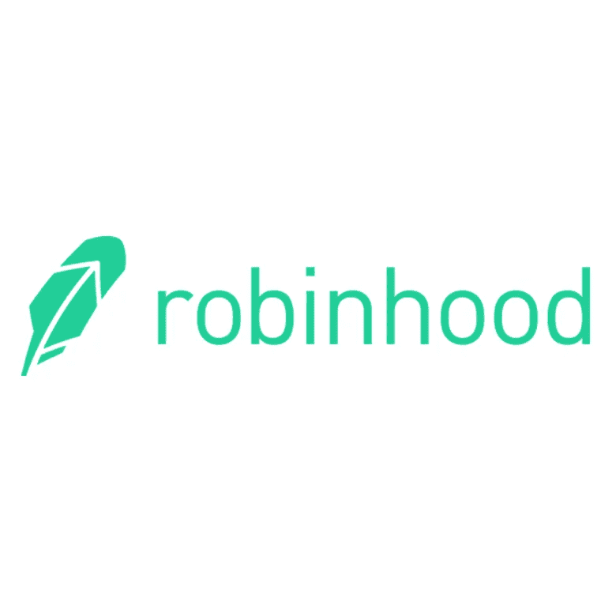

# 针对罗宾汉的案子

> 原文：<https://medium.datadriveninvestor.com/the-case-against-robinhood-2a645eceba71?source=collection_archive---------0----------------------->

## 为什么年轻人应该放慢在应用上投资的速度

在过去几年里，我越来越多的大学同龄人通过移动经纪应用 Robinhood 进行投资。虽然这款应用为新投资者提供了一个坚实的用户界面，但我的同行和媒体一直在回避它的几个问题，我想解决这些问题。

Robinhood 之所以出名，首先是因为它提供免佣金交易。虽然像富达(Fidelity)和先锋(Vanguard)这样的在线经纪商可能会收取你 4-7 美元来购买一只股票，但 Robinhood 让你免费购买。这可能对绿色投资者很有吸引力；然而，它只不过是捕鼠器上的奶酪。更重要的是，罗宾汉不支持任何税收优惠的退休储蓄账户，比如罗斯个人退休账户。对于第一次存钱的人来说，使用这些账户是必须的。让我们看看罗斯的例子。假设你是一个收入低于 120，000 美元的单身年轻人，你可以每年在你的个人退休帐户中存入 5，500 美元，如果你在 59.5 岁时提取这些钱，你的任何收入都是免税的。和你的 401(k)一起，这应该是你财务独立储蓄的基础。然而，与 401(k)不同的是，在 401(k)中，你的投资策略是预先确定的，而在 IRA 中，你有完全的自主权来设计账户——就像你在 Robinhood 中对个人账户的控制一样。

总之，这意味着在你一年的个人退休账户(或者 401(k)账户，如果你是全职工作的话)达到最大额度之前，通过罗宾汉进行投资没有任何好处。虽然你可能会节省 5 美元的交易费，A)这与你从个人退休帐户中获得的税收节省相比微不足道，B)任何主要的在线经纪公司也提供一些优秀的无交易费的非托管 ETF。这里量化一下逻辑，假设你去年的今天(6/10/17)在 Robinhood 上买了 100 股 Twitter。它花了你 1700 美元，今天值 4100 美元。与此同时，让我们假设你在富达网上开了一个罗斯账户，做了同样的事情，只是你要支付 5 美元的手续费。现在你仍然有相当接近 4100 美元，除了 2400 美元的收入在你拿出来的时候不会被征税(我们在这里玩的是长线，在超过 59.5 之前不会触及它)。

这是不是过于简单化了？当然；然而，基本观点是成立的。如果你非常频繁地交易，并且你认为那些交易费用会增加，解决的一个方法是停止高频率的交易，因为你不会赢。说到为财务独立而储蓄，罗斯个人退休帐户是我们许多人的第一步。在你最大化这个之前，不要在罗宾汉身上浪费时间。当然不要碰他们最近推出的期权交易功能，也不要用保证金购买(他们推销这些功能的那张脸应该会提醒你不要把钱放在那里)。

我能想到的只有少数例外。首先，我有同事说个人退休帐户对他们来说是一个糟糕的选择，因为他们在短期内需要钱来偿还贷款或资助他们的生活。至于贷款，即使在你完成学位期间延期还款，在这么短的时间内投资也是有风险的。这一切都归结于你所对抗的利息，如果高于 5%，你可能是在玩火。此外，你可以从个人退休帐户中扣除你的缴款，而不会被罚款——只是利息不行。因此，重要的是要记住，在你 50 岁之前，你不会把钱完全锁起来。除此之外，市场在短期内总是不可预测的，我一直对那些选择用学生贷款来赌罗宾汉的人持怀疑态度。在我遇到的许多案例中，从个人退休账户开始，而不是罗宾汉的日内交易氛围，似乎是一条可行之路。