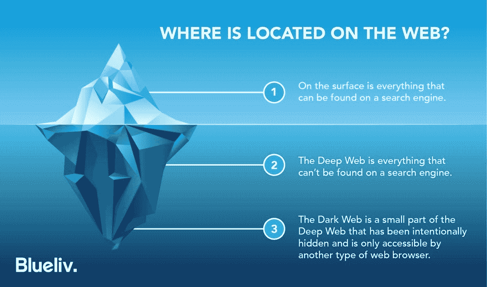
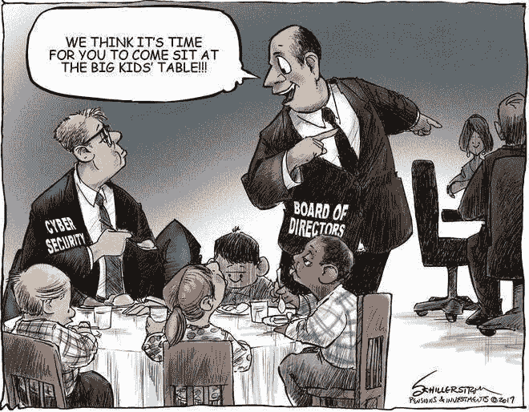

# CRO-CISO 华尔兹

> 原文：<https://medium.datadriveninvestor.com/the-cro-ciso-waltz-145b108325b7?source=collection_archive---------13----------------------->

# 金融机构网络安全与操作风险管理的对接

日益复杂的监管环境，以及主要由新兴金融科技行业推动的持续技术进步，改变了金融欺诈的本质，并催生了一种比过去几十年技术更先进的新型对手。在过去的二十年里，首席风险官(CRO)和首席信息安全官(CISO)在不同的战线上与不同的敌人作战。然而，在网络犯罪时代，敌对动机的变化虽然仍然隐藏着同样的失范，但已经从过去二十年的网站破坏演变为价值 1.5 万亿美元的全球影子经济，相当于俄罗斯的国内生产总值，数据作为新商品进行交易，现在比石油更有价值。如果网络犯罪是一个国家，它将拥有世界上第 13 高的 GDP。

这种在两个孤岛之间实现统一的要求将金融机构(FIs)中企业通道的两个不同方面(运营风险管理和网络安全)结合在一起。在过去几年中，第一批研究开始浮出水面，这些研究将网络犯罪的全球视角从熵占主导地位的市场，转变为由资金充足的全球经济中的收入流和利润分配推动的组织良好的自治负熵系统。

首席风险官(CRO)的职责是根据确定的适用法律法规、欺诈计划和反洗钱(AML)问题维护风险登记册。她的工作是通过识别关键风险和评估缓解控制措施来确定组织的风险状况，从而协助执行公司合规、欺诈和银行保密法(BSA)风险评估。最终，她在组织中的角色是跟踪内部审计或控制评估确定的控制弱点的补救进度；监控公司的风险状况，开发和监控关键风险指标；识别新出现的风险；协调和分析风险信息的收集；并制定和维护政策和程序。

CRO 负责运营风险管理总体情况的宏观视图，而 CISO 负责其 IT 领域内的风险管理。管理公司内部 IT 和云基础架构中的漏洞，与 CRO 非常相似，具有 IT 风险评估、内部和外部审计、合规性以及技术和管理控制评估和监控的权限。虽然这可能是一个困境，但要明白，虽然这些听起来相似，但它们是不同的。事实上，这两个角色在历史上都是向高管层的不同个人汇报的。

从历史上看，CISO 向首席信息官(CIO)报告，因为历史上认为这是一个侧重于技术的角色。在我看来，一些组织错误地将 CISO 报告提交给了首席技术官(CTO)，我希望这种做法很快会消失。然而，随着 CISO 的立场发生了变化，公众舆论法庭也参与进来，认为网络安全不再被视为一个技术问题，更多的组织正在将 CISO 的报告结构转移到首席风险官，将世界对 CISO 网络安全的看法转变为基于风险的视角，而不是纯粹的技术视角。

因为网络安全是一个人的问题，这要求 CISO 与其他高管坐在同一张餐桌上，并在董事会中占有一席之地。Brian Krebs 在最近的一篇文章中引用了我关于这个问题的观点。

这并不是说这没有改善。2016 年， [Bay Dynamics 的一份报告](https://www.securityweek.com/cisos-risk-getting-fired-over-poor-reporting-survey)显示，74%的董事会成员表示，他们每周都会面临公司的网络风险。在接受调查的人中，26%的受访者表示，网络风险是他们董事会最优先考虑的问题，金融、监管和竞争风险紧随其后，比例为 16%-22%。

从历史上看，欺诈和网络安全方面的对手在所使用的战术、技术和程序(TTP)上有所不同，现在开始汇聚成一个对手。正因为如此，主要由金融科技推动的欺诈部门和网络安全部门之间的界限变得越来越模糊，安全控制也越来越模糊。

二十年前，黑客攻击目标的目的是破坏网站。今天，它是盈利支付卡或 PII 数据泄露，赎金，或民族国家的战争。这为向金融机构提供一系列反欺诈解决方案的供应商创造了越来越多的受众，这些解决方案需要 CISO 和 CRO 的受众。

2017 年，Ponemon 研究所发布了一项关于 2017 年数据泄露成本的研究，估计数据泄露的全球平均成本现在超过 362 万美元。网络攻击、金融犯罪和欺诈正变得越来越有针对性、越来越复杂、越来越持久——并且相互交织。虽然技术在风险管理、网络安全和欺诈防范方面取得了进步，但 IBM 商业价值研究所(IBV)最近的一份报告显示，42%的银行高管认为他们的欺诈操作急需彻底改革。

事实是，公司需要制定一个联合 ORM 战略，将欺诈和网络安全结合起来，以应对来自在线犯罪分子、黑客活动分子或寻求破坏支付和金融系统稳定的国家的共同威胁，特别是那些针对位于我国金融系统顶端的大规模金融机构的威胁。然而今天，金融机构正在努力将围绕技术控制的网络安全技术方面与 CRO 负责的人员和流程风险联系起来。

[巴塞尔运营风险委员会(Basel Committee on operational risk)](https://www.forbes.com/sites/steveculp/2017/04/26/banks-face-challenge-of-integrating-cyber-and-operational-risk/#54487c3f4309)2014 年的一份报告将网络攻击作为一种情景，阐述了网络安全漏洞可能导致的运营风险的性质，从连续性到信用甚至市场风险。

运营风险管理(ORM)的发展包括网络安全威胁，这是由三个主要趋势推动的:网络攻击的数量和复杂性增加，现在对金融机构的利润、声誉损害和监管罚款构成威胁；董事会和高级管理层意识到网络安全不是一个技术问题，而是包括金融机构内人员和流程的更广泛背景；低成本收入比迫使银行整合各自为政的风险管理职能。

这种扩展 ORM 的“新常态”将网络安全、欺诈和反洗钱原则结合在一起，在针对银行的 [Dyre Wolf 恶意软件攻击](https://securityintelligence.com/dyre-wolf/)中表现得尤为明显，这种融合早就应该实现，证明网络钓鱼、恶意软件、欺诈、洗钱和业务中断现在都共存，因此需要在网络安全和 ORM 战略之间进行类似的协调。

总之，组织中这两个独立职能的协调日益成为金融机构生存的当务之急，以确保双方都了解自己的具体职责以及如何在企业风险管理战略的大背景下协调一致。将这些点连接起来并调整战略是关键，并从 FI 开始，将这两个历史上孤立的职能部门连接起来，并将其置于正式的标准框架下，如 ISO 或 NIST，以确保 ciso 和 cro 在运营风险管理的同一保护伞下共存。

像往常一样，如果你喜欢这篇文章，请点击“喜欢”来支持我，并与你自己的 feed 分享！这是你支持我和我继续研究的最好方式。如果任何人对这篇文章有任何补充或评论，请在评论区与下面的每个人分享！在 www.alissaknight.com、 [LinkedIn](http://www.linkedn.com/in/alissaknight) 的我的主页上了解更多关于我的信息，在我的 [YouTube 频道](http://www.youtube.com/c/alissaknight)上观看我的视频博客，听我每周的[播客片段](http://alissaknight.libysyn.com/)，或者在 Twitter [@alissaknight 上关注我。](http://www.twitter.com/@alissaknight)

我是 [Aite Group](http://www.aitegroup.com/) 的高级分析师，通过评估行业趋势、创建细分分类、确定市场规模、准备预测和开发行业模型，对影响金融服务、医疗保健和金融科技行业的网络安全问题进行重点研究。我通过公正、客观和准确的研究和内容开发，为这些行业提供网络安全市场的联合和定制市场研究、竞争情报和咨询服务。根据我对当今影响这些行业的当代网络安全问题的研究，我撰写研究报告和白皮书，并提供咨询服务，包括询问、简报、咨询项目、研究结果演示以及预约演讲，我经常在每年的网络安全会议、研讨会和圆桌会议上发表主题演讲。