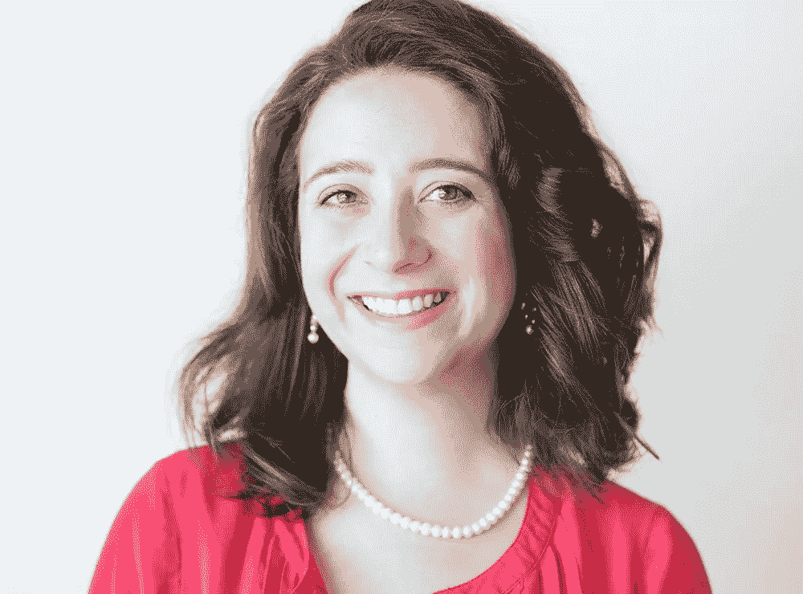

# 一个有头脑的 CEO 的日常日程安排

> 原文：<https://medium.datadriveninvestor.com/the-daily-schedule-of-a-mindful-ceo-cd5e54551cf9?source=collection_archive---------4----------------------->

## 与科莱特·纳塔夫共度的一天

Colette Nataf, CEO of Lightning AI

你可能已经读过无数的文章，强调了一个大的创业公司首席执行官的典型时间表。受欢迎的创始人，如马克·扎克伯格、马克·库班和杰夫·贝索斯，经常因为他们令人厌倦的日程安排而出现在新闻中。诸如“杰夫·贝索斯每天几点醒来”或“马克·库班一晚上睡几个小时”等吸引人的标题吸引着我们，让我们的大脑重新思考我们的工作和生活方式。

我们也应该在凌晨 4 点醒来吗？如果你每天不工作 16 个小时，你能成功吗？你开始怀疑自己是否做错了。我们经常将自己的工作生活与现状社会 CEO 的方式相提并论。

 [## 艾预测:“颠覆，然后是生产力”|数据驱动的投资者

### 人们越来越担心，随着机器学习和互联网的普及，所有白领工作都将消失

www.datadriveninvestor.com](https://www.datadriveninvestor.com/2018/08/06/ai-forecast-disruption-then-productivity/) 

是时候改变我们的思维模式，并意识到我们不必跟随他们的领导才能成功。

# “典型的”CEO 日程安排和比较

你会读到典型的 CEO 在凌晨 4:00 到 5:00 之间醒来，他们的一天看起来是这样的:

**凌晨 4:00-5:00:**冥想/查看邮件

**早上 5:00-6:00:**健身/锻炼

**早上 6:00-7:00:**淋浴/开车去办公室

**早上 7:00-8:00:**在办公室整装待发

**早上 8:00-晚上 7:00:**磨磨磨——会议、工作、客户项目等

有些人甚至比这工作得更久更辛苦。大 CEO 的报告有些工作日晚上在办公室呆到晚上 10 点。要记住的是:对一个人有用的东西，并不总是对另一个人有用。因此，尽管这个时间表可能有利于马克·库班的生活，但对大多数人来说可能行不通。

努力是伟大的，但什么时候它变得太多了？我们什么时候开始意识到我们的时间没有得到尽可能有效的利用？倦怠是真实的，你需要努力避免它。在过去的十年里，我们在美国推广了一种不健康和不可持续的工作文化，大 CEO 们对此有很大的关系。所以向你致敬，杰夫·贝索斯，但是 16 小时工作制并不总是必要的或者有保证的。

问问你自己:你是在高效工作还是只是超级忙？

生产力>忙碌。

# 一位“有头脑”的首席执行官的日程表

三年多前，我创立了闪电 AI。尽管我最初陷入了这样的思维陷阱:为了有效率，我必须一周 7 天 24 小时都忙碌，但谢天谢地，我很快就摆脱了那种[心态。我现在很注意我的日程安排，知道为了带领我的公司走向](https://hackernoon.com/the-happy-ending-to-my-burnout-story-4a3db52542dc)[的成功](https://blog.lightningai.com/why-im-going-down-market-and-building-a-self-serve-app-da4c64febb5f)，我需要做些什么。

**现在我的时间表看起来有点像这样:**

随时醒来——老实说，我没有设闹钟，我会在早上 8:00 到 9:00 之间自然醒来。

上午 9:00:检查电子邮件，回复任何超级紧急的事情

上午 9:30:带我的狗去散步

上午 10:00:正式开始工作日🎉

上午 10:00-下午 1:00:每日站立+2-3 小时的会议

下午 1:00-2:00:午休！哇哦👏

我会一直保持一个优先任务列表。对于任何需要完成的事情，我都会添加到这个列表中并区分优先次序。就我个人而言，我喜欢在午饭后的下午做技术工作，所以这些通常是安静的，有计划的时间段。我关掉 slack，关闭我的电子邮件来保持专注。找到适合你的方法并坚持下去。

下午 2:00-3:00:处理运行列表中最优先的任务

下午 3:00:休息时间！我要么去散步，看电视，要么做一些与减压有关的非工作。

下午 3:30-5:00:我通过检查邮件和回复信息来结束一天的工作。我通常在下午 4 点或 5 点结束我的工作日。这可能“仅仅”是一个六到八小时的工作日，但是在一天结束的时候，我觉得自己既有效率又能在一天的剩余时间里正常工作…也就是和家人共度美好时光！

这并不都是阳光和玫瑰——作为一名首席执行官，我经常会有一些项目需要完成，尽管我不一定会选择那个项目。在这些项目结束时，我通常会筋疲力尽，没有兴趣或愿望继续工作。但我不会为此自责。相反，我会停止一天的工作或者休息一会儿，直到我的精神能量和头脑清醒过来。

# 忙碌 ***和高效*** 不一样吗

在过去的三年里，我明白了忙碌和高效不是一回事。我们都陷入了这样的思维陷阱:仅仅因为我们工作得更多，我们就更有效率。通常情况下，事实并非如此。

忙碌是疯狂的，而高效是专注的。

退一步，看看你的商业模式。看看你一段时间的收入。如果你在凌晨 4:00 醒来，一直“磨”到太阳下山——我希望你的销售不只是增加，而是翻倍。我们通常可以比我们原先想象的更有效地利用时间。我们社会中当前的忙碌文化应该受到责备，因为它认为为了成功，我们必须有疯狂的、超要求的时间表。

我过去每天工作 15 个多小时，现在我每天工作 6-8 个小时。我能够砍掉很多不必要的“业务”,同时提高生产率。以我的专业观点来看，留意你的时间表是成为一名成功 CEO 的关键。

# 关于科莱特

Lightning AI 始于 2016 年，在 Colette 的领导下，仅用三年时间就从 3 个帐户增长到 300+个帐户。除了担任首席执行官的角色，你还可以找到她在 AI 上的发言，以及她作为一名女性科技创始人的经历。