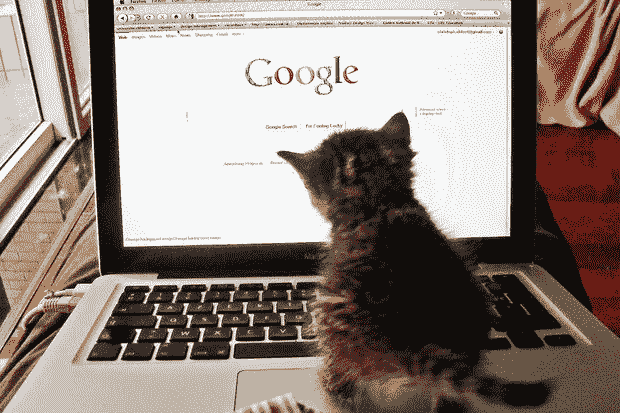

# 谷歌搜索的艺术

> 原文：<https://medium.datadriveninvestor.com/the-fine-art-of-googling-53522a3f3992?source=collection_archive---------9----------------------->

我们都听过一句古老的谚语

> “它在互联网上，所以谷歌它，你会找到它”

但是大多数时候我们找不到我们真正想要的，只能满足于相对接近的东西。这并不意味着这些信息不存在于网上，我们只是无法在不断增长的大海捞针。

> 现在这样想，互联网有点像宇宙。不断增长:不断吸引人:不断扩展:每个角落都有大量的知识等待我们去发现。

本月早些时候，我作为实习生加入了一家公司，我们所有的实习生都被分配了一个训练营项目。这是一个 GIS 应用程序(改天再说)，需要我们所有人作为一个团队工作，并提出一个解决方案。

我们花了几天时间来确定项目的框架、我们要使用的数据集、我们要用来存储数据的数据库、要使用的算法以及开始项目实施所需的更多必要细节。

我们到达了一个点，我们无法继续前进，因为我们有一个问题，我们无法解决。我们找到我们的导师，他说，我引用他的话“你只需要继续寻找”

所以我和我的朋友开始在谷歌上搜索解决方案，几个小时后，我们空手回到了我们的导师那里。我们找到了问题的解决方案，但它很复杂，并抛出了几个版本相关的错误。

导师拿着我的 PC，30 秒左右就找到了解决问题的方法。我并不感到惊讶，因为他知道他在寻找什么，他是导师，他什么都知道。

当我开始仔细观察他如何帮助我们解决问题时，我觉得自己很愚蠢，因为他的解决方案比我们最初预期的要简单得多。我花了一些时间回忆我们错在哪里

让我试着解释一下我错在哪里，而不要让你感到厌烦

我们开始探索概念 A，这将我们引向概念 B，它需要概念 C 才能工作，所以我们的问题是将概念 C 与最终解决方案联系起来，我们在寻找函数、库等有助于我们将概念 C 与我们的解决方案集成的东西，但我们不能，但我们想错了。有一种方法可以让我们将概念 B 与解决方案直接联系起来。c 是不必要的。

大多数时候，在谷歌搜索时，我们倾向于搜索更接近我们的方法而不是我们的解决方案的算法

> 对于任何给定的问题，互联网都有多种不同的解决方案，如果我们将搜索范围缩小到我们的方法，我们可能会失去其他有价值的信息，这些信息可以帮助我们更快地找到解决方案

如果你对自己的方法不太确定，最好继续寻找其他方法，而不是专注于一个失败的原因。

你必须知道如何去寻找，去哪里寻找，如何寻找你的解决方案，并且永远记住资源就在那里。

我自己不是一个谷歌搜索专家，但是这些经历让我意识到了谷歌搜索正确答案的力量

> 在我们的教育体系中，我们倾向于记住相关的东西，但在现实世界中，要记住的东西实在太多了。我认为一个聪明的员工和一个勤奋的员工之间的区别是能够更快地找到一个健壮的现有解决方案，而不是试图从头开始设计一个解决方案

快乐的谷歌搜索:)