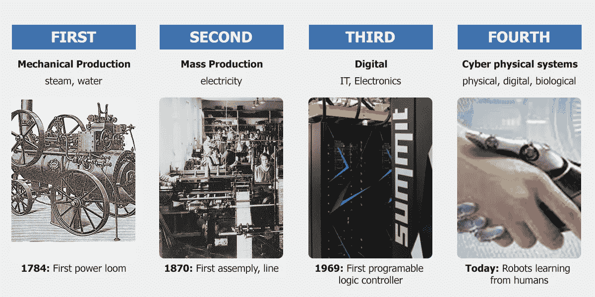
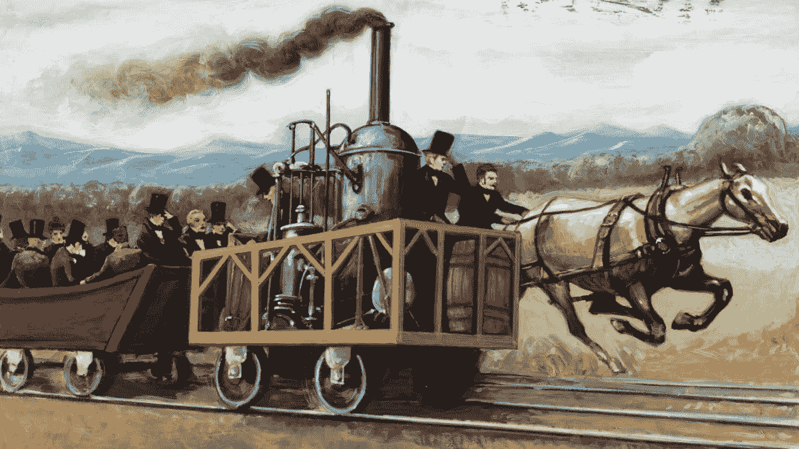
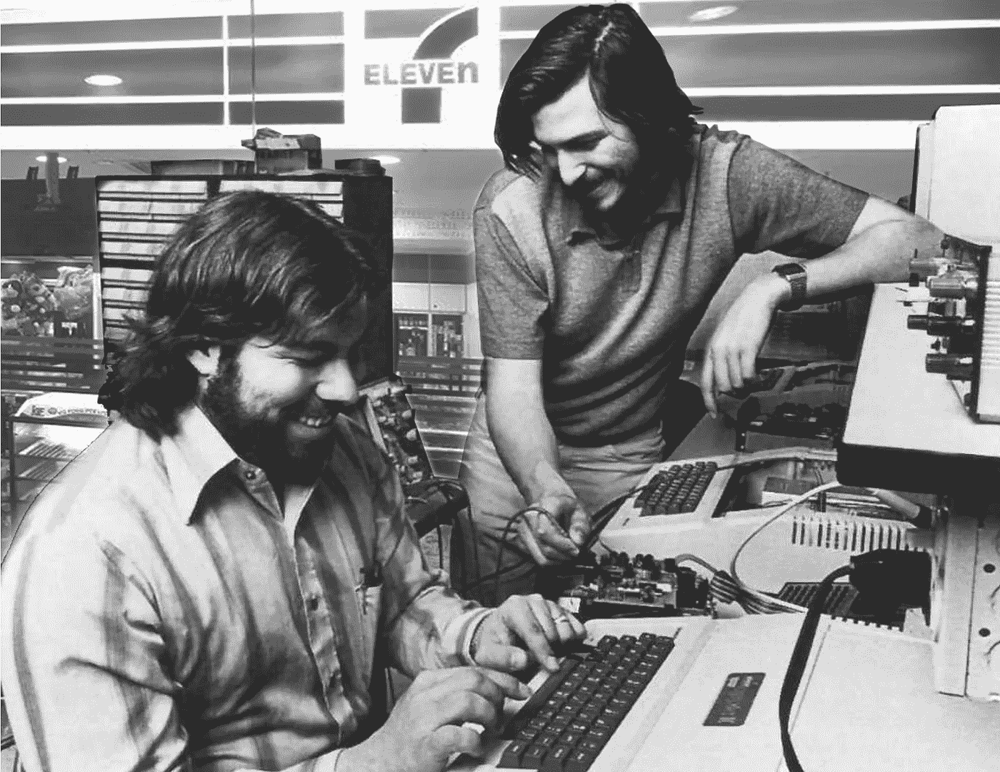
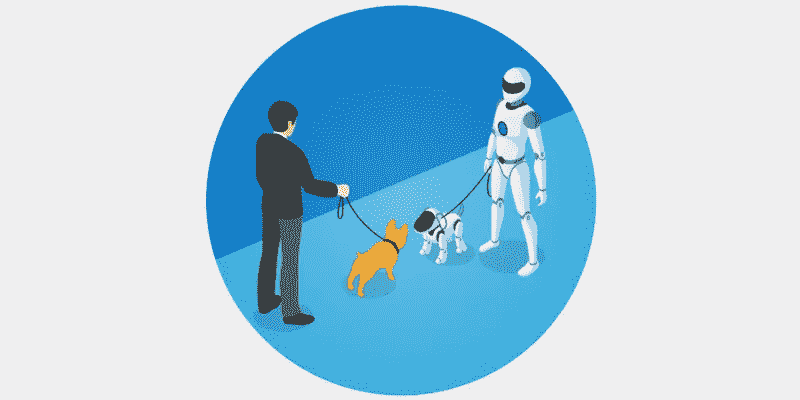

# 工业世界的前四次主要革命

> 原文：<https://medium.datadriveninvestor.com/the-first-four-main-revolutions-in-the-industrial-world-428cf3dd0f78?source=collection_archive---------1----------------------->

## 我们正处于第四次工业革命的尖端

illustrated by [me](https://www.linkedin.com/in/dangtrunganh/)

在数百年的时间里，寻求颠覆性和创新性的解决方案以获得竞争优势的努力引发了工业发展的各种革命。这些是改变了人类历史进程的最重要的里程碑。

> 人类现在创造的财富比以往任何时候都多。

自蒸汽机的第一次工业革命(第一次)以来，出现了以下根本性的变化，如自动化制造环境(第二次)、数字机器(第三次)，并对生产力和效率产生了异常的影响。

 [## 2019 年即将改变世界的技术|数据驱动的投资者

### 很难想象一项技术会像去年的区块链一样受到如此多的关注，但是……

www.datadriveninvestor.com](https://www.datadriveninvestor.com/2019/01/17/the-technologies-poised-to-change-the-world-in-2019/) 

# 工业世界的主要革命

## 第一次工业革命——1765 年

从大约 1760 年到大约 1840 年，水和蒸汽机的发展提高了工人的效率。它从肌肉力量过渡到机械力量。

A world where horses lost their monopoly position

1830 年蒸汽和马力的较量标志着工业革命永远改变了交通运输的时刻。

## 第二次工业革命——1870 年

从 19 世纪末到 20 世纪初，出现了一种新的能源:电力、天然气和石油。这个时代使用电力来创造大规模生产。它带来了农业、制造业和运输业的巨大进步，这些进步始于英国，传到了欧洲和北美，然后迅速传播到了世界其他地方。

## 第三次工业革命——1969 年

它是在 1970 年左右推出的，通常被称为计算机或数字革命，涉及计算机和信息技术的发展作为关键驱动力。自动化是这场革命的核心概念，但仍然需要人工干预。

Jobs with Wozniak (right) in in the garage of Jobs’ parents in 1976

世界上许多人尚未从第三次工业革命中受益，仍有超过 40 亿人没有互联网连接。

# 工业 4.0 以及是什么东西在推动它？

前三次工业革命导致了制造业的彻底变革，即机械化、电力的使用和信息技术。

当今时代，世界正处于被称为工业 4.0 的第四次工业革命的风口浪尖。它融合了我们的物理、数字和生物世界。这个术语是由总部位于日内瓦的世界经济论坛创始人兼执行主席克劳斯·施瓦布在 2016 年出版的《第四次工业 Revolution"⁴.》一书中首次提出的事实上，基于物联网的第四次工业革命已经在 21 世纪初开始了。

Can humans and robots truly be friends?

推动第四次工业革命的新兴技术包括人工智能和机器人、神经技术、生物技术、虚拟和增强现实等，这些都是在过去十年中发展起来的。

下一次，我将告诉你更多关于如何将这一先进技术应用于第四次工业革命。这将是一个伟大的故事！！！

# 参考

[1]兰迪·阿尔弗雷德，2018，连线。 [*09-18-1830:马打铁马，暂且*](https://www.wired.com/2008/09/sept-18-1830-horse-beats-iron-horse-for-the-time-being/) 。

[2] J. B .威廉姆斯，2017，施普林格。 [*大规模生产的开端:电力工业。*](https://link.springer.com/chapter/10.1007/978-3-319-51155-9_6)

[3][Mikael Rick ns](https://www.pcworld.com/author/Mikael-Ricknas/)，2015，PCWorld。[超过 40 亿人仍然没有互联网连接](https://www.pcworld.com/article/2926672/over-4-billion-people-still-have-no-internet-connection.html)。

[4]克劳斯·施瓦布，2017 年**。** [*第四次工业革命*](https://www.amazon.com/Fourth-Industrial-Revolution-Klaus-Schwab/dp/1524758868) 。