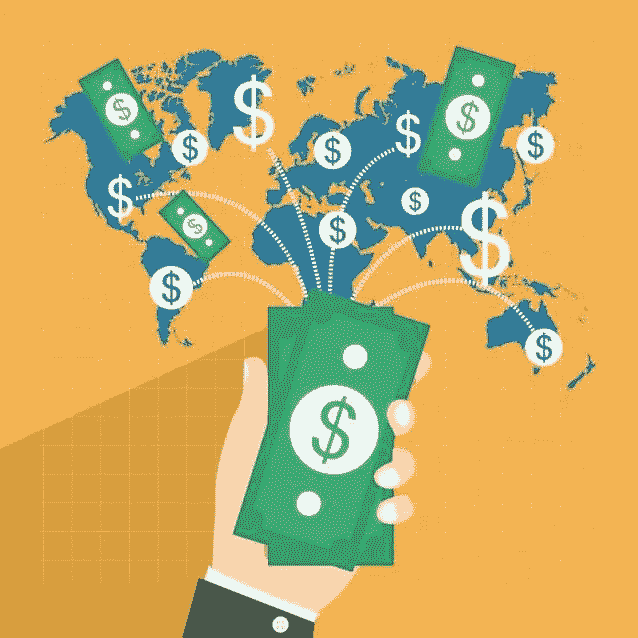

# 货币转账的未来:RTGS 和区块链

> 原文：<https://medium.datadriveninvestor.com/the-future-of-money-transfer-rtgs-and-blockchain-8c5dbfb1f659?source=collection_archive---------1----------------------->

Picture from Bay-pm.com

几十年来，世界货币支付和转移方法的演变(从个人的角度来看)有了巨大的发展。在整个进化过程中，有四个不同的阶段。

易货贸易是第一阶段，从公元前 9000 年一直延续到公元前 600 年。在这个过程中，商品在人与人之间直接交换。然而，这种系统也有局限性，比如很难将货物运送到很远的地方进行交换。由于这些限制，人们过渡到第二阶段，即使用商品货币。商品货币的一些流行的例子是黄金或白银。关于那个时期的一个有趣的理论是，罗马士兵的薪水是用盐支付的。即使这个理论没有被证实是 100%正确的，盐也是古代最重要的商品之一。第三阶段开始于公元前 600 年左右，当时硬币被引入吕底亚，也就是今天的土耳其。之后，大约过了 2000 年纸币才出现。中国人是第一个使用纸币的人，也就是在 9 世纪被称为“飞行现金”的唐朝。之后，在 17 世纪早期，第一张欧洲纸币在瑞典印刷。1891 年，美国运通推出了第一张旅行支票。20 世纪的技术进步开始对工业产生巨大影响。这导致了 1946 年第一张信用卡的诞生，1959 年第一张塑料信用卡的诞生，1967 年第一台自动取款机的诞生，最重要的是在 1994 年，EMV 信用卡标准——代表 Europay、Mastercard 和 Visa——的引入。— EMV 卡是智能卡或芯片和密码信用卡和借记卡。第四个也是最后一个阶段包括在发展中国家提供支付解决方案的手机，在发达国家提供银行服务的应用程序，互联网繁荣(1995-2001)，开创现金交易完全数字化趋势的电子商务公司(如 PayPal)的崛起，以及用信用卡进行触摸支付的能力。2000 年代，塑料卡已经被电子钱包或虚拟卡取代。此外，2009 年比特币作为一种分散货币的诞生，正被用作一种支付或转账方式，这显示了我们将在未来看到的新浪潮。

与此同时，新技术正在以极快的速度改变着行业，人工智能的崛起正在改变客户体验，消费者正在期待免费的即时转账和支付。这就是 RTGS 或实时总额结算变得至关重要的地方。RTGS 允许银行之间的交易实时发生，并在一对一的基础上进行结算。这与批量交易形成对比，在批量交易中，银行在预定的时间间隔，如一天或一周结束时，像在大多数发展中国家那样结算所欠的净额。从批处理事务转移到 RTGS 事务的过程基于两个步骤。首先是技术能力，这种能力正在迅速增长，变得更加强大和可扩展。第二，顾客对即时交货的期望。就像当人们开始使用电子邮件而不是信件或邮件时，他们改变了对交付的看法一样，支付也是如此。

RTGS 可以对金融科技公司产生巨大影响。一个例子是点对点支付应用程序(如美国的 Venmo)。)Venmo 对即时(RTGS)存款收取 0.25 美元的费用，对耗时 1-3 天的标准存款(批量交易)免费。RTGS 的下一步将是免费处理实时支付，这将成为公司提供更好用户体验的重要竞争优势。

另一个例子表明，RTGS 与英国 P2P 贷款行业的发展有着密切的联系。在我看来，点对点借贷利大于弊。P2P 贷款被认为是当人们信用不佳或者银行不想贷款给他们时，他们可以借资金的一种方式。然而，对该行业的另一种观点表明，P2P 贷款的核心优势之一，与其说是信誉或贷款利息，不如说是贷款交付到银行账户的速度。一旦一个人被授权获得贷款，这笔钱立即存入他们的账户。人们愿意为他们的贷款支付更高的利率只是为了速度和方便，这表明了 RTGS 的重要性和期望。

最近，英国银行向非银行支付服务提供商开放了 RTGS 系统。不仅如此，英国计划的改革时间表还将包括区块链和 API 或应用程序编程接口如何与他们的 RTGS 系统对接。换言之，RTGS 代表了支持金融科技创新的关键基础设施层。即使它不能被直接看到，因为它在后台运行，并作为一个支付轨道。支付和存款在不断发展，今天甚至更快，这就是为什么它是最令人兴奋的行业之一。