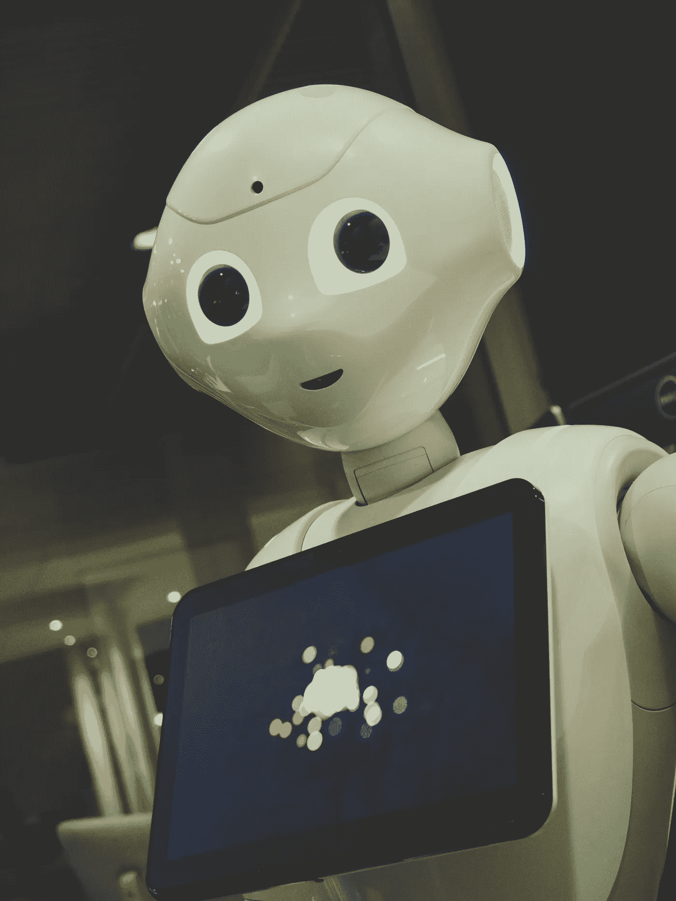

# 心理治疗的未来——“整合疗法”以及人工智能和虚拟现实技术的应用

> 原文：<https://medium.datadriveninvestor.com/the-future-of-psychotherapy-integrative-therapy-and-use-of-ai-and-vr-technologies-f4b54d5a758d?source=collection_archive---------10----------------------->

科学总是在变化，因为我们总能找到新的更好的做事方法。作为人类，我们都会问问题，寻找答案，让我们更好地面对挑战。最近，心理学家开始寻找治疗精神疾病的新方法。治疗的新趋势是一种综合的和更技术化的方法。我们将对此进行更深入的调查。让我们看看每一个项目。

当我们谈论综合治疗时，我们指的是整体的、灵活的和包罗万象的实践，以适合个体患者的方式结合不同的治疗方法。换句话说，它结合了一系列广泛的治疗方法，而且是以一种针对每个患者的方式进行的。这种做法对医生和病人都有很多好处。首先，对医生进行综合治疗培训，可以让他们在理解和处理精神疾病的心理、生物和情感方面获得广泛的技能。这有助于他们更好地发挥专家的作用，因为他们不仅了解各种治疗技术，还了解这些治疗技术相互作用的方式，从而带来最佳的治疗效果。就患者而言，许多研究已经证明，许多类型的精神干预是有效的。然而，在实践中，一种单一的疗法并不适用于所有患者。没有灵丹妙药。一种疗法失败了，另一种就成功了。在综合治疗中，心理学家有机会对病人进行评估，并给出对特定病人最有效的不同治疗方法的最佳组合。结果是一个更面向患者的治疗，具有更好的临床效果。心理治疗和精神健康治疗模式的未来是一体化的。这里有 400 多种不同形式的心理疗法。都有不同的思想流派。心理健康模式日益一体化的原因是由于个体患者给他们的会议带来的深刻差异。当病人来找心理医生时，他们会带来不同的基因构成、问题和担忧。

多年来，医生们尝试了许多整合心理治疗的方法。一些方法包括——理论整合(包括共同因素，同化整合)，技术折衷主义，帮助技能整合和多理论心理治疗。在一个实行技术折衷主义的精神病学家身上，他并不坚持任何理论原则。正因为如此，折衷主义被认为过于善变，缺乏一致性。折衷主义和真正的集成的区别在于，折衷主义者更注重使用不同的方法，但不太关心方法的原则。换句话说，他们寻找有效的方法，但不关心方法或原因。然而，一个真正的综合实践不仅要寻找有效的方法，还要对解释其工作方式和原因的理论原则感兴趣。接下来是理论整合，这是最困难的，因为使用这个系统，从业者试图理解所有心理治疗方法的原理——超过 400 种。然而，更简单的整合形式，如同化整合，集中于一种形式的心理治疗，以期了解其余的一点。这更像是在你已经知道的基础上增加技巧。公共因子方法使用了从卡尔·罗杰的核心条件概念发展而来的治疗联盟。它基于这样一个原则，即不同形式的心理治疗有共同的核心原则。它试图结合这些原则来创造更有效的治疗方法。多元理论方法是最新的方法之一。它试图整理心理学中原则的巨大差异，同时保持它们有价值的原则。其中一个模型是 Brooks-Harris 多理论模型，它整合了心理学的各种方法，如生物学、心理动力学、人本主义、认知行为、躯体(如针对创伤的躯体疗法)、系统(如家庭系统)、多元文化和精神(如超个人疗法)。这一理论是现代综合疗法的基础。它基于五个原则。

第一，综合治疗应该是有目的的——医生应该仔细考虑治疗计划、重点和用于治疗病人的概念

第二，治疗师应该认识到不同的心理治疗方法是密切相关的

第三，治疗师应该了解不同的治疗方法，并根据不同病人的特点来指导他们的治疗选择。这就是综合疗法以病人为导向的原因。

第四个原则是，治疗师应该结合不同的理论来获得更有效的治疗

第五点是，在实践前四点的同时，治疗师应该与病人建立职业关系。

既然我们已经说了很多关于整合疗法的内容，我们想看看人工智能和虚拟现实是如何进入这幅画面的。这是技术与医疗实践相结合的地方。人工智能和虚拟现实的世界已经有了很大的改善，在健康方面显示出巨大的潜力。虚拟现实和人工智能正迅速从游戏领域进入健康领域。虚拟现实包括使用计算机生成的图像，看起来像真的一样。这就是为什么它有点自相矛盾。它是虚拟的，暗示着虚假却真实。虚拟现实的优势在于它处于受控的环境中。已经在焦虑和注意力缺陷/多动症的背景下研究了虚拟现实，并且已经发现虚拟现实是有效的。在焦虑的情况下，当认知行为治疗中逐渐重新暴露于引起焦虑的原因时，它特别有效。虚拟现实在饮食失调、与止痛药结合的疼痛、成瘾和饮食失调的管理方面也显示出巨大的前景。当谈到虚拟现实时，它不仅显示了对病人的承诺，也显示了对医生的承诺，因为培训虚拟现实程序现在正在测试中。人工智能(AI)表示机器和计算机在做需要智能的事情。人工智能意味着我们正在制造能够独立思考的机器和计算机。人工智能可以针对患者的医疗数据、基因构成和问题，开发和设计详细的治疗地图。人工智能可以帮助培训医生，并有可能创造最终的临床体验。当人工智能与储存在计算机中的大量信息结合在一起时。它可以创造出像终极医生一样的东西，可以在几秒钟内处理大量的医疗信息，并可以在没有人为错误因素的情况下，根据伦理做出合理的临床决策。人工智能和虚拟现实可以为心理治疗和心理健康治疗创造强有力的工具。人工智能和虚拟现实可以创造工具来研究我们的五官，生物构成和性格类型。

例如，声音/音乐疗法、视觉疗法、躯体/身体/运动疗法以及对嗅觉神经起作用的疗法都可以纳入精神健康治疗。例如，人工智能可以产生声音来缓解焦虑。虚拟现实可以创造治疗工具，以恢复记忆，并增强对老年抑郁症和痴呆症的积极影响。各种虚拟伙伴和治疗游戏已经被创造出来，用来治疗各种精神疾病。虚拟现实和人工智能可以结合起来，创造出强大的工具，帮助创造一种更加整合的心理治疗方法。

来源:

约翰 c 诺克罗斯和马文 r 戈德弗里德。(2005).心理治疗整合手册(牛津临床心理学系列)，牛津临床心理学系列

杰夫·布鲁克斯-哈里斯(2007)。综合多元理论心理治疗。认知学习