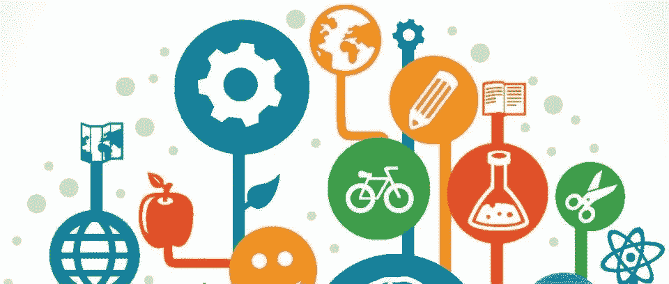

# 工程和科学在技术上的差距

> 原文：<https://medium.datadriveninvestor.com/the-gap-between-engineering-and-science-in-technology-8f9f330f3f9e?source=collection_archive---------27----------------------->

不可否认的是，技术世界的进步是如此之快，尤其是在被引入有目的地微调数据应用的艺术之后——深度学习。

由于不可预见的、看似不相关的研究进展，科技界已经击败了所有的预期。然而，这是以牺牲全球无处不在的知识中一些所谓的永恒联系为代价的。

自从工业革命以来，集体专家知识的应用总是受到工程师拥有的工具的限制，产生了工厂系统和模拟社会，教育也围绕着同样的想法。然而，技术世界通过向感兴趣的个人介绍“你制定自己的规则”的*俗气的*想法，为这个系统设定了终点

尽管科技界为科学研究人员和工程师提供了一种直接交流的方式，但这并没有阻止知识被领域隔离的趋势*。这是因为技术不再受现有硬件(即工程方面)有多先进的限制。事实上，创建一个机器学习应用程序非常便宜，你可以在一台相当弱的计算机上完成它。*

硬件工具的可用性和计算能力——由工程师实现——不会限制今天的技术进步。这扩大了该领域工程师和科学家之间的差距，导致双方都认为对方不那么重要。然而，这并没有阻止他们在一些子领域携手合作，比如:*生物信息学*。

技术进步是科学家和工程师共同努力的结果。前者构建一个经过充分研究的应用程序的*蓝图*，而后者使蓝图有可能真正见光。让我们确保避开无可争议的跨领域知识隔离，拥抱视角差异，为更美好的世界铺平道路。