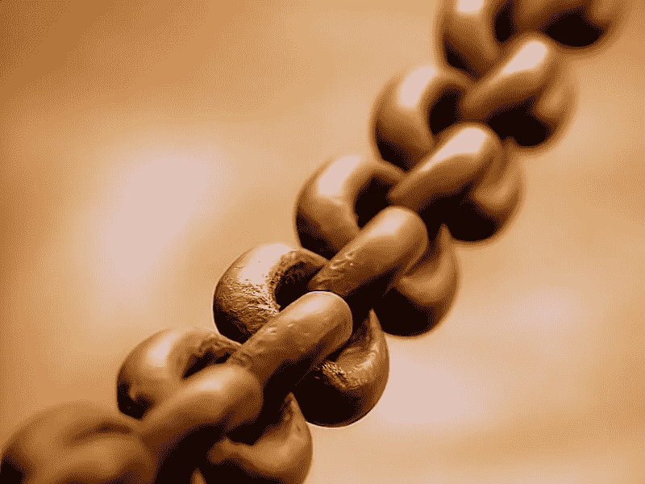

# 特朗普通货膨胀减税的虚伪

> 原文：<https://medium.datadriveninvestor.com/the-hypocrisy-of-trumps-inflation-tax-deduction-b89f62953c9d?source=collection_archive---------5----------------------->

特朗普的税收计划增加了中产阶级家庭的税收，削减了企业的税收，现在他正在推动进一步减税，但只针对富人。

2017 年的税收法案做出了改变，通过改变税率的计算方式，最终将使大多数美国人支付比该法案从未通过时更多的税。更糟糕的是，特朗普政府现在正在考虑对投资实施新的税收减免，这几乎只会让超级富豪受益。

 [## 保护主义、政治和经济动荡——数据驱动的投资者

### 美国股市昨日出现 400 多点的大幅反转，为未来的事情发出了警告信号。市场…

www.datadriveninvestor.com](https://www.datadriveninvestor.com/2018/06/28/protectionism-politics-economic-turmoil/) 

税法中一个鲜为人知的部分是防止税收自动增加，称为消费者价格指数(CPI)，在 2017 年的税收法案中被放缓。CPI 是衡量消费者购买商品和服务的价格变化的指标。CPI 计算中包括的一些商品有食品、住房、衣服、交通、医疗、教育和服务。例如，十年前一加仑牛奶可能只值一美元，但现在涨到了三美元，或者几年前一次理发可能是 10 美元，现在接近 20 美元。为了跟上商品成本的增长，工人要求雇主提高工资。国会认识到，今天挣 30，000 美元的工人能够和十年前挣 20，000 美元的工人购买同样的商品和服务。为了防止人们被过度征税，国会设定税收等级的收入范围每年都要改变，以反映我们购买的物品成本的增加。

税法的这一部分很少引起注意，因为它变化非常缓慢。收入不同的人有七(7)种不同的税级。税收等级的收入水平每年都在攀升；比方说 2%或 3 %,对于大多数税级来说，这可能是几百美元。CPI 的计算每年都在减少每个纳税人的税收，在十年的时间里，它可以为每个家庭节省几千美元。

由于税法的这一部分没有得到太多的关注，难怪特朗普和国会共和党人能够在 2017 年底通过的税收法案中对 CPI 的计算进行大幅修改。他们没有使用 CPI，而是让我们的税法遵循连锁 CPI。环比 CPI 不同于 CPI，它假设随着商品成本的上升，美国人会购买替代产品。买不起房子，人们会租房子；买不起牛排，人们会吃垃圾食品；买不起汽车，人们将乘公共汽车。连锁消费物价指数是我们税法的“勒紧腰带”的方法。

把“环比”这个词放在 CPI 前面实际上能做什么？它戏剧性地 ***增加*** 未来十年人们的税收。低收入人群和那些依靠社会保障的人将感受到最大的影响，你挣的钱越少，影响越大。当你在 CPI 考虑的项目上花费的收入比例较高时，随着额外金额的复合增长，你受到的伤害会更大。为什么美国人对川普和共和党人 ***提高税收*** 没有感到愤怒？首先，变化的影响在几年内不会被感觉到。类似于从一便士开始，在 30 天内每天翻倍(你得到超过 500 万美元)，CPI 每年都是一个小变化，但几年后，它会产生巨大的差异。第二，没有人真正谈过。连锁消费物价指数不是一件容易解释的事情，人们往往不关心多年后会影响他们的事情。

通过改变这种计算方法筹集的资金将用来支付什么？对那些将利润转移给股东的公司永久减税。只有 40%的美国人有足够的财富拥有股票。可悲的是，特朗普政府正在推动又一次财富从穷人 ***向富人*** 转移。

特朗普政府正试图向那些已经从去年的税收法案中受益最多的人提供额外的税收优惠，为他们提供投资通胀税收优惠。如果你以 100 美元买入一只股票并持有 10 年，现在它的价值是 200 美元，你卖掉它，你只需要为价值的增加缴税。共和党人认为，虽然所得税等级根据 CPI 而变化，但投资不存在这种通胀调整。然而，这是一个没有诚意的论点。考虑到通货膨胀，投资税率(称为资本利得税)已经低于正常的所得税。例如，处于最低税级的人(很少投资)不缴纳资本利得税，处于中等税级的人缴纳百分之十五(15)的资本利得税，处于最高收入级的人缴纳百分之二十(20)的资本利得税。这是一个很大的税收减免，因为如果投资收入被算作收入，将被征税近两倍。

特朗普政府认为，通过调整税法中“成本”的定义，将投资者最初支付的金额加上通货膨胀，它有权在没有国会批准的情况下做出这一改变。这一变化的百分之八十六(86%)的好处将流向 1%的美国家庭，并将在未来十年内减少超过 1000 亿美元的税收。这项税收优惠是在去年的税收法案已经以牺牲我们其他人的利益为代价使这些人受益的事实之上的。

总统承诺他的税收法案对普通美国人有利。虚伪之处在于，税收法案的长期利益绝大多数都流向了富人，而牺牲了美国中产阶级的利益。对于大多数美国人来说，2017 年税收法案的好处是前几年的。这些好处将慢慢消失，该法案的影响将变得更糟久而久之。我希望国会能尽快重新审议这个税收法案，因为这个税收法案中还有最后一个肮脏的把戏。对普通人来说，最大的好处是每个等级的税率都降低了，但这种好处将在 2025 年底耗尽。如果由于新的连锁消费物价指数计算方法，税率增加，这些阶层的收入范围降低，许多美国家庭将面临非常艰难的时期。