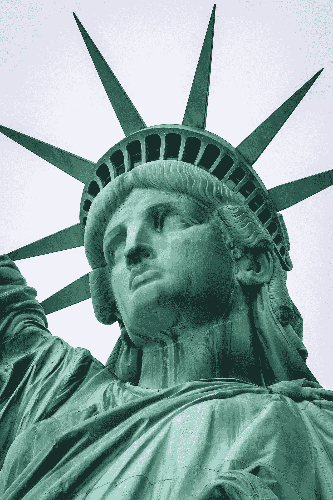

# 美国梦的幻想

> 原文：<https://medium.datadriveninvestor.com/the-illusion-of-the-american-dream-4e1bb80c1f98?source=collection_archive---------14----------------------->

“Statue Of Liberty” by [Brandon Mowinkel](https://unsplash.com/@bmowinkel?utm_source=medium&utm_medium=referral) on [Unsplash](https://unsplash.com?utm_source=medium&utm_medium=referral)

希腊大众媒体的永久信息是美化新自由主义经济模式，这种模式支持财富集中在富人手中将扩散到下层阶级，从而为整个社会创造财富。但事实是这样吗？

美国是全球超级大国，已经成为许多国家的经济模式。然而，许多人没有意识到美国的经济实力对其本国人口的影响，尤其是对中产阶级和工人阶级。

在美国，赢家是非常富有的人，而其他社会阶层属于输家。特别是，在 1979 年至 2006 年期间，工人阶级收入仅增长了 10%(27 年)，而中产阶级增长了 21%。21%并不像看起来那么好，因为人们必须考虑到美国家庭中最小的成员数量，因此，人均收入似乎比实际上要大。事实上，中产阶级收入每年仅增长 0.7%。在这一点上，我们应该记住，与 20 世纪 70 年代末相比，如今中产阶级的工作时间要长得多。如果没有这些额外的时间，美国家庭收入的增加将是微不足道的。分别为同期富人收入增幅 260%。

关于养老金，中产阶级和工薪阶层的状况更差。员工的退休费用负担越来越重，而国家保障的养老金只提供给少数人。养老金是基于像 401K 这样的参与模式，美国人把他们的储蓄放在那里。这些计划投资于共同基金，但也可能包括股票、债券等。我们可以意识到股市下跌对养老金的影响，比如 2007 年和 2008 年，以及预计不久的将来。因此，许多美国人冒着在领取养老金的岁月里收入很少或没有收入的风险。

此外，医疗费用是挤压中产阶级和工人阶级收入的另一种方式，因为他们必须承担保险费用，而员工在医疗保险上花费太多(2007 年每人 7290 美元，2018 年每人 12872 美元)，该州的人均医生、护士和医院数量少于其他富裕国家。因此，在美国，由于缺乏早期护理，死亡率非常高，超过 75 岁的人处于危险之中。

有人可能声称有一个美国梦，所以一个人可以生来贫穷，但他/她可以在这个过程中变得富有，从而逃避上述问题。

然而，数字令人失望。在 20 世纪 70 年代，只有七分之一的人能够上升到高收入阶层，而今天是十分之一。那些属于 1%美国人口的高收入类别的人在 20 世纪 70 年代也属于同一类别，财富的遗传就是证明。由于财富的积累，下层阶级的社会流动将更加困难。

新自由主义模式的彻底失败在它全面实施的第一个国家即美国得到了证明。这种中产阶级和工人阶级完全悲惨的模式适用于整个欧洲，希腊也不例外。