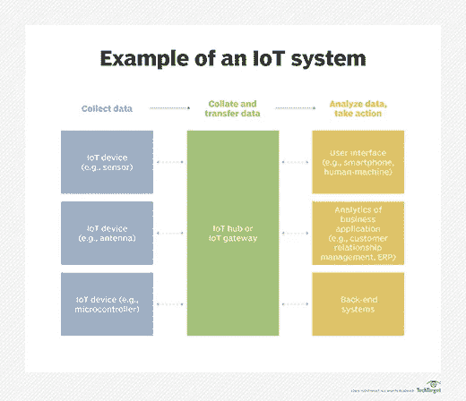
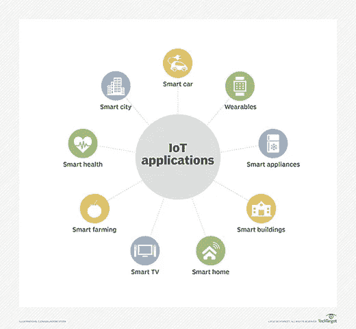

# 物联网

> 原文：<https://medium.datadriveninvestor.com/the-internet-of-things-2a4783074bba?source=collection_archive---------3----------------------->

物联网(IoT)是关于连接的。这是一场旨在将互联网扩展到智能手机、台式机、笔记本电脑和平板电脑等传统电子设备之外的运动。物联网的常见例子有家用电器、手表和汽车。这些传统的非电子设备现在依赖于互联网连接和软件更新才能正常工作。

也许物联网改变我们世界中产品功能的最引人注目的例子之一是特斯拉汽车公司。十年前，“更新你的汽车”是闻所未闻的，但正如特斯拉网站(www.tesla.com)上所写的那样，特斯拉经常收到“空中软件更新，增加新功能和增强现有功能。”当特斯拉的软件工程团队发布更新时，车主会在中央触摸屏上弹出通知。他们可以立即安装或“安排以后安装”对于大多数用户来说，更新需要 wifi 连接，尽管拥有“高级连接”功能的车主可以使用他们汽车的“内置蜂窝连接”从任何地方安装新的更新在这篇[文章](https://electrek.co/2018/10/08/tesla-version-9-software-shames-automakers/)中，一名用户分析了特斯拉的最新软件更新“第 9 版固件”，该软件引入了全新的界面设计以及对汽车的一些功能改进。本文中用户的特斯拉已经六年了。

特斯拉引领汽车行业进入电动未来。汽车制造巨头，包括但不限于，雪佛兰汽车、沃尔沃、通用汽车、日产、福特、宝马和奔驰都在销售或生产电动汽车(【www.energysage.com】T2)。

Apple Watch 是物联网改变我们产品在世界上运行方式的又一个例子。现在在手表上接收短信或电子邮件已经很普遍了。苹果手表还可以跟踪我们的心率和锻炼计划，与我们一起游泳，播放音乐，接听手机电话，使用谷歌或苹果地图告诉我们去哪里，并能够从应用商店下载数千种应用程序。十年前，在你的手表上做这些事情听起来很疯狂。与特斯拉类似，Apple Watch 的成功推动了许多公司，如 Android、Tag Heuer 和 Garmin(以及其他公司)效仿，提供具有触摸屏界面、互联网连接和类似手机功能的手表。

亚马逊 Echo、谷歌 Home 和苹果 Homepod 共同推出了“智能扬声器”，重新定义了扬声器市场。所谓的“智能扬声器”，听我们说话，当被某个关键词提示时，像人一样回应我们。我们可以使用智能音箱来:在线订购东西，查看天气，播放音乐，询问新闻更新，甚至询问故事或笑话。

就连我们最基本的家用电器，比如恒温器，也被 Nest 这样的公司彻底改变了。Nest 恒温器通过“学习”你的时间表来“编程”。根据他们的[网站](https://nest.com/thermostats/nest-learning-thermostat/overview/)，这通常需要大约一周时间。之后，你的 nest 恒温器会在你睡觉时调低温度，在清晨调高温度以便更容易醒来，在你去上班后再调低温度以便节省能量。恒温器也可以用你的手机远程控制。此外，该机器有动作审查，当你进入房间时，LED 显示屏就会亮起。这种技术集成水平在以前的任何家用电器中都是闻所未闻的。

Lime 和 Bird 等电动滑板车公司正在改变人们在城市中的出行方式。每辆踏板车都连接到互联网，可以随时使用应用程序确定其位置。此外，用户使用他/她的手机锁定和解锁踏板车(开始骑行)。

所谓的“智慧城市”是指已经实施了智能路灯和智能电表的城市(internetofthingspareate . techtarget . com)。不久，公共环卫车辆可能会变得自主，从而导致更清洁的公共空间和更少的能源使用。

上述所有产品都是“物联网”一词所指的“东西”毕竟，互联网本身只是一个由“事物”组成的广域网(WAN)更正式的说法是，创造互联网的“事物”通常被称为“节点”。节点是具有唯一标识符(UID)和 IP 地址的任何对象。节点必须能够通过网络进行通信。如何通过网络传输数据？传输数据需要有效的 IP 地址。IP 地址是一个唯一的号码，它与你在网上的所有活动都有关联。您的互联网服务提供商(ISP)负责为您提供有效的 IP 地址。你可以把你的 IP 地址想象成一封邮件上的回信地址。当您访问一个网站并向服务器发出请求时，您的 ISP 需要知道它应该将服务器的响应定向到哪里。这是您的 IP 地址提供的信息。

物联网的另一个关键组成部分是它依赖于计算机与计算机的交互，而不是人与人或人与计算机的交互。这一部分对企业很有吸引力，因为它有可能节省大量资金。例如，在特斯拉汽车公司(Tesla Motors)的案例中，使用软件更新来大规模维修和改进车辆，有可能大大减少特斯拉雇佣机械师和进行内部维修的费用。这释放了更多的工厂生产空间，减少了员工开支，并为客户提供了更积极的体验，因为更新是免费的，可以在一夜之间完成。

然而，这确实提出了一些经济问题——特别是在劳动力市场方面。随着物联网设备增加可以自动化的任务数量，一些工作将会消失。然而，这种“创造性破坏”是几个世纪以来经济增长的标志(尤其是在工业革命时期)。随着新技术的引入，新产品被发明出来。在某些情况下，新产品市场会带来新的工作。

物联网的另一个后果是互联网上的设备数量急剧增加。面向公众的网络上的每个 IP 地址必须是唯一的。如果不是，ISP 就不知道该把信息包发送到哪里。目前最流行的互联网协议是互联网协议版本 4 (IPv4)。IPv4 协议要求所有 IP 地址的长度都是 32 位。这提供了大约 42.9 亿个可能的 IP 地址。虽然这可能看起来很多，但互联网很快就没有地址了。使用 126 位地址的新协议(IPv6)已经开发出来。这提供了超过 340，282，366，920，938，000，000，000，000，000，000 个可能的地址，足以保持互联网长时间开放。

对许多人来说，我们生活中这种程度的技术整合令人不安。这可以理解。让扬声器听我们说话，让恒温器知道我们白天在哪里，在哪个房间，可能会让你感到不舒服。但更严重的是，它也给黑客提供了不良企图——更大的攻击面。它还加剧了网络恐怖袭击或电网断电对我们的经济和日常生活的影响。

最近最臭名昭著的物联网攻击之一是 Mirai 未来组合-一种[僵尸网络](https://en.wikipedia.org/wiki/Botnet)攻击，它渗透到域名服务器提供商“Dyn”，并在很长一段时间内关闭了许多客户网站。 [Mirai 未来组合](https://www.google.com/search?q=what+was+mirai&oq=what+was+mirai&aqs=chrome..69i57j0l2.3306j0j4&sourceid=chrome&ie=UTF-8)通过猜测登录密码攻击安全性差的物联网设备。这是一次分布式拒绝服务(DDoS)攻击。由于物联网设备紧密相连，黑客所要做的就是利用所有相连设备都依赖的一个漏洞——并改变数据，使整个网络无法使用。此外，一些物联网设备——比如 NEST 存储用户的个人信息(姓名、出生日期、何时在家以及何时不在家等)。这些信息对黑客来说是无价的。因此，一种物联网最佳实践是存储尽可能少的个人用户信息，以提供积极的用户体验。

此外，除了黑客，用户隐私也是物联网中的一个大问题。对于一些公司来说，物联网提供了收集更多用户数据的巨大机会。收集这些数据的两个常见动机包括(1。把它卖给其他公司，这样他们就可以进行有针对性的广告宣传。了解顾客的兴趣，这样他们就可以卖给他们更多的东西。这种有意识的数据收集最明显的例子是谷歌和亚马逊家庭产品。这些公司通过整天倾听客户的声音，向他们推销新服务，并允许他们从 Amazon.com 网上购物来了解他们的客户兴趣。

然而，重要的是要明白消费者掌握着这里的权力。如果我们没有购买这些产品，牺牲我们的安全和个人数据来换取花哨的恒温器，我们就不会承担这种责任。至少就目前而言，我们仍然可以购买大量不依赖软件更新并跟踪我们每个位置的汽车和恒温器。也就是说，每年都有公司推出更多依靠互联网连接正常工作的产品……总体市场趋势似乎是技术在我们的生活中扮演着更加亲密的角色。

物联网的未来是广阔的。贝恩公司(【www.bain.com】)预计，到 2020 年，物联网硬件和软件的年收入将超过 4500 亿。Gartner 估计，到 2020 年，将有 208 亿物联网设备投入使用，“2018 年物联网设备和服务的总支出将达到 3.7 万亿美元”(www.gartner.com)。