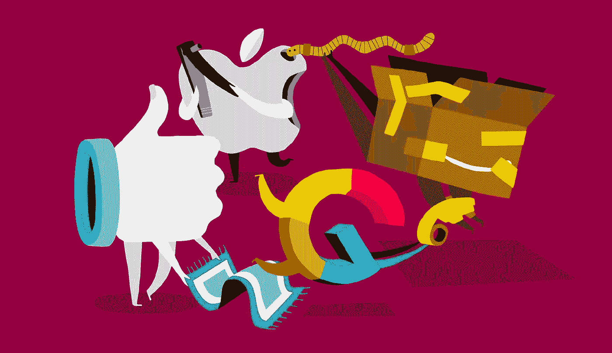
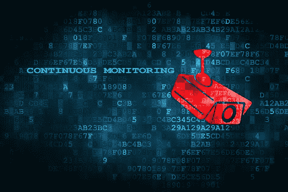

# 颠覆的快乐

> 原文：<https://medium.datadriveninvestor.com/the-joy-of-disruption-d4a3639294b3?source=collection_archive---------10----------------------->

“关键是尽早接受颠覆和变革。不要几十年后再去反应。你不能打击创新。”

—瑞恩·卡瓦劳格

**从来没有人希望**站出来谈论我们当前医疗保健系统的问题——以及医疗保健的未来将如何帮助纠正这些问题。这是有原因的。公开谈论这件事可能会让你的工作面临风险，这就是为什么许多为未来而战的领军人物都是自由职业者或为科技巨头工作。这是一个典型的房间里的大象，加上大企业基于恐惧的心态。他们害怕改变。

写我的书[医疗保健的未来:人类和机器合作获得更好的结果](https://www.amazon.com/Future-Healthcare-Machines-Partnering-Outcomes/dp/0692122966/ref=sr_1_1?ie=UTF8&qid=1536803913&sr=8-1&keywords=future+of+healthcare)是有风险的。如果你对抗系统，系统会反击，不管你是医生、病人还是组织。但是我们都是能够独立思考的人。有如此多的知识被困在这个行业中，因为人们没有权利表达他们的意见，这是一个悲剧。这是政治，政治在医学中没有位置。

好消息是，颠覆是不可避免的，无论人们是否公开反对当前的体系，它都会到来。我只是让自己承担起迎接变化的责任，因为让我们面对现实吧——更好的医疗系统拯救生命，如果有一个生命因为我的工作而得到拯救，那么我就可以睡得很香了。

我们都知道，不是每个人都喜欢颠覆。这个术语本身听起来几乎是威胁性的，但它没有变位恐惧症(对变化的恐惧)那么有威胁性。改变必须发生——否则，我们永远不会进步。

但是，并不是所有的医生都对这种变化速度感到满意，他们甚至可以反击这种变化——以及反对他们的病人采用这种变化。正如保罗·加拉格尔在 iNews 的一篇文章中解释的，“全科医生威胁说，如果他们在预约之前依靠‘谷歌医生’来找出他们的问题，他们就会把病人从他们的执业名单中删除。人们因为害怕“失去权力”的医生进行自己的互联网研究而被嘲笑、被呵斥并感到害怕。许多人害怕预约，因为害怕医生的反应。这种做法已经变得足够普遍，以至于临床领导人可以教育全科医生如何不轻易拒绝病人的研究。"

这是根本错误的，至少在我看来是这样。医生应该很快接受第二种意见，病人可能比医生更了解自己的症状。当然，我们要记得对“谷歌博士”持怀疑态度，但有时谷歌博士是对的。即使他不是，他也可能会引导你做出正确的诊断，而且早排除比晚排除要好。

最后一个事实是，通过抨击研究患者症状的患者，医生发出了一个信号，即患者不应该对自己的医疗保健有任何意见。相反，我们应该庆祝他们正在研究这一问题，并试图利用这一势头鼓励他们遵循其他健康的做法，如戒烟，更多地锻炼或更健康地饮食。

作为一名前执业医师，我要在此时此地告诉你，没有任何借口可以不看病人的研究就拒绝它。然而，全世界的医生都在不断地这样做。真是浪费。

但是事情会改变的。这是必然的。我们所能做的就是帮助引进它，这正是我打算做的。例如，我有这种激情和这种愿景来创建世界上最大的社交媒体健康平台。医疗保健界的脸书。我们与用户互动和收集数据的机会非常巨大。

有很多知名企业家和商人同意我的观点。例如，[苹果首席运营官公司的杰夫·威廉姆斯最近谈到了](http://bit.ly/jeffwilliamshealthcare)该公司颠覆医疗保健行业的潜力，他说:“[新硬件和人工智能]最重要的例子之一可能是利用晶体管技术进步和功率缩放来彻底改革医疗保健的机会。我们认为卫生行业变革的时机已经成熟。我们认为有巨大的潜力来进行设备上的计算，以及云计算，并通过机器学习、深度学习和最终的人工智能来进行学习，从而改变医疗保健的提供方式。我们想不出比这更有意义的事情了。”

我也不能。

# 一种新型的供应商

[根据 Zayan Guedim 在 EdgyLabs](http://bit.ly/edgylabsarticle) 的一篇文章，“医学一直处于深刻而深远的文化和技术革命的风口浪尖。传统医学及其经验性的治疗方法正逐渐让位于预防性和超个性化的医学方法。”

苹果、谷歌和其他科技公司处于这场变革的前沿，它们很可能会给传统大型制药公司和医学研究实验室带来厄运。苹果和谷歌尤其有趣，因为它们多年来一直角力，最明显的是在智能手机市场，现在它们的竞争延伸到了医疗保健领域。这是一件好事，因为竞争往往会导致创新，而创新将帮助我们所有人活得更长、更健康。

如果说有谁在引领医疗保健行业的发展，那就是亚马逊。事实上，富国银行(Wells Fargo)最近的一份报告发现，消费者完全支持这种做法，一半的美国成年人表示，如果亚马逊公司推行这种做法，他们“可能”会使用亚马逊药店。据《华尔街日报》报道，“来自美国消费者新闻与商业频道的一份新报告称，亚马逊正在敲定其制药计划。亚马逊最近在日本扩展了 Prime Now 服务，将药品和化妆品销售包括在内，并建立了一个专业的医疗保健计划，以规范医疗用品和设备在美国的销售。如果是紧急情况，也许他们甚至会用无人机运送。

但亚马逊并不是唯一采取行动的大型科技公司。谷歌已经拥有每个用户的大量数据，它可以交叉检查某些个人的共同特征，以做出最可能的诊断。他们的母公司 Alphabet 创建了许多子公司，如通过处理生物数据来对抗疾病和衰老的 Calico，以及旨在开发创新医疗工具和平台的 Verily。他们甚至将谷歌眼镜重新用于医疗行业，包括使用远程抄写员。

与此同时，苹果可以通过 Apple Watch 和 iPhone 的结合来收集大量的医疗保健数据。iOS 8 为用户提供了一系列监测健康的新功能，Apple Watch 甚至可以跟踪异常的心脏活动，记录锻炼期间的健康指标，并自动感知心律失常。最新的迭代甚至可以运行心电图，并已获美国食品和药物管理局批准。

最棒的是，这些设备不仅仅用于医疗保健。毕竟，没有多少人会全天候佩戴医疗保健设备，尤其是当他们不觉得自己生病，也没有任何预先存在的疾病时。不幸的是，预防医学依赖于在问题成为问题之前发现问题，所以我们理想中需要一种人们在完全健康时愿意使用的可穿戴医疗设备。

这就是苹果、谷歌和其他科技公司相对于老牌医疗服务提供商的优势所在。如果他们创造的设备能够迎合生活方式的需求——如果它们看起来不错，具有先进的功能，同时增加了不专注于医疗保健的价值——那么这就让它们更受欢迎。同样，没有人会随身携带 DSLR 相机，但每个人都在手机中内置了相机，没有人会佩戴医疗设备，但每个人都会佩戴最新的热门技术，如果它能同时收集他们的医疗数据，那就更好了。

事实上，老牌制药公司感到如此威胁，以至于他们已经开始以自己的方式与大型科技公司对抗。葛兰素史克、强生和其他制药公司正在积极从谷歌和微软招聘技术专家。美国消费者新闻与商业频道解释说:“我们的目标是雇佣工程师来帮助大型制药公司研发新药的流程实现现代化。”

# 连续监视

在整个[医疗保健的未来](https://www.amazon.com/Future-Healthcare-Machines-Partnering-Outcomes/dp/0692122966/ref=sr_1_1?ie=UTF8&qid=1536809996&sr=8-1&keywords=future+of+healthcare)中，我主要关注技术将如何影响人类的护理，但兽医护理也是医疗保健行业中一个有趣的子集，许多相同的技术可以应用。

我最喜欢的一个例子来自 Alexa Anthony，他是南卡罗莱纳大学马术队的 NCAA 冠军。她的母亲和姐姐也从事马匹工作，但安东尼发现自己在创建 Magic AI 后成为了一名意想不到的企业家，Magic AI 是一家总部位于西雅图的公司，该公司在[发布了一款名为 StableGuard](http://bit.ly/aiforhorses) 的产品——“世界上唯一的人工智能 24 小时马匹监控和警报系统。”

持续监控系统背后的想法很简单，在 Stableguard 的案例中，它的灵感来自于一个现实生活中的悲剧。2012 年的圣诞之夜，安东尼 8 岁的马患了肠绞痛。消化系统紊乱会致命，但如果发现得够早，也是可以治疗的。“如果这发生在没有人注意的午夜，”安东尼解释说，“他们可以这样做一整夜，到了早上往往就太晚了。我的马就是这样。但是如果有什么东西在他表现出痛苦的症状时就通知了我，我本可以出去给他打一针苯那明。我们本可以阻止它。他今天可能还会在这里。”

现在，如果你和我一样，你已经在思考同样的技术如何能够——也应该——应用于治疗人类。毕竟，不仅仅是马的生命可以被拯救。我想和你谈谈罗莉·麦库姆斯。

[Lorrie McCombs 是一名死于 Kennestone 医院的患者](http://bit.ly/continuousmonitoringcase),她在没有适当监测的情况下被给予阿片类药物止痛。麦库姆斯有呼吸抑制的风险，原因有很多，包括胸部和腹部受伤，以及她病态肥胖的事实。如果她接受了脉搏血氧仪和二氧化碳监测——这是美国麻醉学会基础麻醉监测标准所提倡的——她没有理由活不到今天。

麦库姆斯的鳏夫最近在一起医疗事故诉讼中获得了超过 320 万美元的赔偿，但无论多少钱都无法让人起死回生。如果把钱花在一个持续的监控系统上，这样整个悲惨的情况就可以避免，这难道不是更有意义吗？

令我兴奋的是，今天的连续监测系统已经有可能拯救动物和人类的生命，但我们才刚刚开始。随着技术的不断发展，这些系统只会越来越好，尤其是在我们将新的传感器技术与人工智能和机器学习相结合之后。想象一下，一个监控系统能够教会自己注意什么。

未来可能比你想象的更近。

# 想了解更多？

在我的新书《医疗保健的未来:人类和机器合作实现更好的结果》中，我更多地谈到了数据、人工智能和机器学习。[点击这里给自己买一本。](https://www.amazon.com/Future-Healthcare-Machines-Partnering-Outcomes/dp/0692122966/ref=sr_1_4?s=books&ie=UTF8&qid=1532451664&sr=1-4&keywords=future+of+healthcare)