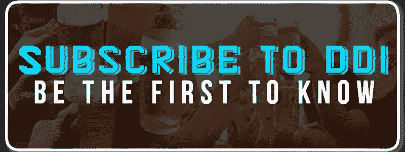

# 商业成功的关键:行为分析

> 原文：<https://medium.datadriveninvestor.com/the-key-to-business-success-behavioral-analytics-f7a2a8b64252?source=collection_archive---------5----------------------->

“The rise of social media”

仅在 2017 年，每分钟就有超过 *456，000 条推文，46，740 张图片被添加到 Instagram 中，谷歌在[www.fusioncharts.com](http://www.fusioncharts.com)处理了 3，607，080 个查询*

数字时代已经到了一个重要的转折点，人们的生活正在被数字化。公司已经投资了数百万到数十亿美元来满足消费者不断变化的需求。问题是，即使他们投入了大量的资源，也只有很少一部分被分析并转化为对经济决策有用的信息。这种情况因**“筒仓心态”**而加剧，一些部门不愿意与其他部门共享数据，导致更多未经处理的信息和折叠，这可能导致公司的整体利润下降或停滞。那我们能做什么？

“Data Democratization”

# **通过 DATAVLT 引入数据民主化**

**DATAVLT** 旨在通过向那些寻求经济高效地发展内部能力的人提供**大众化数据**来增强企业的能力。这是一个按需、自助式的行为分析平台，可以跟踪、分析、整合和关联数据，使用户能够做出更明智的商业决策([http://www.datavlt.com/whitepaper/](http://www.datavlt.com/whitepaper/))。

民主化的数据意味着，即使是组织中较低级别的经理和其他员工也可以访问以前无法获得的关于日常运营的特定信息，从而能够在交付公司产品和服务时做出更快的响应，并能够满足和超越客户的需求。

> 大数据专家伯纳德·马尔(Bernard Marr)认为，“在没有帮助的情况下，您的员工能够更容易、更快地访问数据以获得他们所需的业务洞察力，这就是数据民主化的目标。”

反过来，机构产品的卓越效用为商业伙伴创造价值。这种价值创造可能来自于存储成本的降低，而存储成本的降低无法抵消为实现愿景和目标而处理和使用更大比例的数据所带来的好处。

## 如果它的回报是优越的，那么为什么许多公司不会应用这个概念？

“Data security, scalability, and stability”

# **关注数据民主化**

包括 **DATAVLT** 在内的数据分析工具提供商主要关注消费者行为，使用从经济学、社会学和人类学等领域获得的参数来提取基本数据。将数据与行为输入相关联，如简档、音调和情绪，允许对数据进行更深入和更有意义的分析，因为这些参数有可能创建无限数量的分析场景，超出主要公用事业跟踪(【http://www.datavlt.com/whitepaper/】T2)。这是数据民主化的开始。

**然而，实现数据民主化有两大争议；成本限制以及数据可扩展性和保护。**

数据科学家将耗费大量现金流，并可能耗尽中小企业的财务资源。这就是为什么他们需要经济实惠的数据分析工具来满足他们的业务需求，而这可以通过基于区块链的平台(如 DATAVLT)来实现。

第二个问题需要高度重视，有两种方法可以解决；向组织成员分配其角色所需的数据保管，以及在业务事务增加导致大量数据进入系统时进行扩展的能力。

**首先**，为了防止公司员工为了自己的利益使用信息，他们应该被允许处理他们只需要执行任务的信息。此外，一旦获得晋升的员工也应该被要求交出他们手头的所有信息，以适合他或她不同职位的新的经处理的数据集来代替。

**最后**，可扩展性问题引起了一些关注，因为它可能会影响重要的事情，如数据保护、使用和公司声誉。由于一些区块链驱动的工具，如 DATAVLT，采用了新技术，中小企业可以改变一些市场变量来适应他们的需求，他们将有更大的控制和数据管理的灵活性。话虽如此，他们可以制定关于数据责任的政策，如第一点中提到的政策、数据所有权和安全风险。此外，为了保护公司的声誉，企业可能会将数据使用的规则和条例与如何实现组织目标的方法相结合。

“End-to-end data management”

# **数据分析平台 DATAVLT 如何整合系统网络中的所有数据？**

本质上，DATAVLT 是一个端到端的数据/信息管理平台。端到端数据管理系统允许链接全球系统中不同类型的存储。它包括他们的客户、供应商、云存储和所有其他存储站点的系统。

“Analyzing the target market”

# **使用数据分析有什么好处？**

DATAVLT 列出了一些好处，但我们将简要讨论其中的两个。首先，定制的消费者体验，它允许企业像“众包”一样获得对其产品的洞察力，并执行一些修改以满足他们。最后，深入了解客户/消费者以进行细分，这对于企业非常重要，尤其是如果他们希望接触更多的市场参与者。他们将获得关于什么是目标市场利基的智慧，并可能获得更多收入，将他们的负现金流变为正现金流。

