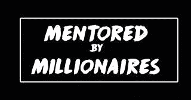

# 天使投资对象(初创企业/中小微企业)的导师类型

> 原文：<https://medium.datadriveninvestor.com/the-kind-of-mentors-for-angel-investees-startups-msmes-ea0de0adebb8?source=collection_archive---------32----------------------->

“two people holding hands” by [rawpixel](https://unsplash.com/@rawpixel?utm_source=medium&utm_medium=referral) on [Unsplash](https://unsplash.com?utm_source=medium&utm_medium=referral)

Photo credit: Mentored by Millionaires

天使投资在乌干达是一个新领域，非常陌生。然而，许多人并不理解它，完全将其称为风险资本主义。我可以说这很接近，但唯一的区别是天使投资者会投资任何数量的初创公司，其中有许多风险投资家可能不会做。

后者高度关注回报，大多数时候投资都不会少于 100 万美元。天使投资者最有可能是个人，即使它并不正式隶属于一家公司，而风险投资者通常是使用从出资者那里收集的资金来资助创业公司的公司。

无论如何，今天的初创企业或企业家在生命早期需要一只手，特别是财务支持，这就是天使出现的时候，就像我们各种信仰或宗教派别告诉我们，婴儿出生时有一个守护天使。初创公司也需要天使。你还记得，如果没有彼得·泰尔(脸书的第一位天使投资人)向这家有前途的初创公司投资 50 万美元，马克·扎克伯格就不会发展得如此之快，也不会有今天的成就。

不要说那是硅谷，因为在乌干达也有可能。我们，KAIN—[https://kain.co.ug](https://kain.co.ug/)/(作为一个天使投资网络和你们这些初创公司/企业家)只需要把我们的思想投入进去。只需要一步一步来。

无论如何，天使投资的好处之一是一种叫做“导师”的东西，对天使投资者和企业家都是如此。你会意识到，在大多数天使网络或团体中，前者每月至少要牺牲几个小时(2-3 个小时)来指导他们的投资对象(他们投资的初创企业)。这可能来自他们的投资经历，也可能来自他们生活中的连续创业者。他们也可以从天使投资大师班或他们网络中的成员那里获得知识。

前几天，我浏览了维多利亚商业天使网络(VBAN)的一条推文。他们在讨论他们(我们天使网络)如何更好地指导创业公司。他们在第二次导师营与 VC4Africa、Make-IT-Africa 和其他人分享了许多伟大的见解。

为了给出我的观点，我在推特上说，我与许多初创公司/企业家/中小微企业互动，他们中的许多人面临着许多挑战。年轻或处于早期阶段，缺乏融资/资金是挑战之一。他们还向我透露，在没有指导(称之为导师)的情况下，在各自的行业中规划自己的道路也是一个问题，尤其是当他们获得资金支持的时候。他们需要有行业知识或业务经验的人来指导他们。更多【https://t.co/wvwHvOV9EP 请访问链接

当我帮助他们(创业公司/企业家/中小微企业)时，在闲聊中他们透露；

“朱利叶斯，你在这方面帮了我很多，但我也希望在这方面能有一个导师”。

其中隐含的暗示是，他们中的大多数人想要一个在同一行业有经验的导师。所以我想，对于一个金融科技初创公司的创始人来说，由一位经验丰富的商人或连续创业者指导可能会更好，这些人已经或拥有或投资了电信、移动支付行业或此类技术十年左右。

然而，不同的创业者对需要哪种导师的兴趣可能会有所不同。但是，说了这么多，球总是在企业家的一边。

朱利叶斯·马萨巴是坎帕拉天使投资者网络(KAIN)的分析师。他也有兴趣通过金融和投资准备，加上数字营销和技术创业的诀窍来帮助企业。