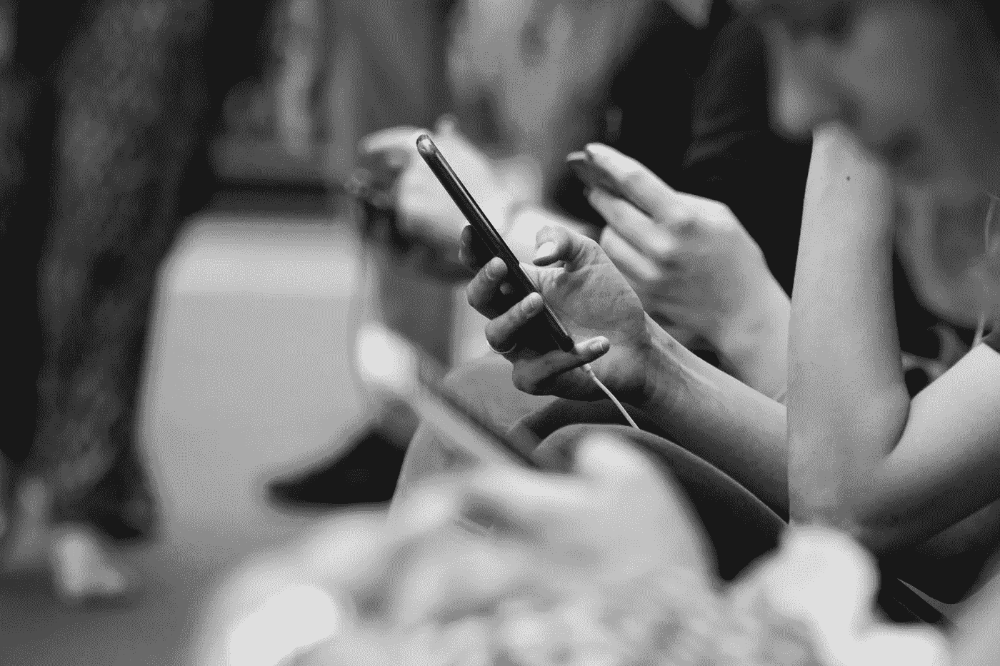

# 最后一封信:Z 世代

> 原文：<https://medium.datadriveninvestor.com/the-last-letter-gen-z-f2919b96ebb2?source=collection_archive---------4----------------------->

他们看待生活的方式和他们采取的决策过程……他们正在破坏这一切。

> 我来自 Y 世代，也就是所谓的千禧一代，他们曾经相信我们会颠覆一切；零售、传播、媒体、广告、线上和线下体验等。人们普遍认为我们扰乱了生活！然而，现在有一个 pro 版本的千禧一代，Z 世代，所谓的明智的一代。

Z 世代，或者说敏感的一代，是由 1996 年以后出生的年轻人组成的，与老一代人相比，他们对生活有着非常不同的态度。他们喝酒更少，吸毒更少，青少年怀孕几乎成了一种异常现象。根据英国怀孕咨询服务中心的说法，他们把高质量的家庭时光看得比性更重要，把好成绩看得比友谊更重要，更喜欢果汁吧而不是酒吧。但这一代人正面临着另一种类型的成瘾，被一些人称为“最大的时间窃取者”——社交媒体！由于他们是第一批真正从小就使用智能手机和社交媒体长大的群体，他们是在既更严肃又不世俗的矛盾中游泳的人。他们混淆了理智和成熟——并且在这个过程中错过了很多。正如 19 岁的哲学系学生黛米·巴博拉向一家英国报纸提到的那样；“我们有太多的事情要做，而不仅仅是喝酒和吸毒，我们现在有太多的事情让我们分心。”

虽然我们过去认为千禧一代沉迷于社交媒体，但 Z 世代将这一点提升到了一个全新的水平，比其他任何一代人每天都要花更长的时间。根据全球网络指数，新生代平均花 3 个小时在社交媒体上，37%的人称社交媒体对他们的幸福有直接影响。他们中的一半人使用社交媒体来打发时间，另一半人使用社交媒体来寻找有趣或娱乐的内容，这些数字证明了 Gen Zers 重视频道上的娱乐内容；就使用率而言，YouTube 是领先的渠道(95%)，他们不太可能像千禧一代那样花时间在脸书和 Twitter 上，然而，他们更可能是“Instagramming”和“Snapchatting”。此外，Gen Zer 在一次关于 Snapchat 的采访中所说的就是一个很好的例子；“这有点像记录你的生活，但你有观众，你马上就知道谁在互动。我喜欢这样——100 个人都在看着我吃什么，这让我觉得很重要。”

随着 Z 世代开始积累购买力，他们现在吸引了长期以来赋予千禧一代的那种关注——他们的行为正在改变这一切。但是怎么做呢？

根据全球网络指数，Z 世代希望有一个品牌让他们感到时尚，给他们娱乐性的内容，提供创新的产品和想法，让他们觉得自己是一个有价值的客户。他们希望在社交渠道上进行个性化的对话，就像他们在这些渠道上与朋友交流一样。他们希望通过品牌获得娱乐，因为品牌可以消除噪音，让他们想观看和分享内容。红牛就是这样做的一个品牌；内容不是围绕产品创建的，而是产生吸引注意力的创新的、原创的内容。

然而，相比之下，更直接的品牌对消费者方法更有可能更好地服务于千禧一代，有影响力的人向他们的追随者发送相关的产品推荐将符合 z 世代的要求。这是因为千禧一代更有可能在社交媒体上关注他们喜欢的品牌，访问该品牌的渠道，以及分享品牌的社交帖子。Z 一代最有可能使用社交媒体来关注他们最喜欢的名人，甚至更喜欢关注演员而不是他们喜欢的品牌。

尽管每一代人都参与社交媒体，但他们都倾向于从品牌和影响者那里获得利基需求。但问题是如何养活 Z 世代，因为他们正慢慢获得购买力，并成为许多品牌的目标受众。他们是未来的买家，而不仅仅是字母表中的最后一个字母。