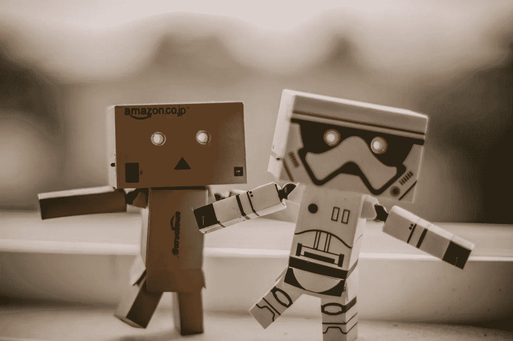

# 自动化的限制(和威胁)

> 原文：<https://medium.datadriveninvestor.com/the-modern-survival-guide-36-limits-and-threats-of-automation-f2441f2e9948?source=collection_archive---------0----------------------->

# 现代生存指南#36

这是[现代生存指南](https://medium.com/@Allen_Faulton/the-modern-survival-guide-introduction-a37f73459250)，一本我写的指南，是关于我认为人们需要知道的关于生活在现代世界的事情。这里表达的观点是我的，而且仅仅是我的——[沃森](https://en.wikipedia.org/wiki/Watson_(computer))还不能写文章。但是机器越来越近，这就把我们带到了本文的主题:自动化和即将到来的人工智能革命。

自从计算机时代开始以来，我们一直在思考和处理自动化的现代影响。但是我们对此的文化表述是…混杂的。在流行文化中，每一个数据先生都有两三个天网，这让我们对自动化系统——特别是人工智能(AI)——的工作方式有一点点扭曲。

因此，我们在文化上习惯于对自动化既恐惧又尊重。正如大多数源自流行文化的东西一样，现实比人们想象的更平淡无奇，也更具威胁性。因此，自动化有着重大的生存意义。

所以让我们开始吧，好吗？

**不:** [人工智能奇点不会很快到来](https://www.sas.com/en_us/insights/analytics/what-is-artificial-intelligence.html)。我们甚至不确定人类意识是如何工作的，但机器学习(或深度学习，如现在所称)远没有复杂到足以产生真正的人类或更好水平的人工智能。现代人工智能根本不具备模拟像人脑一样复杂的系统的处理能力；他们更像蚂蚁，而不是人。未来的人工智能可能会达到人类或更好的水平，但你不必担心天网[很长一段时间。](https://en.wikipedia.org/wiki/Skynet_(Terminator))

是的:自动化对你的工作是一种威胁。这是一个简单的事实，如果现实生活是一个电子游戏，在工作中，我们大多数人都会成为 NPC。我们中的大多数人在相当标准化的工作中做着相当机械的任务，只有相当有限的选项来定义我们在工作中的行为。这意味着我们大多数人都可以被人工智能驱动的机器人取代，只是比目前可用的机器人稍微复杂一点。

例如，出租车司机和卡车司机可能很快就会被自动化车辆取代。事实上，世界各国，包括[美国政府](https://www.nhtsa.gov/technology-innovation/automated-vehicles-safety)，都在尽快朝着这个目标努力。这对道路安全来说可能是个好消息，对物流来说也是个好消息，但对大约 400 万靠开出租车、卡车或公共汽车谋生的美国人来说却是个坏消息。

同样，工厂工作继续被自动化取代，这一趋势只会随着新的深度学习人工智能的出现而加速。自动化的支持者很快指出，自动化程度的提高似乎会产生更多的就业机会，但他们总是从宏观经济的角度来阐述这一点。

当然，通过自动化*提高生产率可能会*在整个经济中产生更多的就业机会，但这并不意味着你的工厂工作回来了，也不意味着你的新工作更好*。这些经济学家经常依靠相关性来进行论证，这应该会让人怀疑。他们还在假设深度学习人工智能不会让大多数人类工作过时方面取得了巨大的飞跃。*

*底线是，人工智能会来抢你的工作，而且不能保证在同一领域会有另一份工作等着你。*

***不是:**[ai 不是特别聪明](https://www.technologyreview.com/s/609223/robots-arent-as-smart-as-you-think/)。至少现在还没有。他们不需要这样。他们只需要知道如何对一组特定的刺激做出反应。一个汽车人工智能不会策划对阿根廷的军事接管；一个工厂人工智能不会写一首十四行诗。重要的是要记住，人工智能是由人类编程或训练来完成非常特殊的任务。人工智能擅长精确的机械任务，中等程度地擅长模式识别，但不擅长高级认知。*

***是的:** [自动化在军事上是个威胁](https://www.theverge.com/2018/4/12/17229150/pentagon-project-maven-ai-google-war-military)。即使人工智能可能不是特别聪明，但为了执行军事任务，它们真的不必如此。如今，对一大群无人机来说，实施禁飞区并不是什么难事。同样，这些人工智能不会被要求制定国家安全政策或写一本畅销的汤姆·克兰西式小说，他们也不会负责战略；他们只是去炸东西的。*

*这有可能重新定义战争。它可以让高科技国家不那么血腥……或者让一个科技国家更容易起步。这也可能使科技国家的战争成本增加另一个数量级(即使是廉价的武装无人机也要花费数百万购买；训练士兵可能还是稍微便宜一些)。*

*不:我们没有接近人工智能引发的天网世界末日。与流行的观点相反，军事情报并不总是矛盾的，将军们也没有兴趣让他们的自动化士兵来对付他们。因此，军用自动化系统具有多重保护和冗余功能。天网式的情况是单点故障的典型例子，军方不太可能同意这种解决方案。*

*还有[正在进行的研究](https://www.extremetech.com/extreme/182147-us-military-begins-research-into-moral-ethical-robots-to-stave-off-skynet-like-apocalypse)将战争法则注入军用机器人。这可能会导致天网的完全相反——机器人实际上比人类士兵更有道德责任感。当然，在许多历史战争中，这是一个低门槛。*

***是的:**自动化会对你产生影响。计算机革命结束了；人工智能革命才刚刚开始。随着时间的推移，我们将在生活的各个领域看到越来越多的小规模机器智能——“物联网”及其控制器。与所有革命一样，这将导致社会和经济动荡。我们无法准确预测这一切将如何发展。*

*我们所知道的是一些影响区域。我们知道人工智能将影响工业、军事、医疗、交通，当然还有娱乐活动。我们不知道它会在多大程度上影响服务行业、陪伴、护理和社会领域。这些领域将取决于人工智能在与人类的互动中变得更加智能和微妙。不可能知道这将如何改变就业市场和社会生活，但它会改变。*

***否:**自动化将无法做*一切*。人工智能仍然是非常具体的特定任务，而且相当有限。人类在循环中总会有一席之地；所有种类的人工智能在解释现实世界的某些方面都有很大的困难，并在很大程度上依赖人类对特定任务的分析。*

*但是…*

*不:我们没有为即将到来的自动化革命做好准备。这与以前的工业革命完全不同，主要是因为人工智能有可能迫使如此多的人失业，以至于生产率的提高可能无法抵消工作岗位的减少。人们只能买得起、储存和使用一定数量的东西——被解雇不利于购买更多的东西。在我们当前的经济模式中，有一个与自动化相关的即将到来的经济瓶颈，我们对此准备不足。*

*此外，公司总是有尽可能自动化的动机——公司账本上最昂贵的资产几乎总是人。随着机器有能力做越来越多过去需要人做的事情，员工数量自然会下降。这项技术的本质是人工智能不太可能随着时间的推移而逐步引入，从而为恢复留出时间；一旦有了逐步引入的工具，成本激励将是立即在*逐步引入。**

## *作为一个人工智能世界中的人类该做些什么*

*这是我整理出来的一幅严峻的经济图景，但不能保证它会像我想象的那样发展。一方面，在某个时候，世界各国政府都有可能卷入其中。例如，限制自动化或自动化类型的立法可能会在某个时候颁布。*

*但是，考虑到政府往往在解决问题的同时也搞砸了事情，市场力量可能是这里的驱动因素。如果发生这种情况，自动化革命将不会停止，整个经济部门可能会减少他们的劳动力需求。不管发生的速度有多快，最终结果都是一样的:许多机器人在做现在由人来做的工作。*

*在这种情况下，历史模型很简单:人们要么转移到不受自动化控制的部门，要么成为自动化系统的监督者。即使是全自动化的现代工厂，也仍然需要几个人在出现问题时拉下“紧急停止”杠杆，并确保质量控制。*

*然而，在最终核算中，这往往会导致低技能工作越来越少，而高技能职位和受过教育的劳动力越来越受重视。有几个行业将继续抵制这一趋势——需要可变技能和高流动性的工作，如建筑和管道工程——但没有一个行业能幸免。*

*因此，未来的就业可能会以大量的再培训为特征。这是一个我们需要习惯、计划和接受的概念——这不是你父亲的经济，人们可能不会在同一家公司做同样的工作 40 年。在某个时候，机器人来了。当他们这样做的时候，准备好移动到下一个只有人类的位置。*

*也就是说，人工智能变得有自我意识和自我复制，并以矩阵形式接管我们的世界。查看 [*维基百科文章*](https://en.wikipedia.org/wiki/Technological_singularity) *。**