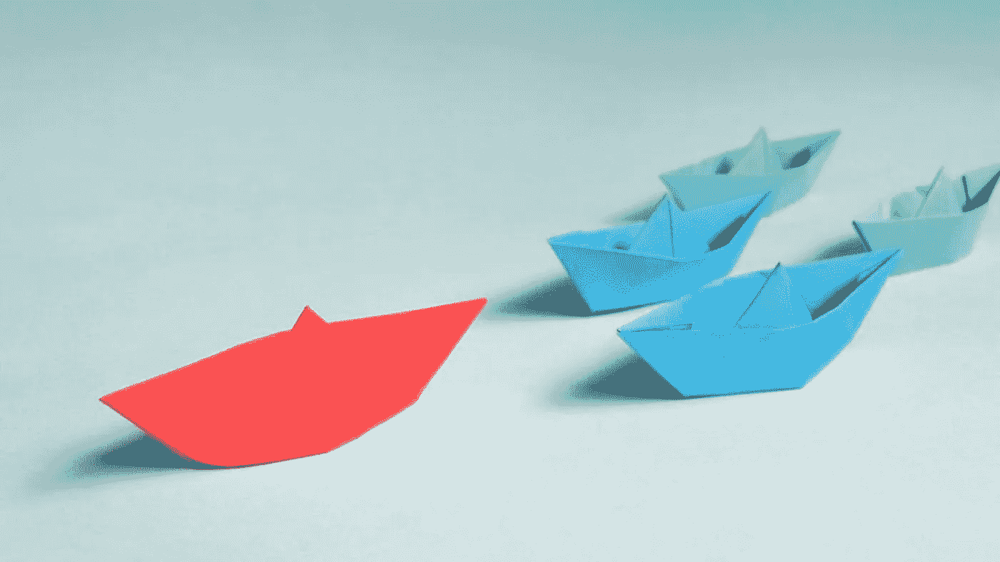

# 社会等级制度的需要和不可避免的本质——第二部分

> 原文：<https://medium.datadriveninvestor.com/the-need-and-inevitable-nature-of-social-hierarchies-part-2-5ddf4413ad4f?source=collection_archive---------1----------------------->

## 学习。忘却。学习。重复一遍。

Image Source: Google

在 [的上一篇文章](https://medium.com/@steffi.Netizen)中，我们谈到了**社会暗示**和**社会地位**以及这些特征如何在人类和非人类灵长类动物中立即发挥作用。在某些部分，我们讨论了社会等级**对于更好的团队生产力和协作的重要性**。

在本文的中，重点将放在社会等级的**生理学**上，比如它们的结构、形成和功能。将阐明人类和非人类成年人社会等级的指标和特征，一系列被认为是社会等级表现的行为，

在接下来的文章(**第三部分**)中，我们将继续学习**自己的地位如何在感知他人的地位中发挥重要作用**，以及学习社会地位如何塑造成年人的认知。

几个迹象表明，社会等级是与生俱来的，在任何人类和非人类的社会中都很常见。

这些特征已经进化成一种更好的群体生活环境。社会等级自然会因物种不同而有细微的差别，但它们可以通过，

> 1.分析一个群体中因身体和智力能力不同而不同的成员。
> 
> 2.群体形成的速度有多快(代表当期望一致时人类分组的**自发性**)。
> 
> 3.他们中的每一个作为一个群体在一起运作得有多好，这表明他们在一个群体中彼此适应得有多好(代表**功能**和**适应** **值**

社会等级制度的存在最终被发现是一种**特征**，它是从**必然性**中进化出来的，因为它有助于人类的同一性一起和谐地发挥作用。

社会等级中最重要的不变因素是**根据**价值维度**对群体成员**进行排名，例如成员是上级还是下级。这种评估群体成员的尺度表明了他们每个人的支配水平。

**优势**通常表现为在有争议的互动中压倒对手/其他参与者。支配也被认为是生存所必需的技能。**个体特征**和**交互作用的结果**都在群体的等级建立中起着重要作用。

此外，等级结构可以导致个体特征的形成。尽管如此，**特别是在人类群体**中，等级不仅与个人特征有关，还经常与群体****共识**和个人拥有的**声誉**有关。**

> **因此，人类群体中的等级制度是多维的，很大程度上依赖于群体，并且是自我强化的。**

****跳到其他方面**，群居动物自发形成等级制度。在许多研究结果中，可以明显看出，群体中成员的地位是通过不对称的优势表现来确定的。**例如**，一个简单的皱眉展示了初次见面的一群猴子中的个体地位角色。**以同样的方式**，未知个体通过成对的相互作用表现出地位，通过支配或顺从的行为或姿势。**

> **随着群体中等级制度的建立，攻击性行为通常会减少，而合作性行为会不断增加。**

**在群体中，地位角色很快被认可和接受是很常见的。当群体内部资源有限、需要特定技能、生活伙伴关系健康时，社会等级制度是帮助 T21 的手段。在团体成员中分配必需品和劳动是最好的方法。**

**在阴暗的一面，社会等级制度被要求提高群体中主导成员的生存水平，并获得对其他成员的影响力。在群体中，每个人保持自己的个性和项目技能是很重要的，这些技能是群体生存所必需的，可以在社会学习过程中培养。**

**例如，作为一个群体，我们追随(向他人学习)成功人士，因为我们相信他们拥有提升自身地位所需的所有特质和技能。结果，所有的优势都给了那些特权很高的人，然后是其他群体成员(希望成功)，这反过来又推动了群体的生产力。**

## **唷！**

**我被发生在我们内部和周围的许多事情逗乐了，这些事情把我们培养成一个特殊类型的人。**

**我将在“**社会等级制度的需要和不可避免的本质**”的下一部分继续其余的内容。**