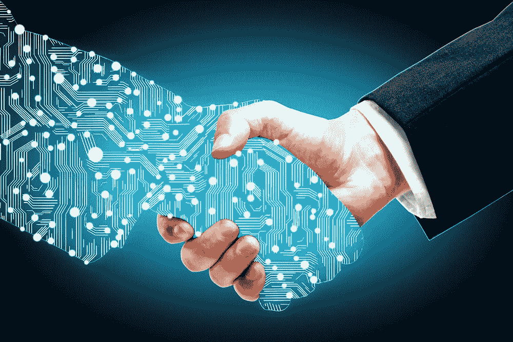
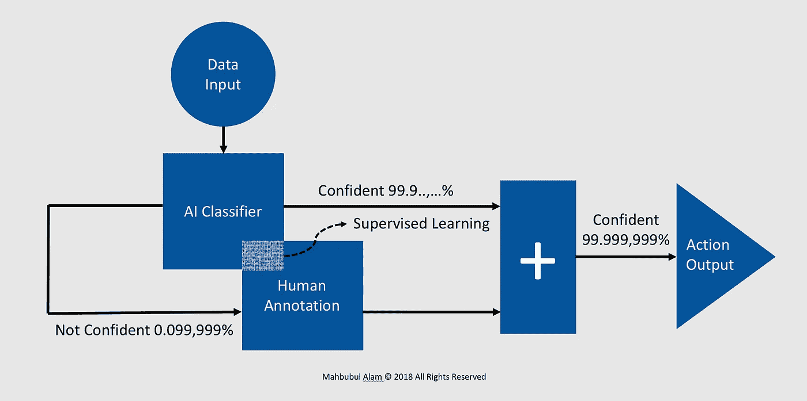

# 无人驾驶汽车需要人类控制

> 原文：<https://medium.datadriveninvestor.com/the-need-for-human-control-in-self-driving-vehicles-a9b0ee2b188d?source=collection_archive---------3----------------------->

自动驾驶汽车诞生的目的是消除人类在方向盘后面的需求。驾驶是一项“例行任务”，由一系列重复动作组成，通过其他车辆、行人和骑自行车者的海洋将车辆从一个地点安全地移动到另一个地点。如果你开车长途穿越严重的交通堵塞，你可能会理解它所需要的紧张努力，更不用说浪费的时间了，时间就是金钱！随着数据可用性的增加，人工智能(AI)近年来越来越受欢迎。像其他工业机器一样，使用人工智能，公司现在正在努力自动化驾驶的“平凡”任务，以便我们可以更好地利用我们的时间。尽管许多公司投资数十亿美元，竞相开发自动驾驶技术，但还没有一家公司完善这项技术。但问题是:技术真的能 100%完美吗？

**人工智能机器**

无论是机器学习、深度学习、神经网络还是其他认知方法，每个行业都在利用人工智能来从数据中获取利润。让我们举几个简单的例子——(1)[Gmail 使用机器学习算法成功过滤了 99.9%的垃圾邮件](https://www.techemergence.com/everyday-examples-of-ai/)。(2) Udacity 的自动驾驶汽车工程师正在建立由深度学习算法组成的项目，作为他们课程的一部分，[以 98%的准确率识别交通标志](https://towardsdatascience.com/recognizing-traffic-signs-with-over-98-accuracy-using-deep-learning-86737aedc2ab)。无论人工智能是用于医疗诊断还是玩棋盘游戏，算法的准确性并不总是 100%，因为归根结底，软件代码就是软件代码，它总是容易受到系统或代码本身缺陷的影响。系统的可靠性只能达到 99.999，999…但几乎不可能达到 100%。汽车行业受到高度监管，这是为了确保人类安全。这也意味着，除非车辆真正可靠，否则它们会给我们的生命带来危险。那么，我们如何确保自动驾驶汽车至少 99.999%可靠呢？

**人在回路架构**

人类将在自动驾驶汽车的安全运营中发挥重要作用，以确保基于人工智能的系统对他们采取的行动更有信心。让我们看看下图中的输入输出循环:

Source: [Mahbubul Alam, BrightTalk](https://www.brighttalk.com/webcast/8615/315173?utm_campaign=knowledge-feed&utm_source=brighttalk-portal&utm_medium=web)

当数据被输入到人工智能分类器(基本上是算法)时，系统会评估人工智能代理所做决策的可信度。如果它不满足执行该动作所需的置信度的阈值，则该任务被转移到人工注释。就自动驾驶车辆而言，远程操作员将对此负责，并为车辆做出关键决定。一旦达到置信水平的阈值，车辆就执行最合适的动作。每当使用人类注释时，它都会被记录在系统中，人工智能会从特定情况中学习——也称为“监督学习”,这是一种在特定情况再次出现时在没有人类注释的情况下存储和使用的记忆。当涉及到有关安全和安保的决策时，尤其是对人的生命而言，置信水平阈值设置得相当高。这反过来又确保了自动驾驶汽车将以高于 99.999%的可靠性运行，如果不是完全的 100%，简单来说就是更少的事故。

是的，自动驾驶车辆来了。人们的假设是，这些车辆将比我们自己驾驶的车辆更安全。但是我们真的骑起来有多舒服呢？我们是否相信这些车辆足够可靠，可以放弃所有控制？自动驾驶汽车将不仅仅是自动驾驶的汽车，它们将成为一个更大的生态系统的一部分，这个生态系统需要电信和与远程操作员的真人互动。最终，人类仍将在车辆的“方向盘”后面，唯一的区别是人类驾驶员与车辆的比例将从 1:1 变为 1:1000，这意味着未来一名远程操作员将负责大约 1000 辆自动驾驶车辆。激动人心的时刻即将到来！

**免责声明:本文表达的观点和意见仅代表我个人，不代表任何其他人或公司。所有内容都受版权保护。*