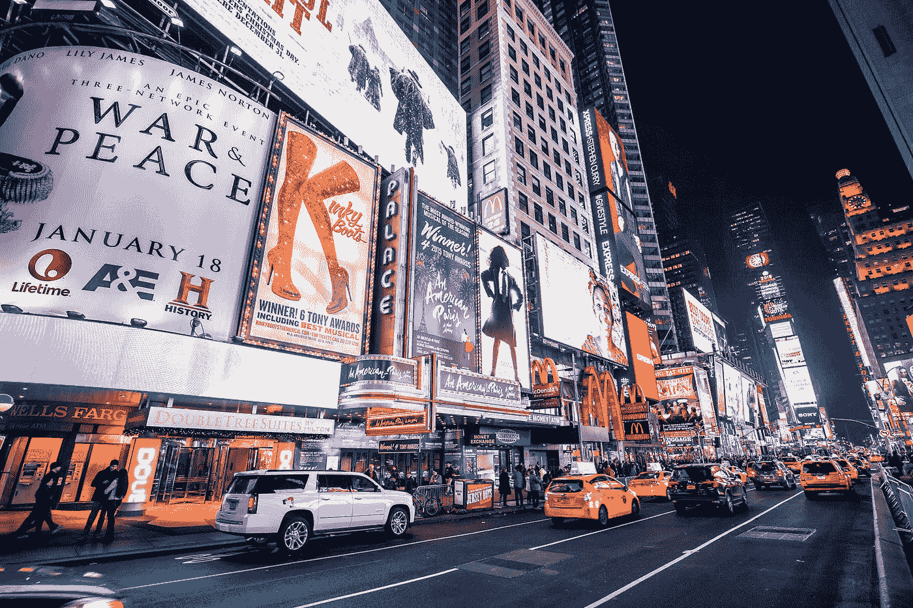

# 广告的力量

> 原文：<https://medium.datadriveninvestor.com/the-power-of-advertising-863da2b1c8a4?source=collection_archive---------3----------------------->

Photo by [Denys Nevozhai](https://unsplash.com/@dnevozhai?utm_source=medium&utm_medium=referral) on [Unsplash](https://unsplash.com?utm_source=medium&utm_medium=referral)

许多人低估了广告对我们的影响。

苹果出售伟大的产品，但其创始人史蒂夫·乔布斯也被许多人称为最伟大的营销者之一。他的天才营销活动证明了这一点，例如 PC vs Mac 广告，宣传 I-pod 是你口袋里的 1000 首歌曲(而不是谈论无聊的技术细节，如它有多少空间和内存——这是竞争对手正在犯的一个错误)，以及他如何以这样的方式宣传苹果产品，专注于使用它们的人群类型，而不是谈论它的优越功能。

史蒂夫·乔布斯也很崇拜耐克，一家销售鞋类商品的公司。但耐克过去和现在都能够通过制作广告来表彰成功的运动员和那些努力尝试的人，从而创造和激发顾客的品牌忠诚度。耐克从不做广告说他们的产品比竞争对手好(尽管有些人声称耐克生产最好的鞋子)。相反，耐克专注于在顾客中创造一种对其品牌的情感反应。

当我阅读耐克创始人的回忆录《鞋狗》(Shoe Dog)时，他提到了他在耐克早期的一次讨论，他意识到人们购买耐克鞋的原因之一是因为他们喜欢该公司所代表的东西。看起来耐克已经在这方面做出了努力，在过去的几十年里，它一直在制作广告，让人们了解他们的主张和价值观。

然而，就营销而言，我认为最伟大的公司之一是可口可乐。苹果创造卓越的产品，并将其与伟大的广告相结合。耐克生产很棒的鞋子，并将其与很棒的广告相结合。另一方面，可口可乐创造了一种可怕的产品。喝可口可乐对健康有很多负面影响，包括糖尿病、蛀牙、肝损伤、胆固醇等。然而尽管如此，许多人继续购买可口可乐。该公司在广告和产品植入上花了这么多钱，以至于大多数人拿起一杯可乐几乎成了一种无意识的行为。

我也不相信这仅仅和品味有关。很多人声称百事可乐比可口可乐好喝(他们都不健康)。在盲品测试中，更多的人更喜欢百事可乐而不是可口可乐。然而，可口可乐已经成为“最受关注”的品牌，当人们想到不健康的饮料，我指的是软饮料时，第一个进入他们脑海的品牌。这是因为可口可乐过分专注于营销。2017 年，可口可乐在广告上总共花费了 40 亿美元，几乎是百事可乐 24 亿美元的两倍。

可口可乐这样做已经有很长时间了。在 20 世纪初，可口可乐甚至将高达 20%的收入用于广告(来源:百事可乐 vs 可乐:营销战纪录片)。一个多世纪以来，可口可乐一直专注于营销，让他们的品牌成为消费者文化和生活方式的一部分。

可口可乐这个名字是特意选择的，因为它更容易记忆。可口可乐是一个有重复发音的单词，更容易记忆。与不知名或容易忘记的产品名称相比，我们更倾向于选择我们记得且容易回忆起来的产品。当我们记得或以前听过某事时，我们会有一种熟悉感。其他公司使用这种营销技术的例子有奇巧和果冻肚皮。

我们中的大多数人甚至没有意识到我们会因为广告而无意识地被某样东西吸引。否则为什么这么多人选择一种对他们来说不健康的饮料，而且它的味道也不如它的竞争对手？

我从来没有意识到好的营销是多么的重要和有效。但是我读的商业书籍越多，我就越发现并不总是好的产品能带来成功。一个对消费者不利的产品，在它的行业中是第二好的(可口可乐没有百事可乐好喝)，如果它与伟大的广告相结合，仍然可以成为最成功的。如果我们没有足够的注意和意识，我们这些消费者可能会成为受害者。伟大的营销是区分成功企业和失败企业的一项独立技能。

还有，不要买可口可乐或者百事可乐。少吃那些东西，它们都对你的健康有害。