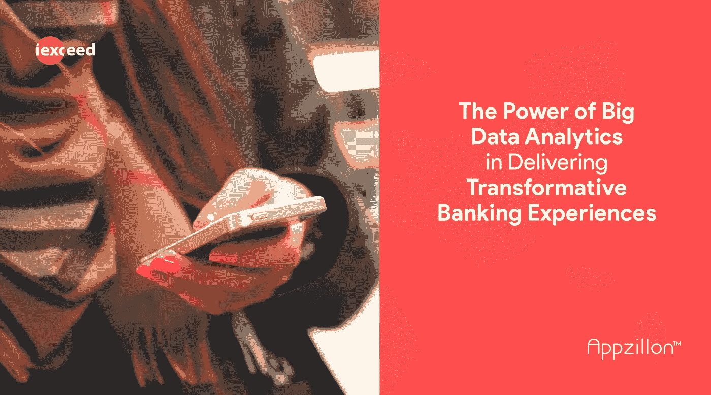

# 大数据分析在提供变革性银行体验方面的力量

> 原文：<https://medium.datadriveninvestor.com/the-power-of-big-data-analytics-in-delivering-transformative-banking-experiences-d23131ab63bc?source=collection_archive---------9----------------------->

世界各地的政府和各种规模的公司都在积极参与大数据项目，因为所有这些数据都有一个故事可以讲述，有可能使业务运营变得更好

虽然数字革命始于 50 年代末，但它对我们日常生活的影响在最近十年左右变得更加明显。出现这种情况的原因是移动设备的广泛使用和更容易访问互联网。这种采用也导致了另一种趋势——连接设备。如今，人们每天都会使用多种设备，并在执行不同活动时在它们之间无缝切换。所有这些因素以及其他几个因素，如信息过度暴露导致的注意力持续时间缩短，以及选择任何产品或服务的多种选择，导致了这样一种情况，即有效吸引和留住客户对于企业的成败至关重要。

那么，如何做出对企业有益的正确决策呢？

早在 2005 年，O'Reilly Media 的 Roger Mougalas 首次创造了“大数据”一词。它指的是使用传统的商业智能技术几乎不可能处理的大型数据集。今天，据说每天产生 2.5 万亿字节的数据，随着技术的不断发展和更快的计算速度，这个数字还会进一步增加。2011 年[麦肯锡发布了一份名为《大数据:创新、竞争和生产力的下一个前沿》的报告](http://www.mckinsey.com/insights/mgi/research/technology_and_innovation/big_data_the_next_frontier_for_innovation?utm_source=datafloq&utm_medium=ref&utm_campaign=datafloq)，单是这个标题就足以毫无疑问地表明数据无疑是新的石油。世界各地的政府和各种规模的公司都在积极参与大数据项目，因为所有这些数据都有一个故事可以讲述，有可能使业务运营变得更好。

 [## 金融科技初创公司正在扰乱世界各地的银行业-数据驱动的投资者

### 传统的实体银行从未真正从金融危机后遭受的重大挫折中恢复过来…

www.datadriveninvestor.com](https://www.datadriveninvestor.com/2018/10/20/fintech-startups-are-disrupting-the-banking-industry-around-the-world/) 

所有这些都导致大数据分析在最近变得非常重要。它与业务的集成有助于在销售/用户旅程的每个可能阶段增加价值，因为可以从所有渠道(移动、网络、物理位置、社交媒体等)获得 360 度的洞察力。)和涉及的设备。这些见解可以用来调整、改造，甚至提出新的计划来改进和优化商业模式、产品和服务。

在银行和金融行业，大数据有望成为创新的关键驱动力之一，帮助银行提高绩效。根据 IDC“全球半年度大数据和分析支出指南”的最新更新(截至 2018 年)，大数据和商业分析(BDA)解决方案的全球收入预计将在 2022 年达到 2600 亿美元，2017 年至 2022 年预测期的复合年增长率为 11.9%。在整个预测中，对大数据和业务分析解决方案投资最大的行业是银行业、离散制造业、流程制造业、专业服务和联邦/中央政府。这一趋势证明，由大数据分析提供的切实可行的见解驱动的业务计划将为成功铺平道路。

麦肯锡的另一份名为《银行业分析:实现价值的时刻》的报告强调，在一些地区，高达 65%的客户现在通过多种数字渠道与银行互动。这通常会导致通过多种渠道和形式与同一客户进行重复的互动。银行现在意识到，必须通过多种渠道无缝地提供一致、相关且最终令人愉快的银行体验，以吸引和留住客户。大数据分析在实时了解客户的活动和期望方面发挥着重要作用，并在用户旅程的所有阶段提供定制产品。

大数据有 3 个定义方面，或者更普遍的说法是 3v——数据量、收集的数据类型的多样性以及处理数据的速度。对于银行来说，这意味着他们可以利用大数据分析的结果来研究消费模式，并确定发生交易的关键渠道，以便向基于不同用户角色细分的客户恰当地交叉销售产品和服务。这些发现还可以用于风险评估、合规性和报告、客户反馈管理以及批准或拒绝贷款等。

IBM 声称，今天的零售和机构银行客户比以往任何时候都更有权力。他们对信息的可访问性提高意味着他们可以在几秒钟内比较产品并自发做出决定，特别是通过银行和金融机构提供的移动应用程序。这大大降低了机会的窗口，这仅仅意味着银行只有几秒钟的时间来说服客户他们产品的价值。因此，他们需要所有有助于改善卓越运营的客户洞察。应用使用分析还积极帮助银行确定其应用的哪些方面最吸引用户，从而导致增强和更新以解决这些发现。通过提供个性化、实时和创造价值的产品，银行可以最大限度地提高绩效，并大幅提高客户保持率。

例如，劳埃德银行集团与美国人工智能(AI)初创公司“Pindrop”合作，在 2016 年使用其技术检测欺诈电话。Pindrop 是一种考虑大量数据来了解合法呼叫和欺诈呼叫之间的区别的技术。Pindrop 设计用于识别电话语音的几个特征，如位置、背景噪音、号码历史等。，这有助于创建音频指纹，进而可用于突出异常活动和识别潜在的欺诈行为。世界各地将大数据分析大量集成到其运营中的银行和金融机构的数量正在与日俱增。

展望未来，很明显，随着技术的进步，大数据分析在银行和其他业务中的作用将进一步发展。正在分析的大量数据有可能最终改变我们的生活方式(自动化、预测性反应和对可能情况的响应等)，大数据分析将成为确保真正个性化和安全的银行体验和运营的下一步。

## [sud hir Babu，](https://www.linkedin.com/in/sudhir-babu-03259a/)I-exceed 产品工程副总裁兼负责人