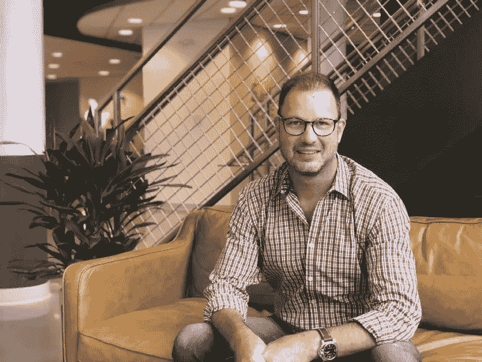

# 问题的力量

> 原文：<https://medium.datadriveninvestor.com/the-power-of-questions-cd3669d7ca8c?source=collection_archive---------14----------------------->

## 提问需要一种成熟，一旦成熟，这就是力量。

源自拉丁语“Quaerere ”,意为“询问”或“寻求”以解决哲学或神学问题，后来被用作“旨在引出讨论答案的话语”。

关于问题和它们所拥有的力量，已经写了很多。事实是，问问题需要一定的成熟，而许多人可能要到很久以后才能问出问题。事实证明，提问并不那么容易。

**我不是一个很好的提问者。**

直到我快 30 岁甚至 30 岁的时候，我很少问好的、试探性的问题。这并不一定是因为我知道答案:我可以向你保证，我不知道。但是我觉得人们希望我知道一些事情。和我打交道的人通常年龄更大，也许更成功，因此，我很少会透露我目前没有答案。不要误会，我在问各种各样的问题，在我的脑海里，但那只是把我对一些事情的理解限制在我自己的探索能力上。通过不问问题，我限制了我可能掌握的信息的范围——我需要这些信息来做出最明智的决定。这个地方叫无知。(如果你对阅读更多关于无知的内容感兴趣，这里有一个我大约一年前写的的[小短文。)](https://www.linkedin.com/pulse/when-ignorance-good-justin-j%C3%A4rvinen/)

几年后，我意识到我的超能力不是知道答案:而是处理大量信息并找到解决方案。它是好奇，制定好的问题集，遵循路径，挑战假设，可视化结果，并提出更多好的问题。最终，我对问题内在力量的理解变得成熟了，并像一个 8 岁的孩子一样拥抱它们。

在 Salt Flats，我们一直在测试我们自己的创新模型，名为*proximity Discovery*，它本质上是通过我们提出的问题来映射想法如何相互联系，进而加深我们对事物的理解并扩展我们的创意画布的边缘。有了这张地图，你可以看到想法是如何相互关联的，同时看着它们以清晰的逻辑从要解决的核心问题中脉动出来。使用这个工具，我们可以对想法进行评分，评估感知的和真实的风险，甚至发现机会来钻取和运行单个想法或功能的过程。正如我的一些同事喜欢说的那样，你可以“缩小或放大”。近似发现是一个可靠的、基础的模型，它基于人类实际上是如何思考的——通过提问来实现。

> 今天，可能更难区分有经验的人，或者博览群书、普遍聪明的人——和伟大的思想家。

**这个模型没有疑问就不存在**。没有问题就不会有创新。问题就是力量。问题是从一个想法到另一个想法的桥梁；它们是神经递质。列奥纳多·达·芬奇以善于提问而闻名，被认为是历史上最伟大的思想家之一。今天，鉴于我们每个人每天消耗的大量信息，获取知识很容易:它几乎无处不在。你几乎可以无意中对任何话题都了如指掌！

# [在 Anchor.fm 上听我最近的播客](https://anchor.fm/justin-jarvinen)

但是当达芬奇挑战他周围的世界时，问题是导致突破的原因。哲学家被视为社会领袖。科学家很少发现他们想要发现的东西——爱因斯坦的广义相对论就是一个很好的例子。今天，可能更难区分有经验的人，或者博览群书、普遍聪明的人——和伟大的思想家。

> 如果人类是计算机，你将拥有存储能力和处理能力。最终，存储走向了云端。

你看，伟大的思想家不害怕提问。他们认为这是获取他们目前没有的信息的一种方式。因此，在我 30 岁出头或 35 岁左右的某个时候，我开始接受问题——公开提问，这样我就有更多的信息可以处理。对于创新、颠覆、转型或任何其他依赖于产生洞察力或差异化思维的业务中的任何人来说，例如在某些类型的咨询中，当然还有在代理界，提问是获得伟大想法的唯一途径。建议:对房间里总是知道答案的人持怀疑态度。答案几乎总是那个人所知道的极限。

> 事实往往是暂时的。

Asking questions helps actors fully understand their characters.

**康斯坦丁·斯坦尼斯拉夫斯基，一位著名的表演教练创造了一种提问方法，他要求他的每个学生都使用这种方法，称为“神奇的如果”。简而言之,“神奇的假设”是一种技巧，在这种技巧中，你向你所扮演的角色引入一个随机的“假设”场景。例如，你是一个在*苦苦挣扎的作家，被迫兼职来支付账单*。太好了，一个演员可以进入角色，并处理这个角色如何处理知道自己是下一个伟大作家的复杂性，同时还必须服务于日常生活。啊，痛苦啊！但是…..如果他出了什么事怎么办？如果他小时候遇到了一个外星人，那个外星人向他解释说写下的任何东西都会成为他自己命运的一部分呢？如果他写的东西真的发生在他身上，比如，他的妻子得了一种疾病，导致他需要定期工作。他会停止写作，尽管他知道自己很棒！提问可以改变未来的进程。在回答了这些问题后，这个角色可能完成了什么？这个故事会把我们带到哪里？**

****你的大脑自然会寻找问题，因为它的工作是做决定……****

**问题确实可以改变任何事情的进程。如果你错过了我关于神经经济学的演讲，有人在这里得到了相当不错的直播。我的部分讨论集中在大脑在决策过程中问自己的问题上。我应该这样做吗？我会得到什么回报？安全吗？值得我花时间吗？在博弈论中，其中一个研究领域叫做[跨期选择](https://en.wikipedia.org/wiki/Intertemporal_choice)。在 IC 中，我们研究今天的决策如何影响未来的潜在选择。另一个与 IC 相关的有趣的问题游戏是 [10/10/10 游戏](https://www.fastcompany.com/3007613/10-10-10-rule-tough-decisions)。在这个游戏中，你要求自己在三个不同的时间框架内思考问题:10 分钟、10 个月和 10 年后。问问你自己，在这些时间框架内，这个决定会对我产生什么影响？或者，基于我对未来某个时刻的理解，我如何改变今天的决定？**

> **问题是决策的基础！**

**1 月 16 日，我们将主持一个关于问题的力量的现场会议。在这个互动研讨会中，我们将探索各种技术并从中获得乐趣。空间有限，所以[今天就注册](https://www.eventbrite.com/e/the-power-of-questions-tickets-52506903562)。**

**##**

****我希望你喜欢这篇文章。我们正在盐滩这里建造一些特别的东西，所以如果你喜欢你刚刚读到的东西，请给我一两下…或者八下掌声。****

****我是贾斯汀·贾维宁，除了偶尔发表一些我感兴趣的文章外，我还负责盐滩生态系统战略&风险投资。我们正在通过一个名为“战略发现”的变革性流程来改变公司应对企业战略的方式，这是一个专有的服务和工具连续体，可以产生新产品、新业务模式和创造巨大价值的新机会。****