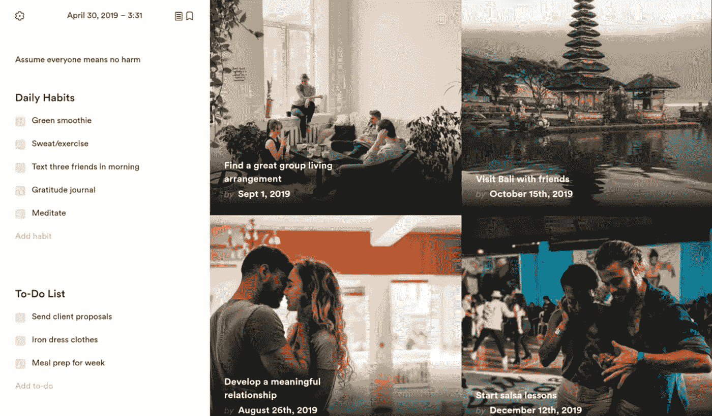

# 使用起来并不麻烦的生产力工具(提示:Chrome 扩展)

> 原文：<https://medium.datadriveninvestor.com/the-productivity-tools-that-arent-actually-a-nuisance-to-use-hint-chrome-extensions-96a06f5960?source=collection_archive---------7----------------------->

作为一个尝试过无数生产力工具和应用的人，我告诉你一个小秘密——大多数都很糟糕，被高估了。为什么？

他们中的大多数在筒仓里工作。你需要在手机和电脑上用多个不同的账户下载多个应用。

 [## 跑步摆脱疯狂:锻炼如何提高你的生产力——数据驱动型投资者

### 没有比锻炼更好的方式来开始一天的工作了。我试着一周至少做四天，在…

www.datadriveninvestor.com](https://www.datadriveninvestor.com/2018/10/23/running-to-get-rid-of-the-crazy-how-working-out-increases-your-productivity/) 

之后，它们要求你定期打开它们，输入最新的有用数据。

但最大的问题是必须记住首先打开所有这些应用程序来输入我们的信息。如果我们打开通知，它们通常会令人非常讨厌。

有一半的时间，当我们打开手机更新我们的生产力应用程序时，我们已经被手机的世界吸引住了——忘记了我们最初检查手机是为了做什么。

那么我们如何解决这个问题呢？

# 为什么这些对我们不起作用？

*从现在开始，为了让这些工具有效，我们需要养成检查我们的习惯追踪和生产力应用的习惯。*

在查尔斯·杜希格的《习惯的力量》(惊人的书)中，他解释了习惯是一个多步骤的过程，从一个触发器开始。

我认为这是一个很大的缺陷——很难在我们的日常生活中如此频繁地创造这些新的触发因素，以至于我们会自动地审视我们的目标、待办事项、习惯等。

很多这样的应用确实提供了提醒、徽章和其他通知——但是是在我们的手机上。对于试图摆脱手机束缚的我们来说，这是一个巨大的问题。

# 输入…Chrome 扩展。

Chrome extensions are accessible at the top of our browsers — in plain sight where we already spend lots of time.

我们大多数人使用谷歌浏览器作为默认浏览器。如果你不知道，你应该知道。能够通过其扩展添加重要功能的最大原因之一，其中许多是免费的。

# 当我们工作的时候，我们已经生活在我们的网络浏览器中了(也就是理想的生产力)。因此，我们的生产力工具也应该存在于此。

当我们要工作的时候，无论是加载我们的电子邮件，我们的客户关系管理，还是我们选择的项目管理工具，我们已经给自己设置了打开网络浏览器的线路。

我们的触发点是“我有工作要做”→打开 Google Chrome(然后转到我们使用的主要网络工具)。从以前开始，它就已经深深印在我们的脑海里了。

那么，为什么要重新发明轮子呢？让我们毫不费力地驾驭这一波已经植入我们大脑的习惯。

# 那么对于生产力来说最好的 Chrome 扩展有哪些呢？

最后，正确的问题！

**我的最爱:**

[谷歌日历](https://chrome.google.com/webstore/detail/google-calendar/gmbgaklkmjakoegficnlkhebmhkjfich?hl=en) —快速点击图标查看您即将举办的活动或添加更多活动的简单方法。

[Todoist](https://chrome.google.com/webstore/detail/todoist-to-do-list-and-ta/jldhpllghnbhlbpcmnajkpdmadaolakh?hl=en)/[any . do](https://chrome.google.com/webstore/detail/anydo-extension/kdadialhpiikehpdeejjeiikopddkjem?hl=en)——我个人痴迷于随身携带我的待办事项列表，并且总是在每个设备上同步。这两者都有很棒的移动应用程序，带有可靠的 Chrome 扩展(和良好的基于网络的版本)。

用于 Gmail 的 Checker Plus—这是一个方便的小邮件图标小工具，功能丰富。我有很多电子邮件账户，在桌面上查看它们是一件痛苦的事情。当我有邮件时，能够快速看到图标变成某种颜色，并且能够点击它，执行快速回复、快速删除等操作。很可爱。因为我认为频繁查看+回复邮件是一个真正的生产力杀手，所以我故意隐藏这个图标，当我准备快速查看邮件时才显示它(在任何给定的时间拖动 Chrome 中的地址栏来隐藏或显示你的扩展图标很方便)。

新闻推送根除者——如果你不小心的话，无意识地滚动脸书的新闻推送已经变成了一个巨大的时间和快乐真空。脸书聪明地连接了我们的大脑，每当我们感觉到各种各样的触发因素而我们没有意识到(例如无聊)时，它就会打开它——所以这个扩展通过在默认情况下用 quite 阻止我们在电脑上的新闻订阅来帮助我们战胜这一点(仅供参考，Chrome 扩展目前在移动设备上不工作)。

# 最后……purpose tab——您的个人清晰控制面板，位于每个新选项卡上。

PurposeTab example screenshot

当我使用其他生产力工具并且它们运行良好时，我想要一种方法将它们联系在一起——并且将它们与更多的“为什么”联系起来。我想要一种自动的方式来提醒自己正在努力的方向。我决定创建[目的标签](https://chrome.google.com/webstore/detail/purposetab-your-clarity-f/fmhpabfiomkjppgbgjbfecjbphmiphmj)。

PurposeTab 是一个免费的 Chrome 扩展，可以作为你的个人清晰仪表板，允许你将目标与行动联系起来([你可以在这里](https://medium.com/@j_gold/purposetab-what-you-need-to-do-and-why-on-every-new-tab-59ddec6b000f)了解更多信息)，以及其他有用的工具，如简单的记事本和书签工具。

这里最关键的是这一切的自动性质；*每次你在 Chrome 中打开一个新标签页，都会显示目的标签页，所以你总是会被(礼貌地)提醒你需要做什么&为什么。*

我们希望以一种最小的、不烦人的方式来做这件事，我们对目前为止版本 1 的反馈感到非常自豪！

我们在 5 月/6 月初推出了一些很棒的功能，包括跨电脑同步、开关某些部分的能力、轻松链接到其他待办事项应用的能力等等。

**下来试试 PurposeTab Chrome 扩展？** [**只需访问 PurposeTab.com**](https://chrome.google.com/webstore/detail/purposetab-your-clarity-f/fmhpabfiomkjppgbgjbfecjbphmiphmj)**，它会将你重定向到 Chrome 网上商店安装扩展。**

如果你想要更多的这类内容，[请在媒体](https://medium.com/@purposetab)上关注 PurposeTab，这是我希望发布更多相关内容的地方。