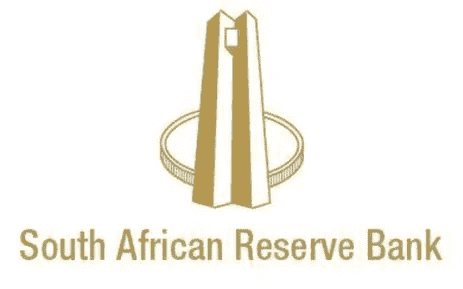

# 禁止比特币的社会经济后果

> 原文：<https://medium.datadriveninvestor.com/the-south-african-intergovernmental-fintech-working-groups-consultation-paper-on-policy-proposals-6b5bbdb5d402?source=collection_archive---------10----------------------->

**南非政府间金融科技工作组(IFWG)发布了关于加密资产政策提案的** [**咨询文件**](https://www.resbank.co.za/Lists/News%20and%20Publications/Attachments/9037/CAR%20WG%20Consultation%20paper%20on%20crypto%20assets_final.pdf) **，** [**请求**](https://www.resbank.co.za/Lists/News%20and%20Publications/Attachments/9037/Joint%20media%20statement_crypto%20assets%20consultation%20paper.pdf) **公众成员和任何受影响的利益相关方就该文件提供意见。我准备并提交了以下回复。**

我很高兴就 IFWG 的咨询文件提出我的意见。

我不想对咨询文件的每一节或每一段作出回应。相反，这份意见书将侧重于 IFWG 建议的加密资产监管方法，并将得出结论，任何拟议的禁令都有可能对所有南非人造成负面的经济后果。

协商文件规定，南非当局保留禁止购买、出售或持有加密资产或使用加密资产进行支付的权利:

*【5 . 3 . 4】****南非目前不打算禁止购买、出售或持有加密资产，也不打算禁止使用加密资产进行支付****……但是，不禁止使用加密资产的决定是基于现有的情况以及目前采用、接受和使用的水平。* ***因此，如果加密资产对各自的监管任务构成重大风险，南非当局保留修正其政策立场的权利***

*(自己的重点)*

*向 IFWG 提交的这份文件:(I)预先阻止南非当局禁止加密资产的任何未来尝试，并强调强大的民族国家(即美国和中国)已经试图禁止比特币，但没有成功；以及(ii)建议南非当局应该仔细考虑如果他们实施限制南非人民购买、出售或持有加密资产或使用加密资产支付的能力的法规，并且加密资产成为世界储备货币，将会有什么影响。*

# ***美国想要禁止比特币，而中国还未能实施他们的禁令***

*美国司法部前联邦检察官凯瑟琳·桓(Kathryn Huan)谈到了 2012 年她在司法部的上司如何要求她帮助“*关闭并起诉比特币*”。从这段 [YouTube 视频](https://www.youtube.com/watch?v=PnuJQIWM34o&t=130s)的 1 分 48 秒开始，凯瑟琳承认从来没有任何机会达到这个结果。*

*在中国，加密货币交易所和交易平台在 2017 年 9 月被监管机构有效禁止。尽管如此，一家加密资产基金的创始合伙人、中国居民埃里克·梅尔策(Eric Meltzer)报告称，中国公民仍在以“场外交易”(OTC)的方式购买大量比特币。关于这一点，请参见 Eric 的[工作证明简讯](http://proofofwork.news/)的第 33 号帖子。*

*这些失败的尝试证明了一个事实，即审查比特币系统是不可能的。事实上，比特币是分散的，没有中央机构、机构或封闭的人群来控制或确保比特币的持续运营。*

*为此，没有切实可行的解决方案来阻止人们使用比特币，我们需要思考这对全球经济意味着什么。*

# ***自由的货币市场***

*比特币不会消失，它的发明创造了一个自由货币市场。实际效果是，与监管相反，供给和需求将决定持有、支出和接受哪些资金。*

*自由货币市场存在于 19 世纪。在我看来，研究这一时期发生的事情是恰当的，因为结果表明，我们在比特币和加密资产方面做出正确的决定是多么重要。*

*在 19 世纪，各国采用了完全由贵金属支持并可立即兑换成贵金属的货币标准。一些国家选择了黄金，另一些国家选择了白银。1717 年，英国率先采用现代金本位制，其他欧洲国家(法国、荷兰、瑞士、比利时和德国)紧随其后。印度、中国和香港等国采用了白银，带来了巨大的经济后果。*

*黄金是比白银更好的价值储存手段，随着越来越多的国家选择黄金而不是白银，黄金相对于白银的购买力增加，这为其他国家加入金本位创造了更大的激励。现实是，自由的货币市场往往会导致“赢家通吃”的结果。参见我的文章“[比特币的下一步是什么:2019 年及以后](https://medium.com/datadriveninvestor/whats-next-for-bitcoin-2019-and-beyond-5202bafa62dc)”，了解这一原则以及它如何也适用于比特币。*

*此外，美国美联储前主席艾伦·格林斯潘在 1966 年发表了一篇[文章](http://www.321gold.com/fed/greenspan/1966.html)，其中包含了对“赢家通吃”结果的解释:*

**“在货币经济发展的早期阶段，可能会使用几种交换媒介，因为各种各样的商品可以满足上述条件。* ***然而，其中一种商品会逐渐取代所有其他商品，被更广泛地接受。对持有什么作为价值储存手段的偏好将转移到最广泛接受的商品，这反过来将使它更容易被接受。这种转变是渐进的，直到这种商品成为唯一的交换媒介。单一媒介的使用非常有利，原因与货币经济优于物物交换经济的原因相同:它使交换在不可估量的更大范围内成为可能。”****

*(自己的重点)*

*白银的非货币化对当时使用白银作为货币标准的国家产生了重大的负面影响。最终，印度在 1898 年从银本位转向金本位，而中国和香港是最后两个在 1935 年放弃银本位的经济体。*

*当印度在 1898 年将卢比的支持转移到黄金支持的英镑时，支持卢比的白银在此前的 27 年里已经贬值了 56%。直到 1935 年，中国一直保持银本位制，在此期间，中国的白银贬值了 78%。这种财富和资本的毁灭带来了广泛的负面社会经济后果。*

# ***南非当局责任重大***

*19 世纪所证明的是，没有一个国家或个人能够脱离自由货币市场所强加的经济现实。简而言之，如果我们最终持有一种正在贬值的货币，而其他人持有一种正在升值的货币，那么与他们相比，我们的财富正在减少，我们都生活在相同的经济中，购买相同或相似的商品和服务，因此我们不能站在货币的错误一边。*

*在这种情况下，当加密资产(比特币)正在成为世界储备货币时，所有利益攸关方都有责任考虑如果南非当局选择限制或阻碍加密资产(包括比特币)的使用会产生什么影响。*

*我的文章“[比特币就像黄金，但它更高级](https://medium.com/datadriveninvestor/bitcoin-is-like-gold-but-its-superior-675977c83746)”阐述了为什么比特币有潜力可持续地作为价值储存手段和整个世界的交易媒介。在我看来，南非当局应该考虑好货币的属性是什么；为什么黄金被世界用作货币；黄金的缺点和比特币成为全球储备货币的潜力。*

*我们应该进行这些调查和思想实验，因为如果比特币(或任何其他加密资产)成为全球储备货币，而南非人在货币化过程中被不公平地限制持有这种资产，那么，就像印度人和中国人在 19 世纪所遭受的那样，南非人将经历巨大的财富毁灭。*

# ***建议的监管方法***

*正如咨询文件中所述，美国商品期货交易委员会主席 Chris Giancarlo 强调，在监管加密资产时，需要采取谨慎且“无害”的方法:*

**“无害”无疑是发展互联网的正确途径。…* ***在健全的政策、监管监督和私营部门创新的适当平衡下*** *，新技术将允许美国市场以负责任的方式发展，并继续* ***发展我们的经济，增加繁荣****

**(自己的重点)**

**这无疑是一种监管加密资产的审慎方法，因为它让美国人能够参与进来，同时全球市场决定比特币或任何其他加密资产是否应该作为价值储存手段和交易媒介在社会中使用。如果加密资产真的成为下一个全球储备货币，那么美国人将能够为自己定位，他们最终将能够保护他们的财富。**

**鉴于潜在的极端负面后果，IFWG 和南非当局应该本着“不伤害”南非人的心态来管理加密资产。**

*****免责声明*** *:评论、观点、意见和对未来事件的任何预测反映引用作者的观点，不一定反映其雇主或为同一雇主工作的其他专业人士的观点，不是对未来事件或结果的保证，也无意提供财务规划或投资建议。***