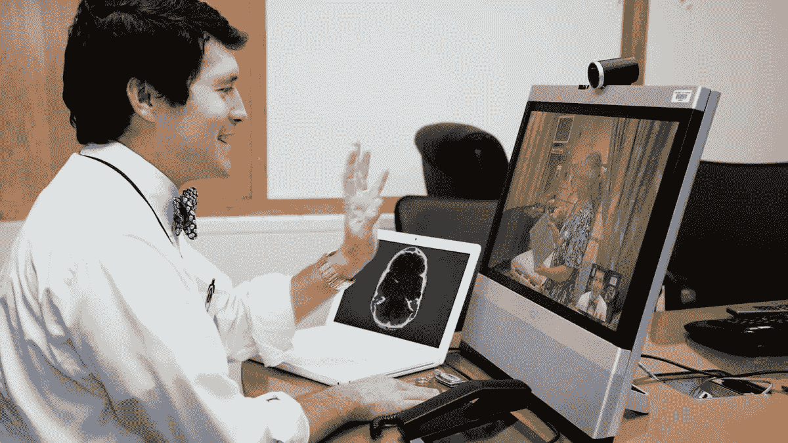

# 远程医疗服务采用率低的主要原因

> 原文：<https://medium.datadriveninvestor.com/the-top-reasons-behind-the-low-adoption-of-telehealth-services-284be5a8c29e?source=collection_archive---------28----------------------->

Telemedicine, Telehealth

一个新的话题是关于覆盖医疗保险不足的一个方面的费用，这是一些医疗保健提供商网络关注的问题。

从理论上讲，远程医疗服务是节省成本、确保所有人更好地获得医疗保健的完美答案。然而，随着越来越多的患者回避使用它，而是选择传统方法，事情似乎并不容易。

 [## 大笔资金和尖端技术:人工智能/人工智能投资将如何革新医疗保健…

### 在过去几年人工智能(AI)和机器学习(ML)的显著发展中…

www.datadriveninvestor.com](https://www.datadriveninvestor.com/2018/03/22/big-money-and-cutting-edge-technology-how-investment-in-ai-ml-will-revolutionize-the-healthcare-industry/) 

CMS 的新发现揭示了远程保健服务的采用率低得惊人，远程保健服务可以提供基于价值的服务而不增加成本。事实证明，在 2014 年至 2016 年期间，只有 1%的医疗保险受益人接受了远程医疗服务的帮助，即使采用率一直在上升。

这使得大约 90，000 名医疗保险受益人使用了 275，199 次远程医疗服务，仅占医疗保险下 3，500 万患者总数的 0.25%。

的确，合作医疗为农村医疗服务提供者在阿片类药物治疗和家庭保健服务等问题上提供补偿。但是它对整个卫生保健团体和病人意味着什么呢？

# **远程医疗服务的挑战**

远程保健是基于价值的护理的主要贡献者，并将成为未来几年高效提供护理的有用工具。我们必须牢记这一点，并考虑任何基于技术的治疗(如远程医疗)带来的挑战。

第一个问题是医学中使用的技术。我们在技术上取得了突飞猛进的进步，但我们的医疗保健系统仍然无法准确有效地利用它。一个主要原因是医疗专业人员和技术制造商之间的差距。我们不得不承认，远程医疗的效用有限，我们正在应对医生的高度不信任和患者的疏远，这限制了远程医疗服务的发展。

第二个问题是验证远程保健系统的适当效用。几乎所有的创新都是由天使投资者、风险资本、私募股权、企业家或所有这些人的利益驱动的，这不是一个隐藏的事实。这意味着他们中的大多数人都在寻找快速的金钱和投资回报。我对此没有异议，但是商业模式的本质使得最终产品或交付物容易受到过早推出和偏见的影响。

第三个问题涉及提供服务的性质或与任何创新相关的公用事业，在这种情况下，远程保健系统。目前，医疗保健计划允许为阿片类药物康复、精神病学和农村地区提供远程保健服务。事实上，精神病学是采用远程医疗服务最常见的领域，85.4%的使用远程医疗服务的人都有心理健康诊断。它们的使用是有效的，因为当前的系统不能被使用或仅在特定情况下被验证。

第四，远程医疗系统的创新已经作为一种替代直接现场临床访问的手段向企业和消费者进行了营销。它不仅助长了误解，而且对医生和病人都有非常危险的后果。远程保健服务永远无法完全取代在许多情况下需要的门诊。

第五，当前的系统及其基于价值的补偿方法鼓励管理式医疗机构将患者留在家中，从而减少临床或医院就诊的次数。通过减少去医院或诊所的次数来最大限度地提高公共卫生的效益和降低成本是非常明智的。但是，通过专门提供虚拟护理让患者呆在家里和限制患者呆在家里之间只有一线之隔，因为他们的医疗问题可以通过远程医疗系统来管理。

第六，远程保健系统的应用将为保健标准设定新的限制，使资源对每个人都是可用的。然而，资源的可用性将受到特定远程保健系统的技术性质的限制。

 [## 突然的决策和政策能拯救医疗保健吗？

### 医疗保险和医疗补助服务中心以及国家健康信息协调员办公室…

medium.com](https://medium.com/datadriveninvestor/can-abrupt-decisions-and-policies-rescue-healthcare-5f790f4d1857) 

# **我们需要采取正确的步骤**

需要高水平的政府控制和监督，以确保医疗保健组织的护理质量和患者安全。同样非常重要的是，每一个虚拟护理系统都要经过其领域专家的适当验证，在这种情况下，专家就是医生。围绕技术的使用应该有足够的意识、知识和培训，以便它可以用于适当的目的，导致更好的临床判断和医疗护理标准的维护。

医疗保健和权力之间的平衡必须以医患关系为中心来建立。只有这样，我们才能建立对远程医疗服务的信任，并在完全公开其功能和隐私问题的情况下实施它。

患者应该有权获得自己的健康记录，而独立医生需要资源来扩大他们的护理范围，以达到完全符合基于价值的报销模式的地区。我们需要超越出于经济原因让病人留在家中而不是出于经济原因去诊所治疗他们的动机。远程医疗遵循个性化护理模式的概念，任何偏离个性化方法的做法都将导致其失败。

我们不能犯在没有首先建立先决条件的情况下出售虚拟医疗平台的错误。有效的远程医疗模式的要素包括战略、技术、个人支持以及清晰透明的交付模式。我们需要以最大化效率和护理质量的方式利用资源，而不是成为另一种财务盈利的工具。

只有应用正确的策略，我们才能提供无国界的医疗服务；否则，我们最终会缩小医疗保健的范围。

加入我们，改变现状。

 [## 全民医疗保健|超越贫困和地理界限

### 无国界医疗组织是一个只有一个使命的联合协作运动.....！创建一个医疗保健…

www.healthcarebeyondborders.com](https://www.healthcarebeyondborders.com/)