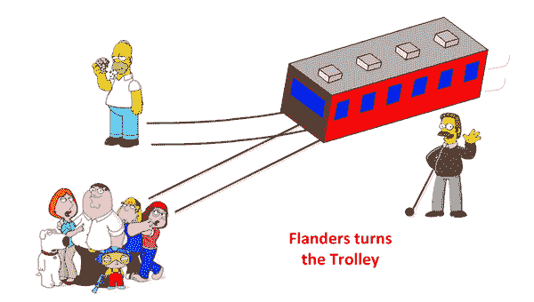

# 电车问题——经济与伦理

> 原文：<https://medium.datadriveninvestor.com/the-trolley-problem-economy-and-ethics-47b6cd7fe9a5?source=collection_archive---------3----------------------->

手推车问题是菲利帕·富特在 1978 年提出的，是一个道德困境。据报道，有五个人面临死亡的危险，因为一辆电车正从他们身上驶过。如果司机拉下刹车，电车开进旁边的街道，人们就能得救。在人行道上，有一个人，如果电车开到那里，这个人就会被撞死。因此，进退两难的问题是，一个司机是选择杀死一个人还是五个人，换句话说，根据边沁(1776 年)，“基本公理是，最大多数人的最大幸福是对与错的衡量”。

可以说杀五杀一的决定是一个提高整体繁荣的决定。除了这种进退两难的政治问题之外，还提出了一个现代经济问题。根据公布的数据，人工智能将废除 50%的工作岗位，因此人类 50%的生产能力将变得无用。因此，要么通过削减社会支出、战争等方式废除这一政策。正如一些人争论的那样，应该找到另一种解决办法(基本收入是一种想法，尽管是在开始)。我们应该只从经济角度思考，还是应该从政治和科学的角度来回答这个问题？

 [## 为什么包容性财富指数比 GDP 更能衡量社会进步？-数据驱动…

### 你不需要成为一个经济奇才或金融大师就能知道 GDP 的定义。即使你从未拿过 ECON 奖…

www.datadriveninvestor.com](https://www.datadriveninvestor.com/2019/03/08/why-inclusive-wealth-index-is-a-better-measure-of-societal-progress-than-gdp/) 

经济学家会问，既然总繁荣随着五个人的死亡而增加，是否应该为此制定一条法律？一项为了让其他人生存而杀死一些人的法律？一项会得到整个社会支持的法律？然而，经济学家的问题是，这种政策不是帕累托(意大利经济学家 1848-1923)最优的，也就是说，这些政策既不能积极帮助人们，也不能伤害他们，因为其他人会再次受到伤害。是否应该为了其他人的福祉而消灭那些对经济构成“负担”的老年人、失业者和弱势群体？

经济学无法应对道德困境，比如电车问题引发的道德困境。这是一个全面繁荣的问题，也是理解和预测人们面对道德困境时的反应的问题。流行经济学的兴起始于 1992 年加里·贝克尔(Gary Becker)获得诺贝尔奖，将微观经济分析扩展到对人类行为和互动的研究，包括对市场之外的人类行为的研究，这一研究在史蒂芬·列维特的名著《魔鬼经济学》(Freakonomics)和史蒂芬·都伯纳至 2005 年的著作中达到顶峰，这是经济学的一个突破，但它们没有回答道德困境。

因此，对于超出金融激励范围、但涉及全人类的问题，这种决定不应仅仅由经济学家来关注，而应成为更广泛的整体政治辩论的一部分。