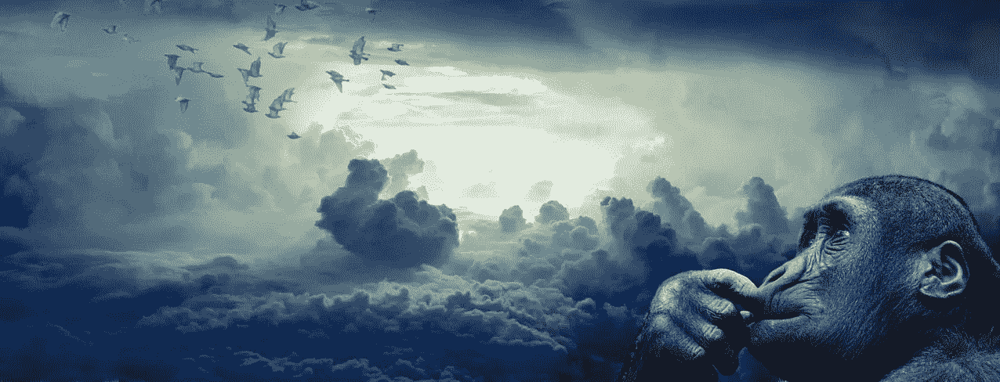
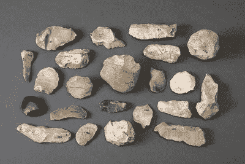

# 世界上最神奇的机器

> 原文：<https://medium.datadriveninvestor.com/the-worlds-most-amazing-machine-3bb4ee9440aa?source=collection_archive---------8----------------------->

## 完全由大自然创造。

在我们的星球上(也可能是在宇宙中，直到我们发现其他情况)设计出的最令人惊奇的计算机不是人类创造的，而是大自然创造的。没有齿轮等运动部件；没有主板，没有中央处理器(CPU)，没有随机存取存储器(RAM)，没有硬盘驱动器或显卡，只有 1000 亿个收集和传输信号的神经元，以及神经元用来传输这些信号的树突和轴突。人脑大约有 75%是由水组成的，是人体中脂肪含量最高的器官，其中至少有 60%是脂肪。它是人类神经系统的主要器官，与脊髓相连。这两者构成了中枢神经系统。大脑由大脑、脑干和小脑组成。它控制身体的大部分活动；处理、整合和协调它从感觉器官接收的信息；做出决定并向身体的其他部分发送指令。

现代人脑大约在 700 万年前开始了它的旅程。大约在那个时候，大约 100 万年左右，一种生物从猿类群体中出现，虽然主要表现出类似猿的习惯，如用四只脚走路或用指关节走路，但也有用两条腿走路的能力:这是猿类家族中第一个双足成员，我们人类就是从这个家族中出现的。

 [## 模式和机器人:复杂的现实|数据驱动的投资者

### 哈耶克的名著《复杂现象理论》(哈耶克，1964)深入探讨了复杂性的话题，并断言…

www.datadriveninvestor.com](https://www.datadriveninvestor.com/2019/03/04/patterns-and-robotics-a-complex-reality/) 

这种生物不是我们的直接祖先，而是 28 种非常早期的类人物种中的一种，这些物种在接下来的几百万年里开花、繁盛并灭绝。

这种生物被命名为 Paranthropus Aethiopicus。它的脑容量约为 450 毫升，约为现代人的三分之一，但比我们的近亲黑猩猩还要大。慢慢有证据表明 Aethiopicus 可能是第一个使用工具的人。

人类的大脑是如何从 450 毫升增长到现在的大小的一直是很多争论的主题，但它与饮食从坚果、根茎和水果到更多的肉类的逐渐变化密切相关。已经发现的最早的石器工具表明，它们被用来从食腐动物的骨头上刮下肉，并粉碎它们以获取里面的高蛋白骨髓。自然决定了更大的大脑会产生更好的大脑，进化力量倾向于更聪明的动物。

更多的人类猿跟随猿，包括生活在大约 250 万年前的南方古猿加尔希，他们开始使用更复杂的石器。当被认为是智人的直接祖先的能人首次出现时，大脑的大小似乎在接下来的大约一百万年中逐渐增加。这个早期人类的大脑容量为 950 毫升。它们下颚的形状和牙齿的大小表明它们不是像它们的祖先那样吃坚果、根茎、块茎和树皮的生物。这种粗糙的素食需要非常复杂和高能量的消化系统。

哈比利斯被昵称为杂工，因为它有相当复杂的工具制造能力，而且它的饮食越来越富含蛋白质。任何种类的高蛋白食物，包括从动物尸体、白蚁、啮齿动物和小动物身上捡来的肉，都会不可避免地使大脑变大。随着我们的祖先消耗更多的肉类，他们的身体将复杂的消化系统所需的能量重新分配给构建更大的大脑。科学家已经积累了早期人类用肌肉换取大脑的证据。通过发展火的用途并利用它来烹饪，它使肉类和采集的食物更易消化，减少了对复杂消化系统的需求。我们食草祖先的一个可能遗留物是人类的阑尾。它是一个附着在大肠上的小袋，与小肠连接，不直接帮助消化。

时间向前跳跃到大约 20 万年前出现在地球日历上的早期智人(美国)，大脑大小已经增加到与现代人一样大，大约 1,345 cc，男性略大，女性略小，性别之间的大小差异与智力水平无关。

发展中的现代人类的更大的大脑产生了一个主要问题。女性必须比她们远古的祖先更早分娩，因为大脑更大的婴儿在某个阶段后无法通过产道。科学家认为，这种进化变化始于远古祖先的大脑达到 850 cc 的成人尺寸。人类学家罗伯特·马丁称之为“大脑的卢比孔”，一旦越过这条线，将需要更长的童年。当比较刚出生的黑猩猩和人类时，一个黑猩猩婴儿生来就具有爬在母亲背上的能力，几个月内就几乎可以自给自足。人类婴儿在出生后的第一年是无助的。在接下来的几年里，它完全依赖父母。婴儿出生时的大脑容量约为 370 立方厘米，在出生后的第一年里，大脑容量增加到约 960 立方厘米，此后，增长率下降。

研究表明，五岁以下的现代儿童使用 40%到 85%的新陈代谢率来维持他们快速成长的大脑。成年后，这一比例下降到 15%到 25%。

正是大脑的神经元使我们的思维、感觉、视觉、运动和几乎所有对我们人类来说重要的事情成为可能。1000 亿个神经元是我们大脑的机器，聚集在我们的头骨内，形成一团果冻状的灰质。

这台神奇的机器已经发展了数百万年。它把我们从一个可怕的半猿半人的人类带到了月球，然后又回来。在火被用来避免灭绝之前，人类已经存在了足够长的时间。它让我们重塑了我们赖以生存的星球，让我们成为毁灭自己的工具。我们的大脑具有创造性和破坏性。他们允许我们创造美丽的艺术和自我毁灭的武器。他们为人类提供了舒适生活和环球旅行的能力，并创造了可能导致我们自身毁灭的机器。

如果我们能存活那么久，那么在接下来的 20 万年里，人类的大脑会去哪里？我们过去常说“天空是极限”。现在，我们观察和探索天空。

## 我们奇妙、惊人的人类机器会进化到我们学会和平、和谐地生活在一起的程度，还是会播下我们集体毁灭的种子？