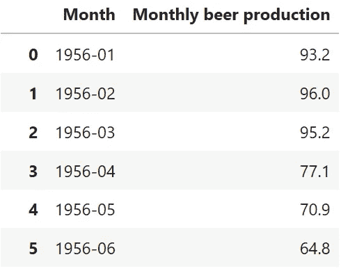
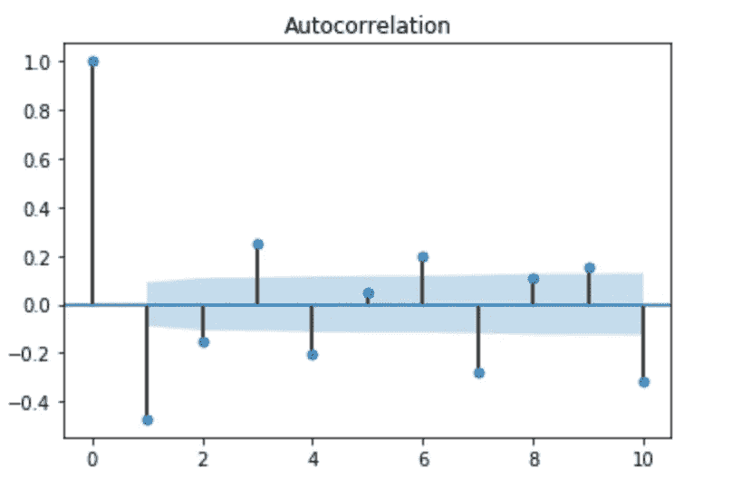
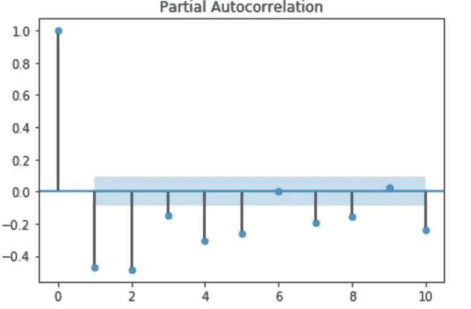
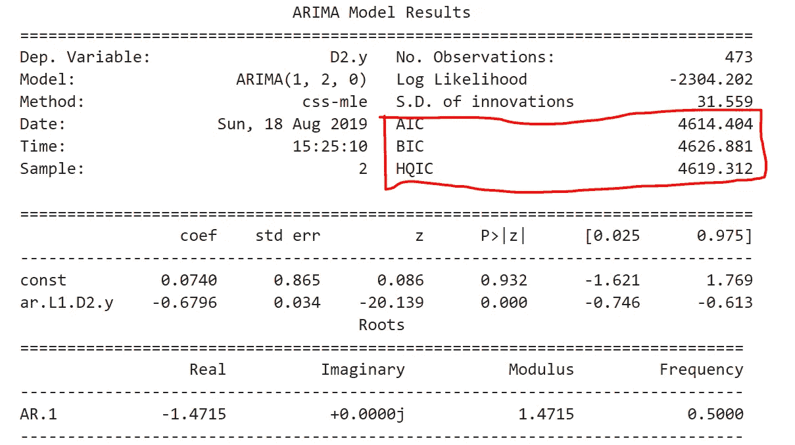
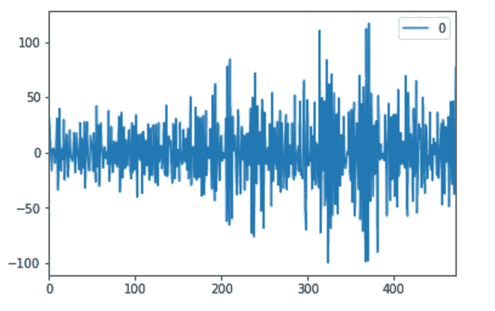
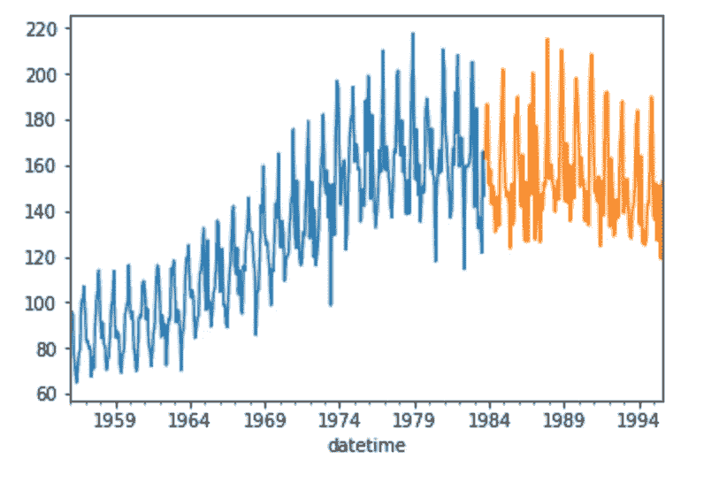
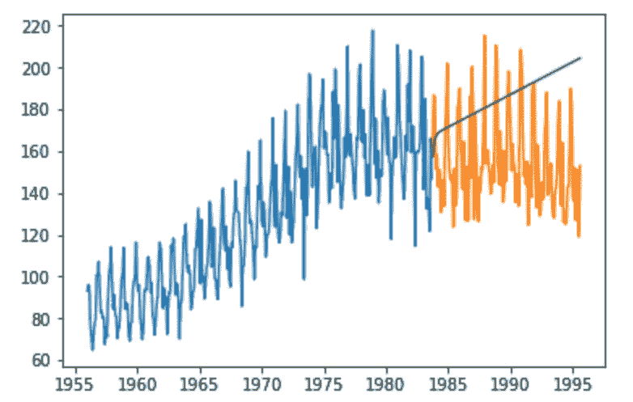

# 用 Python 进行时间序列分析

> 原文：<https://medium.datadriveninvestor.com/time-series-analysis-with-python-f5ab388b865a?source=collection_archive---------0----------------------->

时间序列是一系列按时间顺序排列的数据点，通常时间点间隔相等。时间序列的例子有股票价格、月收益、公司销售额等等。时间序列可以被视为具有目标变量(价格、回报、销售额……)和唯一特征(时间)的数据。事实上，时间序列的想法是，我们可以通过分析给定变量在整个时间内的行为来推断有趣的信息。然后，如果出现相关的发现，就有可能预测我们未来的价值趋势。

在开始分析之前，有必要花些时间介绍一下我们将要使用的模型。它们属于自回归移动平均或 ARMA 模型。ARMA 模型的思想是，给定一个时间序列 *Y* ，在时间 *t* 的 *Y* 的值可能取决于它过去的值(这是自回归分量)和它过去的误差项，误差项应该是白噪声(这是移动平均分量)。


一般来说，每个统计模型都是按照一个确定的方法进行估计的(即，用普通的最小二乘法估计回归)。在我们的例子中，ARMA 模型是根据最大似然估计(MLE)来估计的。基本思想非常直观:给定样本的参数向量的 MLE 是该样本更可能被观察到的值。

[](https://www.datadriveninvestor.com/2019/02/28/descriptive-vs-inferential-statistics-whats-the-difference/) [## 描述性与推断性统计|数据驱动的投资者

### 描述性统计和推断性统计是统计分析的两大分支。根据定义，描述性的…

www.datadriveninvestor.com](https://www.datadriveninvestor.com/2019/02/28/descriptive-vs-inferential-statistics-whats-the-difference/) 

模型的拟合过程将返回估计的系数。但是，我们需要知道那个模型的顺序( *p，q* )。要做到这一点，时间序列分析的第一步(我要补充的是，任何数据分析任务的第一步)是研究和熟悉我们的数据，检查它们并制定一些初步假设。

为此，我将使用 [Kaggle](https://www.kaggle.com/shenba/time-series-datasets#monthly-beer-production-in-austr.csv) 上的一个免费数据集，其中包含奥地利每月的啤酒产量:

```
df=pd.read_csv('monthly-beer-production-in-austr.csv')
df.head()
```



让我们来看看我们的数据的行为:

```
df['datetime'] = pd.to_datetime(df['Month'])
df = df.set_index('datetime')
df.drop(['Month'], axis=1, inplace=True) df.plot()
```


正如你所看到的，在 1959 年和 1979 年之间有一个明显的上升趋势，然后产量似乎稳定下来，并缓慢下降，直到 1985 年:从这里开始，它再次上升，也有一些下降，因此很难确定一个明确的模式。

现在，每个时间序列都可以分解成四个主要元素或组成部分:

*   **级别**:系列的平均值
*   **趋势**:该值的“方向”，可以增加或减少
*   **季节性**:这是一个系列中重复的短期周期
*   **噪声**:是序列中的随机变化，无法用现有信息解释

注意，所有序列都有水平和噪声，而趋势和季节性是可选的。为了验证这些可选元素的存在，将系列分解成这些组件是有用的，我们可以通过使用一些 Python 工具来实现:

```
from statsmodels.tsa.seasonal import seasonal_decompose
result = seasonal_decompose(df, model='additive')
result.plot()
```


这里，我假设模型是可加的。这意味着我们的变量的值是由上述分量的总和给出的:

```
Y(t)=level + trend + seasonality + noise
```

相反，有一些模型假设这些元素的值是相乘得出的，而不是相加得出的。

现在需要引入一个进一步的概念:平稳性。

理想情况下，我们希望管理稳定的序列(也就是说，在一段时间内具有恒定的均值和方差),以便绕过时间序列的主要问题:在固定时间 *t* 观察目标变量的所有可能实现的不可能性。事实上，我们只观察到任何给定变量在一段时间内的一条实现路径。

有不同的方法可以使时间过程静止。其中之一是简单地取其一阶差，一旦减去季节成分:

```
import numpy as np
x=df-result.seasonal
diff=np.diff(x)
plt.plot(diff)
```


它现在看起来更稳定了。嗯，我们所做的这些干预——去掉季节性，取第一个差异——可以直接实施到模型中，建立所谓的 SARIMA(季节性自回归综合移动平均线)。事实上，“综合”部分考虑了系列的 *dth* 差异，而“季节性”部分考虑了季节性。

因此，正如我之前所说，训练模型之前的最后一步是决定参数的数量 *p* ， *q* ，在这个特定的情况下， *d* (我们必须采取的差分顺序，以使我们的系列平稳)。一个好的方法是检查我们系列的自相关函数和偏自相关函数:

```
from statsmodels.graphics.tsaplots import plot_acf, plot_pacf
plot_acf(diff, lags=10)
plot_pacf(diff, lags=10)
```



这些函数告诉我们时间序列值是否与它们过去的值有某种关联，如果有，到什么时间滞后。考虑到 *t* 和 *t-n* (ACF)之间的值之间的所有相关性，或者仅考虑 *t* 和 *t-n* (PACF)处的值之间的相关性，可以计算这些序列相关性。

如何解释这两个情节？基本配方如下:


一般来说，训练一个以上的模型并根据给定的标准对它们进行比较总是一个好的做法(我将在后面详述这个概念)。幸运的是，Python 中有一个函数可以在几秒钟内进行比较，返回参数的最佳组合(同样，我们仍然需要定义“最佳组合”的含义)。

在使用这个函数之前，让我们通过选择低数值的 *p* 、 *q* 和 *d* 来训练一个非常简单的 ARIMA 模型。

```
from statsmodels.tsa.arima_model import ARIMA
model = ARIMA(diff, order=(1,2,0))
model_fit = model.fit()
print(model_fit.summary())
```



一旦训练好模型，要做的第一件事就是检查它的残差。事实上，为了使我们的模型足够精确，基本原则是残差是稳定的，没有特定的趋势。事实上，如果有一个趋势，这将意味着仍然有一个模型没有捕捉到的模式，有一些可用的信息没有被使用。如果残差不是平稳的，那么我们的模型需要更多(或不同组合)的参数。

让我们检查一下我们的残差:

```
residuals = pd.DataFrame(model_fit.resid)
residuals.plot()
```



它们看起来可能是静止的，但我们需要测试它。为此，我将采用永盒测试，其假设是:

*   H0:数据是独立分布的
*   H1:数据不是独立分布的(因此，它们表现出序列相关性)

让我们检查一下这个测试运行到第 10 个延迟时的输出:

```
from statsmodels.stats.diagnostic import acorr_ljungbox
acorr_ljungbox(residuals, lags=10)
```


返回数组中的第二个列表包含来自 Ljung box 测试的 *p 值*:由于所有的 *p 值*都低于 0.05，您可以用> 95%的置信水平拒绝序列与其前 10 个滞后之间没有自相关的空值。正如你所看到的，测试拒绝了我们的第一个假设，没有相关性。这意味着我们的模型无法捕捉所有可用的信息，考虑到我们随机设置其参数，这是可以理解的。

现在，正如预期的那样，让我们使用 *auto_arima()* 函数来检查最佳模型。它根据 AIC、HQIC 或 BIC 值返回最佳 ARIMA 模型。后者(在上面模型总结中的红框中)是三种不同的信息标准:它们绕过了如果我们只依赖 MLE(倾向于增加参数数量以最大化联合发生概率)会出现的过度复杂的风险。事实上，当参数数量增加时，这些标准惩罚了 MLE 函数，遵循了成为统计理论基本原则的“简约法则”(引用奥卡姆的 Williams(1287-1347)，“最好的模型是那些简单且与数据拟合良好的模型”)。

所以我们先把我们的时间序列分成训练集和测试集。在这里，我将再次使用原始的、不稳定的数据集，以便您可以看到 *auto_arima()* 将如何尝试使用特定的模型来修复它。

```
train = df[:int(0.7*(len(df)))]
test= df[int(0.7*(len(df))):]train['Monthly beer production'].plot()
test['Monthly beer production'].plot()
```



现在让我们运行我们的 *auto_arima()* 。为此，您需要通过控制台上的 pip install*pip install pmdarima*来安装*金字塔*包。

```
from pmdarima.arima import auto_arima
model = auto_arima(train, trace=True, error_action='ignore', suppress_warnings=True)
model.fit(train)
```


如你所见，最好的 ARIMA 模型是参数为 1，1，1 的模型。现在是时候做一些预测了:

```
import matplotlib.pyplot as plt
forecast = model.predict(n_periods=len(test))
forecast = pd.DataFrame(forecast,index = test.index,columns=['Prediction'])#plot the predictions for validation set
plt.plot(train, label='Train')
plt.plot(test, label='Test')
plt.plot(forecast, label='Prediction')
plt.show()
```



正如你所看到的，该模型能够捕捉到(并夸大了一点)1985 年后再次开始的轻微上升趋势。很明显，我们的模型将我们啤酒产量的突然下降解释为暂时的，预测了长期的上升趋势。

最后，我们可以使用均方根评估指标来评估我们的结果:

```
from math import sqrt
from sklearn.metrics import mean_squared_errorrms = sqrt(mean_squared_error(test,forecast))
print('Root Mean Squared: {}'.format(rms))
```


综上所述，Python 提供了几种时间序列分析的工具，你可以决定是依靠 *auto_arima()* 还是借助信息准则找到你的最佳参数个数。