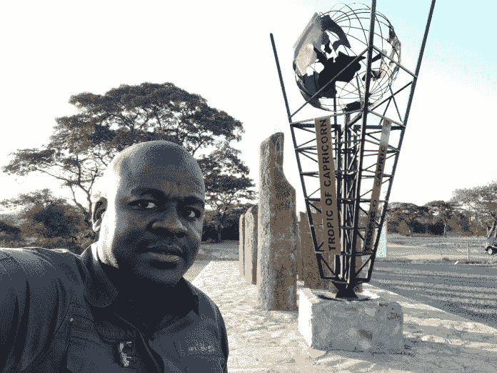
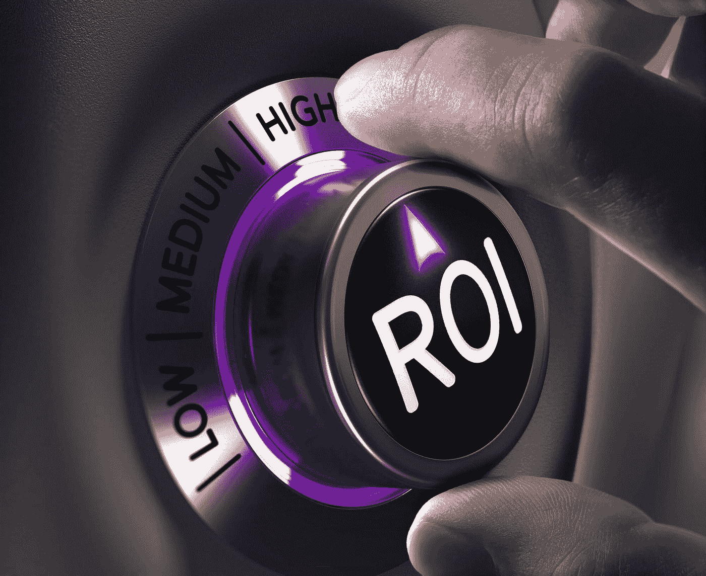

# 为了获得优势，有影响力的人推动市场

> 原文：<https://medium.datadriveninvestor.com/to-gain-an-edge-influencers-move-markets-2025d8f05a35?source=collection_archive---------36----------------------->

## 影响者营销挖掘名人的领域

Henny Mohenyi Maruapula is an expert influencer.

影响力营销提出了几个问题:不仅是它是什么，它还是一个东西吗？

[Henny Mohenyi marapula](https://twitter.com/hennymaps)坚定地肯定了第二部分。毕竟，他以贸易为生。[通过他的业务](https://webfluential.com/hennymaps)，他专门从事社交媒体营销和管理、品牌意识、活动后勤、影响力和公共关系策略。

“影响者营销是一种专注于有影响力的人而不是目标市场的营销形式，”马鲁普拉说。“它识别对潜在客户有影响的个人，并围绕这些影响者组织营销活动。

“影响者营销的内容可以被框定为推荐广告，其中影响者自己扮演潜在买家的角色，”他说。

影响者投资回报(ROI)可以通过多种方式获得。

“最现实的是获得更多的关注，人们谈论和使用由影响者营销的产品，”马鲁普拉说。“另一个投资回报是销售额或收入的增加，以及营销产品的更多渗透。

“纯粹基于影响者的专业知识，对营销产品或服务的可信度、保证和客户满意度可以成为投资回报，”他说。“挑选最适合该活动的有影响力的人，并让合适的人追随或参与其中，这一点至关重要。”

 [## 数字营销人员是否已经到达了人间天堂？

### 合作使他们与大公司平起平坐

medium.datadriveninvestor.com](/have-digital-marketers-reached-heaven-on-earth-1fd805b078ee) 

简而言之，正确的目标市场意味着更快的投资回报。

根据 Maruapula 的说法，影响范围是影响者营销的一个重要指标，取决于各种因素:

*   市场范围——个人有能力联系的人数。
*   独立性——影响者在推广特定观点时是否有既得利益。
*   影响频率——个人影响购买决策的机会数量。
*   专业知识——影响者在多大程度上是主题专家？
*   说服力——忽视影响者建议的后果程度。
*   角色的彻底性——在决策生命周期中施加影响的程度。

# 忽略了什么是重要的

“覆盖面很重要，但这些关键方面同样重要，”马鲁拉普拉说。“没错，但令人难过的是，大多数公司都懒得去寻找这些标准，或者检查某个特定的影响者是否符合所有的条件。他们只是检查范围，然后绕过其他检查点。

“你可以接触到 100 个人，只有一个人购买，但接触到 10 个人，有 3 个人购买，”他说。“看看影响力较小的公司如何产生更大的影响，增加销售额。想想吧。”

影响者营销活动的成功可以是有形的，也可以是无形的。

“它是有形的，从某种意义上说，你可以很容易地触摸和看到钱进来——如果它是产品——或非有形的——特别是如果它是一种服务或品牌意识，”马鲁普拉说。“在这种情况下，成功可能是有更多关于服务的询问。

“成功也可以是上市后的，”他说。“竞选结束后，媒体平台上可能会有更多的谈论。因此，影响者营销活动会在人们心中产生持久的影响。”

 [## 影响者拯救濒临破产的公司

### 最好的人建立关系，创造高质量的线索

medium.datadriveninvestor.com](/influencers-rescue-companies-on-the-brink-c2359ee77737) 

在寻找影响者时，马鲁普拉推荐了以下几类人:

*   积极分子:有影响力的人参与他们的社区、政治运动、慈善机构等等。
*   联系:有影响力的人拥有庞大的社交网络。
*   权威:有影响力的人受到他人的尊敬和信任。
*   活跃的头脑:影响者有多种多样的兴趣。
*   引领潮流者:有影响力的人往往是市场的早期采纳者或离开者，因此，公司必须明智地选择特定的活动。

有鉴于此，Maruapula 定义了这些主要类型的影响者:

*   教育工作者——乐于助人，富有洞察力。
*   教练——乐于助人和积极参与。
*   艺人——依靠参与和灵感茁壮成长。
*   魅力——依靠洞察力和灵感茁壮成长。

# 争取参与

“有影响力的人应该改变对客户品牌或产品的态度，”马鲁普拉说。“潜在顾客或客户态度的改变基于影响者产生的内容。

“有一个被称为种族的模型，它代表延伸、行动、转变和参与，”他说。“这些步骤旨在帮助品牌在整个客户生命周期中与客户互动。”

*   接触:找到有影响力的人，进入信息发布渠道，如脸书、推特或 Instagram。
*   行动:通过创建二次营销活动来鼓励参与，以产生更大的意识，从而达到更大范围的目标消费者。鼓励目标客户在社交媒体上分享他们的观点以参与主题。
*   转化:影响者应该将他们的追随者转化为产品的顾客。形成对产品的了解后，再做购买决定。影响者营销被认为是产生销售的有力工具。
*   参与:建立客户关系是关键。影响者应该把首次顾客变成产品的忠实顾客。

**关于作者**

吉姆·卡扎曼是拉戈金融服务公司的经理，曾在空军和联邦政府的公共事务部门工作。你可以在[推特](https://twitter.com/JKatzaman)、[脸书](https://www.facebook.com/jim.katzaman)和[领英](https://www.linkedin.com/in/jim-katzaman-33641b21/)上和他联系。

*原载于 2018 年 11 月 13 日*[*www.datadriveninvestor.com*](http://bit.ly/2OEGDd3)*。*