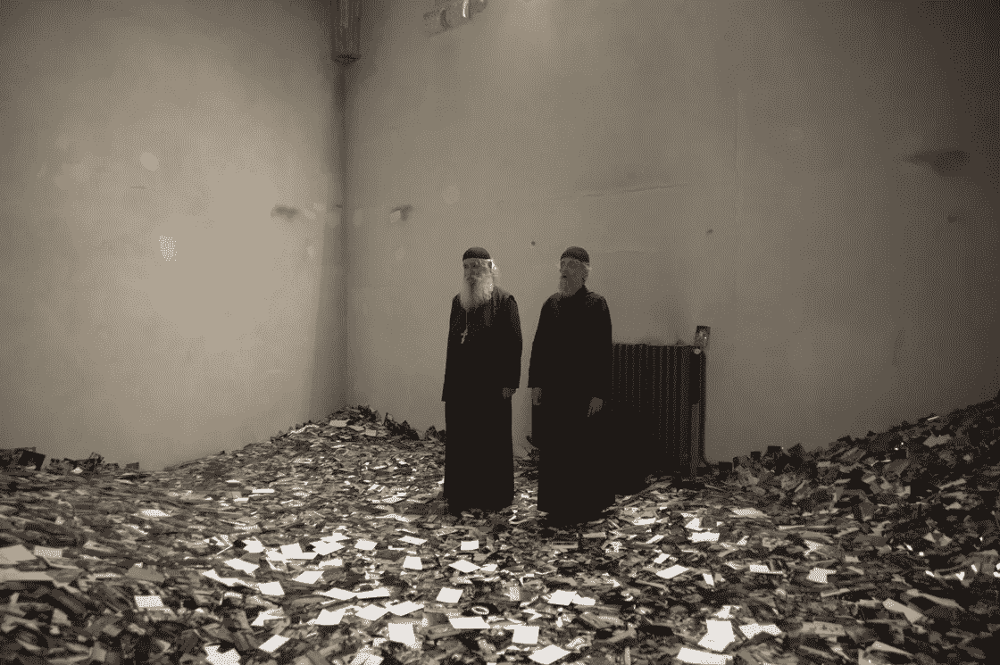

# 永远不会被忘记

> 原文：<https://medium.datadriveninvestor.com/to-never-be-forgotten-b394986e6c74?source=collection_archive---------5----------------------->

Erik Kessels — 24 Hrs of Photos

他可以重建他所有的梦，所有的幻想。有两三次，他重建了一整天。他告诉我:我自己的记忆比世界形成以来所有人的记忆都多。”

纪念的快乐——豪尔赫·路易斯·博尔赫斯 1942

~~~

我拿着一张年轻女子的照片。她穿着白色的裙子，戴着手套，坐在一个空荡荡的房间的地板上。在她的左边坐着一个男人，但是只能看到他的肩膀和一只手的一部分。照片被撕成了两半。

照片中的女人是我的母亲。我只在第二个人失踪的时候见过这张照片，当我很小的时候，我会盯着她旁边的空白，好像盯得足够久就可以揭示神秘人的身份。我曾经问过我妈妈他是谁。“哦，我不记得了，”她撒谎道。

~~~

1871 年,《思辨哲学杂志》上发表了一篇文章—*—*记忆的显著案例——描述了居住在俄亥俄州的 54 岁盲人丹尼尔·麦卡特尼的案例。从 1827 年 1 月起，他九岁的时候，麦卡特尼可以非常详细地记得他生命中的每一天。在过去的 40 多年里，当给定任何日期时，他都能够确认星期几，描述天气，回忆他吃了什么，并提供当天事件的详细描述。

原来，麦卡特尼先生患有现在被称为“超强记忆症”或*的高度自传体记忆* (HSAM)这种疾病使人们能够时时刻刻回忆起自己生活的确切细节。他们无法忘记。

虽然我们中那些头脑分散的人可能会羡慕这种非凡的能力，但许多患者发现这种经历令人难以承受，他们的大脑中充斥着过去的场景。随着这些记忆一遍又一遍地回放，它们描述了对几十年前所犯错误的持续悔恨。看起来，有太多的记忆是可能的。

当我收到脸书鼓励我记住这一天的通知时，我思考着这个问题。它的算法似乎把我过去某个特定时刻的图像拼凑成了一个大杂烩:一个朋友的笑脸放在我看到的一辆待售露营车的图像旁边，还有我在旧公寓的家具上发现的霉菌的照片。那真是值得纪念的一天吗？

记忆这个词来自“mem”，意思是“头脑”。当我们记忆时，我们“想起”。它与单词 mimmer 有关，表示溺爱或梦想。在荷兰语中,“记住”翻译成 her ineren——字面意思是“使内部重新形成”。

这表明记忆是一种缓慢的、沉思的行为，是一种对我们故事的一部分的内心复述。一些东西充当了触发器——从图像、声音或气味到一个简单的词——引发了一系列的联想，突然我们发现自己陷入了过去的“梦”中。我们被邀请去‘钟爱’这一刻。

人工智能、机器人或计算机实际上什么都不记得:它们只是根据一套算法提取和分析数据。当他们试图“回忆”时，他们得到的是可笑的，有时是痛苦的错误。

然而，每天我们都通过众多的社交媒体平台向互联网上传数百万张图片。这些相同的平台鼓励我们“记住”、“保存”和“分享”:照片、视频、标签、文件、引用、笔记、链接、列表。如果你的数字数据还不足以让你忙起来，谷歌的 Photoscan 应用程序可以扫描你最喜欢的打印图片并将其存储到云中，这样可以保持它们“安全、可搜索和有组织”。还担心你会错过某个时刻吗？Roader Time Machine 是一款可佩戴的相机，可以持续记录数据，所以当你按下按钮时，你也可以获得事件发生前的 10 秒钟。

放心:一切都有救了。什么都不缺。什么都记得。什么都不会被忘记。

这种持续的数据积累意味着我们正在迅速接近一个时刻，我们很可能“回到过去”，并“记住这一天”，或任何一天，非常详细。随着我们屈服于数字时代日益增长的自我展示的要求，我们越来越成为我们自己和彼此的狗仔队，将我们的相机指向以前被认为是亲密和私人的情况和地方。我们每个人都生活在我们个人版的《楚门的世界》中，我们和其他人可以按下倒带按钮，再次观看我们生活中的一集。再一次。

然而，一个不断回忆的世界有它自己的危险:我们的错误不会因为时间的流逝而消失，我们的伤口也不会愈合。我的母亲可以用一滴眼泪让一个男人(或者至少是他的形象和它的关联)“消失”，与她不同，我们现在必须接受我们的过去也是我们的现在和未来。前伴侣的社交媒体信息，你本不该发布的愚蠢的推文，有人在 Instagram 上分享的不幸照片，你 14 岁时参与的误导性(可能是私人的)色情短信——所有这些都可能会困扰你。就像 Funes the Memorious 一样，你可能会发现你的思维变得“像一个垃圾处理器”

尼古拉斯·卡尔在他 2010 年的书《浅滩》中指出，“每一项技术都是人类意志的表达。通过我们的工具，我们寻求扩大我们的力量和对我们周围环境的控制——对自然，对时间和距离，对彼此。”

那么，我们用自己造成的机能亢进来寻求控制什么呢？

斯蒂芬·简金森，孤儿智慧学校的创始人，在他的姑息治疗工作中，曾坐过 1000 多人的病床。“大多数将死之人并不真的害怕死亡。他说，“他们害怕消失得无影无踪。[……]他们害怕我们能够继续前进，经过一段时间的调整，就好像他们从来没有过一样，这就是我们通常所说的‘继续我们的生活’。”换句话说:他们，我们，害怕被遗忘。

这就是我们如此狂热地储蓄和分享的原因吗？我们是否执着于堆积如山的数据，试图确认并延续我们的存在？我们不是在说“看着我”，而是在喊“请不要忘记”？也许我们最渴望的是一些保证，我们的重要性足以被真正记住。当我们不在或不再在这里时，为了那些关心在他们的记忆中“留住我们”的人，为了让我们的故事再次深入内心。

然而，正是我们不断的上传和分享冒着让我们被遗忘的风险。我们把储藏误认为保存。回忆的算法。故事的数据。我们没有看到人类的心灵和思想并不像计算机那样运作，错误地将遗忘视为一种诅咒，忽视了它对人类记忆功能的至关重要性。

健康遗忘(即不是由脑损伤或退化性疾病造成的遗忘)是我们记忆的盟友。它让我们能够区分有助于我们工作的信息和内容中多余或不可管理的东西。UCSC 心理学教授本·C·斯托姆在接受《科学日报》采访时告诉我们，“擅长忘记不需要的信息的人也擅长解决问题，当他们被其他信息分散注意力时，也擅长记住一些东西。这说明遗忘在解题和记忆中起着重要的作用。(……)我们需要能够更新我们的记忆，这样我们才能记住并思考当前相关的事情。”

为了记住重要的事情，重要的是忘记。而我们的遗忘是另一个人的*被遗忘*而他们的遗忘是我们的。不是所有的东西都可以而且必须被拯救。

这可能很难接受，因为我们手边有如此多的“记忆”。只需点击一个按钮，我们就可以将数据保存到所谓的云中，忽略了云并不是其名称所暗示的无尽、失重的空间，而是大量的物理数据中心，它们吞噬着土地和能源，随着我们对存储需求的增长，产生越来越多的二氧化碳。我们正在用尽地球上的宝贵资源来存储无数的图像，而我们可能永远都没有时间或兴趣去看这些图像。

对于一个名为“24 小时照片”的艺术作品，荷兰艺术家埃里克·凯瑟尔斯在一天之内下载了上传到 Flickr 的所有照片，总共约一百万张。他打印了其中的一小部分，大约 350，000 张，在画廊里堆成波浪状。当被要求解释这个项目时，Kessels 说:“我想象淹没在他人经历的表象中的感觉。”

我们的数字包袱沉重地压在我们的心理和我们的星球上。随着我们逐渐丧失了私人生活的权利，我们失去了成为自己生活的编辑的特权，也失去了决定我们的故事中哪些片段值得复述、哪些片段值得记忆以及由谁来复述的特权。当我们自愿向数十亿匿名互联网用户提供复制、修改、存储和分享我们个人图像的选项时，我们有可能破坏我们曾经认为理所当然的可能性:抛弃过去的选项，原谅自己和他人任何不当行为的能力，放手让事情顺其自然的机会。

记忆与遗忘，成长与衰退，生与死——每一个都是另一个的必然对应。我们的文化不断试图打破这种生与死的循环:首先是通过开发在其寿命中似乎几乎不朽的材料，现在是网络世界似乎无穷无尽的非物质化。两者都对地球和我们的生态造成了严重破坏。然而，我们身体的退化和腐烂是不可避免的。这个地球上所有物种的所有身体总有一天会消失，我们每个人都必须充分利用分配给我们的短暂而未知的时间。试图用比特和字节来捕捉我们存在的每一个细节是徒劳的，也是对受时间和物质束缚的丰富生活的一种伤害。

为了意识到并庆祝我们真正重视的东西，我们必须让一些东西——也许是大多数东西——死去并消失。我们必须奉献时间和空间来保存真正的财富，而不是囤积‘精神垃圾’。反过来，我们必须接受一些人会决定将我们从他们的生活中“撕裂”。被大多数人遗忘，但被珍贵的少数人真正记住，肯定比迷失在一片无关数据的森林中，迷失在小猫和卡布奇诺中更令人向往。

~~~

互联网一分钟内会发生什么:

[http://www . visual capitalist . com/happens-internet-minute-2017/](http://www.visualcapitalist.com/happens-internet-minute-2017/)

照片来自 Erik Kessels 的“24 小时照片”

http://www.kesselskramer.com/exhibitions/24-hrs-of-photos