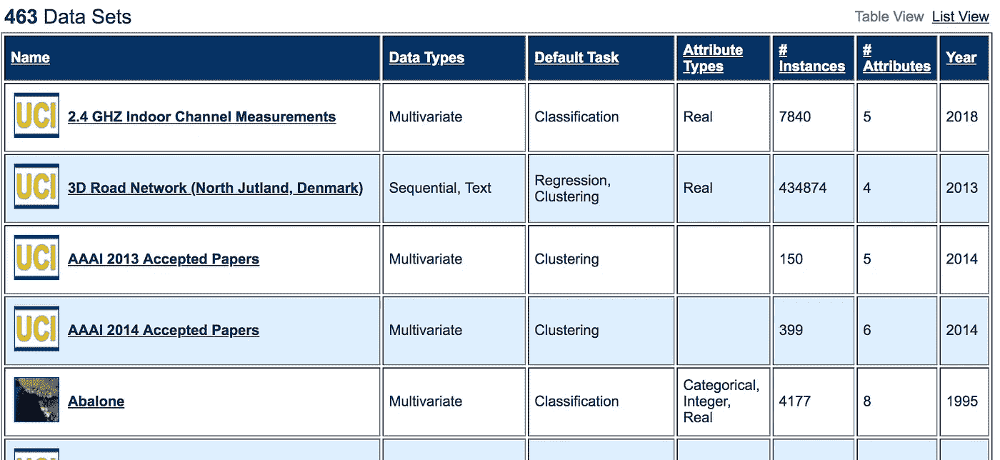
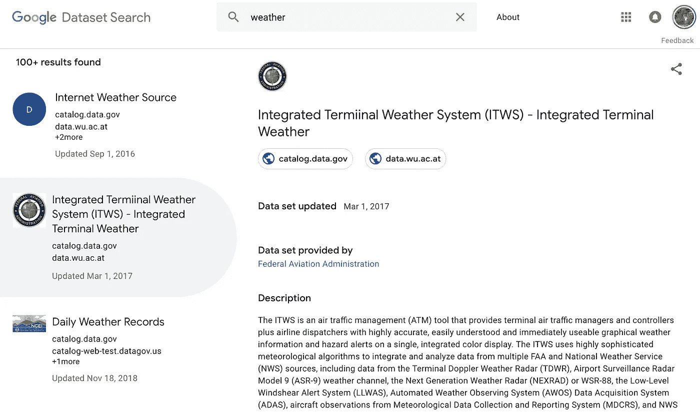

# 机器学习和分析数据集的 8 大来源

> 原文：<https://medium.datadriveninvestor.com/top-8-sources-for-machine-learning-and-analytics-datasets-5d2d94ada8ab?source=collection_archive---------4----------------------->

## 寻找机器学习和分析数据集的终极指南

Photo by [Samuel Zeller](https://unsplash.com/@samuelzeller?utm_source=medium&utm_medium=referral) on [Unsplash](https://unsplash.com?utm_source=medium&utm_medium=referral)

很难找到一个特定的数据集来解决各种机器学习问题，甚至很难进行实验。下面的列表不仅包含用于实验的伟大数据集，还包含描述、使用示例以及在某些情况下解决与该数据集相关的机器学习问题的算法代码。

# 1- Kaggle 数据集

 [## 数据集| Kaggle

www.kaggle.com](https://www.kaggle.com/datasets) 

这是我最喜欢的数据集位置之一。每个数据集都是一个小社区，在这里你可以讨论数据，找到一些公共代码或者在内核中创建你自己的项目。它们包含大量各种形状和大小、不同格式的真实数据集。您还可以看到与每个数据集相关联的“内核”，许多不同的数据科学家已经提供了笔记本来分析数据集。有时，您可以在笔记本上找到解决特定数据集中预测问题的算法。

# 2-亚马逊数据集

 [## 自动气象站开放数据登记处

### 除非在适用的数据集文档中特别说明，否则可通过 Open…

注册表. opendata.aws](https://registry.opendata.aws/) 

该资源包含不同领域的许多数据集，例如:(公共交通、生态资源、卫星图像等。).它还有一个搜索框来帮助您找到您正在寻找的数据集，它还有数据集描述和所有数据集的[使用示例](https://registry.opendata.aws/usage-examples)，这些信息非常丰富且易于使用！

数据集存储在亚马逊网络服务(AWS)资源中，如[亚马逊 S3](https://aws.amazon.com/s3/)——云中高度可扩展的对象存储服务。如果您使用 AWS 进行机器学习实验和开发，这将非常方便，因为数据集的传输将非常快，因为它位于 AWS 网络的本地。

# 3- UCI 机器学习知识库:

[https://archive.ics.uci.edu/ml/datasets.html](https://archive.ics.uci.edu/ml/datasets.html)

Snapshot from UCI Repos

来自加州大学信息与计算机科学学院的另一个伟大的存储库[100 个数据集](https://archive.ics.uci.edu/ml/datasets.html)。它根据机器学习问题的类型对数据集进行分类。您可以找到单变量和多变量时间序列数据集、分类、回归或推荐系统的数据集。UCI 的一些数据集已经被清理干净，随时可以使用。

# 4-谷歌的数据集搜索引擎:

 [## 数据集搜索

### 了解有关在数据集搜索中包含数据集的详细信息。

toolbox.google.com](https://toolbox.google.com/datasetsearch) 

2018 年末，谷歌做了他们最擅长的事情，推出了另一项伟大的服务。这是一个可以按名称搜索数据集的工具箱。他们的目标是统一成千上万不同的数据集存储库，并使数据可被发现。干得好，谷歌。

# 5-微软数据集:

2018 年 7 月，微软与外部研究社区一起宣布推出“微软研究开放数据”

 [## 微软研究院开放数据

### 编辑描述

msropendata.com](https://msropendata.com/) 

它在云中包含一个数据存储库，致力于促进全球研究社区之间的合作。它提供了一堆在已发表的研究中使用的精选数据集。

# 6- Awesome 公共数据集集合:

 [## awesome data/awesome-公共数据集

### 公共领域中以主题为中心的 HQ 开放数据集列表。公关☛☛☛-awesome data/awesome-公共数据集

github.com](https://github.com/awesomedata/awesome-public-datasets) 

这是按主题组织的数据集的一个很好的来源，如生物学、经济学、教育学等。这里列出的大多数数据集都是免费的，但是在使用任何数据集之前，您都应该检查许可要求。

# 7-政府数据集:

也很容易找到政府相关的数据集。许多国家向公众公开了各种数据集，作为一种透明的做法。以下是一些例子:

*   [欧盟开放数据](https://data.europa.eu/euodp/data/dataset)门户:欧洲政府数据集。
*   [美国政府数据](https://www.data.gov/)(并非出于政治目的，但由于[川普政府关闭](https://edition.cnn.com/2019/01/10/politics/government-shutdown-state-of-play/index.html)或主页上提到的“缺乏资金”，该网站暂时不可用)。
*   [新西兰政府数据集](https://catalogue.data.govt.nz/dataset)。
*   [印度政府数据集。](https://data.gov.in/)
*   [https://www.opendatani.gov.uk/](https://www.opendatani.gov.uk/)(北爱尔兰公共数据集)
*   [新加坡政府数据集。](https://data.gov.sg/)
*   [澳大利亚政府数据集。](https://data.gov.au)

# 8-计算机视觉数据集:

如果你从事图像处理、计算机视觉或深度学习，那么这应该是你实验的数据来源。

 [## VisualData

### 计算机视觉数据集的搜索引擎

www.visualdata.io](https://www.visualdata.io/) 

视觉数据包含少量可用于构建计算机视觉(CV)模型的大型数据集。您可以通过特定的 CV 主题(如语义分割、图像字幕、图像生成)甚至是解决方案(如自动驾驶汽车数据集)来查找特定的数据集。

总之，从我的观察来看，似乎有一个全球方向，让越来越多的数据可供研究和机器学习社区使用和轻松访问。这些新数据集的社区将继续增长，并使数据易于访问，以便众包和计算机科学社区可以继续快速创新，并为生活带来更多创造性的解决方案。