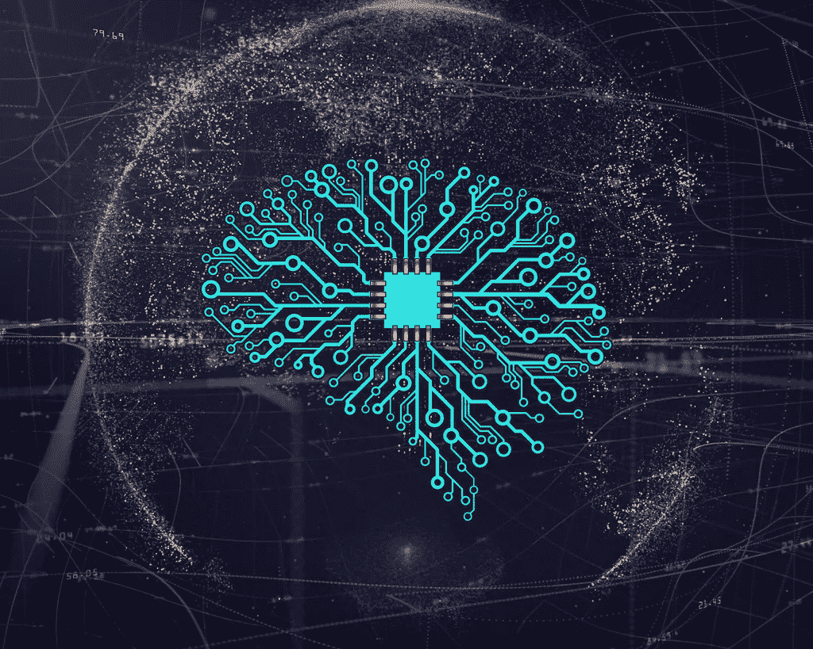

# 人工智能的趋势和挑战:2020 年智能企业的全球状况

> 原文：<https://medium.datadriveninvestor.com/trends-and-challenges-of-ai-a-global-state-of-intelligent-enterprise-2020-8e88416a3a8?source=collection_archive---------14----------------------->

虽然大多数受访者处于 IE 之旅的前期或早期实施阶段，但绝大多数人(54%)预测他们将在两年内建立。这是因为 IE 的宣传和现实以及实现人工智能和智能自动化等技术之间的鸿沟。事实上，它容易面临许多挑战。

**挑战-** 创新的障碍来自不同的层面。[根据我们发出的调查，共有十项挑战被投票。](https://intelligentautomationbfsi.iqpc.com/landing/trends-and-challenges-of-ai-a-global-state-of-intelligent-enterprise-2020?utm_source=hypearoundsaas&utm_medium=ad&utm_campaign=10000.002-external-ad&utm_term=hypearoundsaas&utm_content=text&mac=medium_aguis&disc=medium_aguis)前三大挑战是文化(49%)、升级/使用遗留系统(39%)和竞争优先级(35%)。

其他主要挑战包括将计划与投资回报挂钩、招聘合适的人员、技术的快速变化、从投资中获得最大价值、获得高级管理层的认可、分配内部职责以及缺少合适的供应商。

当被要求就如何克服这些挑战进行投票时，选民选择了案例研究、行业研究和培训作为前三名。投票后的两个解决方案对供应商市场有了更清晰的认识，并且有了更多的预算。

**实现智能企业—** 为了实现这一目标，必须将智能自动化视为一种战略解决方案，RPA 的局限性(没有信息架构的乘数)以及日益增长的消耗

成熟的人工智能市场的未来将是基于消费的服务，不需要业务职能部门成为伪 IT 部门。相反，他们将利用结合自动化和人工智能的 SaaS 平台，作为整个组织的战略资产来提供价值。

[*(参见完整报告)*](https://intelligentautomationbfsi.iqpc.com/landing/trends-and-challenges-of-ai-a-global-state-of-intelligent-enterprise-2020?utm_source=hypearoundsaas&utm_medium=ad&utm_campaign=10000.002-external-ad&utm_term=hypearoundsaas&utm_content=text&mac=medium_aguis&disc=medium_aguis)

# **快速事实**

**制药领域的人工智能——药物研发的未来**

根据阿斯利康全球企业负责人的说法，人工智能将成为“到 2027 年的主要药物发现工具”

总部位于伦敦的 Benevolent AI 使用其人工智能主导的系统来审查论文和摘要，以在“已知事实”之间建立未识别的联系。

近五分之一的制药专业人士认为，我们正处于一场革命的风口浪尖

**人工智能在 CX——客户体验的未来**

882%的 CX 领导人对人工智能对行业的影响感到“兴奋”，而 8%的 CX 领导人对即将到来的指控感到“担忧”

到 2020 年，接受调查的大多数 CX 组织(53%)预计他们的人工智能运营将“建立”

对于超过 1/3 的组织来说，与现有基础设施和遗留系统的集成是人工智能投资的一个障碍，并且缺乏人工智能投资的可论证 ROI

**防御中的人工智能——全球安全情报的未来**

对于国防工业的组织来说，在人工智能时代生存需要适应。那些拥抱人工智能并开始计划采用人工智能的人现在可以建立起对竞争对手的优势。没有这样做的人可能会被完全抛在后面。

71%的人预计到 2020 年，智能企业技术将对国防工业产生“重大”影响。

在预计到 2020 年对国防工业产生最大影响的工业工程技术中，人工智能名列榜首，紧随其后的是认知分析。

**能源领域的人工智能——石油和天然气的未来**

在三年的结构精简和强制节俭中，衰退后的石油和天然气行业已开始利用创新技术的潜力，在稳定的财政环境中提高业绩和盈利能力。

54%的人认为智能企业可以解决大规模人员变动造成的人员流失。

根据这项研究，工业工程技术对石油和天然气最重要的影响将是降低成本、简化流程、实现业务现代化和节省时间。

想要了解制药、客户体验、国防和能源领域人工智能的更多事实和信息吗？点击此处查看 26 页的完整报告。

[有兴趣了解更多？点击此处访问网站。](https://intelligentautomationbfsi.iqpc.com/landing/intelligent-automation-for-banking-financial-services-and-insurance-agenda?utm_source=hypearoundsaas&utm_medium=ad&utm_campaign=10000.002-external-ad&utm_term=hypearoundsaas&utm_content=text&mac=medium_aguis&disc=medium_aguis)