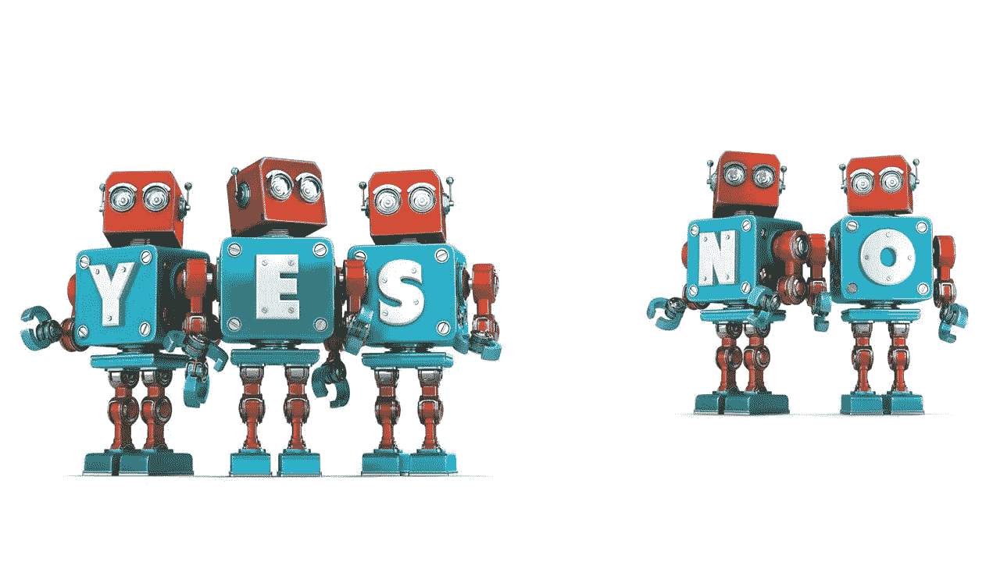

# UBI，是还是不是？

> 原文：<https://medium.datadriveninvestor.com/ubi-yea-or-nay-8e8086917511?source=collection_archive---------4----------------------->

在我的上一篇文章中，我解释了为什么大数据喂养的人工智能大脑会让我们变得聪明。我描述了一个假设的情况，在不久的将来，一家小型社区餐厅的经理将能够使用自然语言，通过采用基于人工智能和大数据的服务来优化和发展其业务。技术将使每一个企业、每一个人和每一个机构变得更有效率和更有利可图。全球将会产生难以置信的财富。接下来的关键问题是，我们应该如何利用这些即将产生的财富？这个谜题揭示了经济、社会、道德和伦理方面的考虑。顶级全球机构研究新工业革命的潜在影响，并建立这些技术在未来二十年将如何发展的模型。对这些未来实践的一个共同威胁是强加给当今工作的风险。潜在的大规模失业可能会带来广泛的社会动荡。

经济难题

充分利用信息时代的新技术所创造的当前范式挑战了资本主义本身。一个以信息为标准投入的经济体，不能像一个由基于商品和稀缺资源的市场驱动的经济体那样进行管理。新经济的主要产品是信息。信息不是一种有限的资源，它在三个方面改变了资本主义的基础，(如前所述……)在他的书《后资本主义》中为保罗·马森辩护首先，它将减少对工作的需求，从而大规模消除工作岗位。其次，它正在侵蚀企业正确形成价格的能力，并在以前不可能的地方创造信息对称。第三，它为挑战垄断和经济实力的合作开辟了新的途径。后两种效应对一个更加公平的经济非常有利，但第一种效应要求我们有及时的答案。如果大规模裁员的速度快于新增就业的速度，我们可能就没有足够的消费者和用户来推动新经济的发展。这是一个令人不快的难题——我们如何才能在创造空前财富的同时大规模削减支持资本主义的工作岗位？如果我们回顾并分析过去由技术引发的破坏性经济周期，我们可以找到适用的模型并找到可行的答案。那些时期被称为工业革命。在每一个周期中，我们都看到相似的模式。从长远来看，它们创造了更多的财富和就业机会，但在转型期间也带来了社会压力。技术一直是人类和社会长期进步的最重要的驱动力，但它也有一个价格标签，必须由经历转型的一代人来选择。但是，有吗？迄今为止，自动化已经创造了财富和进步。今天，我们比 200 年前第一次工业革命开始时活得更长、更舒适。但是，如果我们在这些过渡期问员工他们的期望和观点，他们不会赞成，甚至是灾难性的。在工业革命发生的年代，对工人来说可能是残酷的，向被取代的工人解释其好处和积极的预测将是尴尬和无意义的。我们在道德上有义务吸取过去的教训，以创造更美好的未来，避免不必要的痛苦和悲伤。从经济上来说，我们已经发现如何做到这一点。一个很好的例子是奥巴马总统为让我们走出 2008 年大萧条而创造的反周期。它受到了 1929 年股灾和其他衰退教训的启发。我们需要在第四次工业革命中做同样的事情，创造社会公平，为我们所有人而不是少数人实现更好的过渡。如果我们投资于教育，为流离失所者和新一代学生建立社会网络，我们就可以避免痛苦。没有理由认为，从更长远的角度来看，新的周期不会创造就业和财富。我确实这样认为。但看到它在未来二十年的集中效应，是很可怕的。这一周期将造成更严重的痛苦，因为它的全面影响将在前两次工业革命的四分之一时间内感受到，第三次工业革命的大约一半时间内感受到——仅仅 25 年。没有足够的时间让整整一代人适应新工作的要求。对于需要更多教育和批判性思维的新岗位类别，我们必须对每个工人和学生进行技能再培训和技能再提升。因此，我们需要建造一座桥梁，一座将今天与我们所有人更光明的未来连接起来的桥梁。这需要我们所有人理解这一点，并使用民主的方式来推动变革。

团结的桥梁

这座桥将把自由派和保守派、资本家和社会主义者联系在一起。这是当今自由主义者、社会主义者和人道主义者最关心的问题，即不断加剧的社会不平等。在过去的几十年里，1%的富人和其他人之间的社会差距不断扩大。新技术的浪潮应该会，但它并没有缓解问题。在资本方面，新公司的合并和收购正在巩固领导地位，并推动业务集中在少数几家公司。就在我们说话的时候，三大科技公司正在与万亿美元的上限调情，这是历史上从未见过的水平。随着我们看到更多的集中，关键行业的竞争越来越少，这个问题往往会恶化。尽管政府上月进行了肤浅的庆祝，但我们看到，尽管美国实现了充分就业，但工资水平却停滞不前。更糟糕的是，保护主义又回到了议事日程上，保护了最大企业的利润，提高了民众的生活成本。不断扩大的社会差距侵蚀着社会的基础，并对民主构成威胁。其后果各不相同，从无家可归人口的增长(西海岸无家可归人口达到惊人的 10.6 万人)，到医疗保健和社会网络等社会成本的增长，再到城市暴力的上升。如果我们齐心协力实现平衡的经济议程，我们就可以避免不必要的社会压力，这一议程能够促进经济增长，打击企业集中，刺激竞争以抑制价格，减少社会不平等。资本家对过去十年的经济复苏非常满意，员工也很高兴，因为工作回来了。数字革命推动了企业的发展，企业获得了更多接触新用户和市场的机会。但是，随着自动化增加了工作岗位的减少，并且很快会大规模减少，我们将会看到企业更有利可图，但是越来越多的人失去了工作。这不是一个可持续的循环。在未来几年，我们将达到一个盈亏平衡点，我们将需要更多的用户和消费者来保持业务增长，但失业工人将退出市场。形势将变得严峻，因为新工作岗位的创造速度将赶不上它们被淘汰的速度。我们需要一个解决方案来保护我们的经济和人民。这意味着，重新分配收入和将消费者重新纳入经济的机制将成为资本家和社会主义者、企业和工人、保守派和自由派的目标。正如我在以前的文章中解释的那样，如果我们及时这样做，我们不需要增加税收来资助这种机制，因为人工智能将扩大财富的产生。我们所需要的是更好地进行再分配，在转型期间让人们留在正规经济中，并投资于社会公平，主要是向所有人提供高质量的最新教育，以创造能够在 21 世纪发挥生产力的新劳动力。工作会回来的。我们需要有准备的工人来带他们。今天，我们在技术岗位上有缺口，仅靠我们的内部市场无法满足。我们在国际上争夺人才，公司正在尽一切可能吸引这些人才。但是它们供不应求。我们可以预计，这将很快成为大多数行业的现实。我们需要让我们的学生和当前的劳动力为竞争这些工作做好充分准备。教育每一次都更加明确了就业能力线，在未来，我们将只为具有明确的协作意识和情感技能的高技能工人提供工作。一座我们需要建造的桥梁。我们将投资创造更多的社会公平，通过项目显著改善教育，保证失业人口的基本收入。这些计划可能有不同的形式，如婴儿债券或 UBI(普遍基本收入)，这是一个保证整个人口最低收入的计划。包括美国城市在内的全球多个国家的许多试点项目证明，为个人和家庭提供基本需求并帮助他们免于负债，对于他们重新融入生产性社会非常有效。这样，他们就能创造必要的条件，让他们重返校园，重新获得技能，接受新工作的培训。有一种说法是不真实的，那就是得到这些项目帮助的人们将不再为更好的生活条件和更体面的谋生方式而斗争。这是道德上正确的做法。

愿我们一起努力

是时候抛开我们的政治分歧和当前对社会政策的理解了。人工智能正在用新的道德问题困扰我们，并将要求我们重新讨论我们前进时想要采取的道德行为。一笔前所未有的财富将被创造出来。我们需要互相帮助，有尊严地过渡到一个更加人道主义的新未来。UBI 和婴儿债券只是两种可能的解决方案。我们依靠有利的公共政策来实现这些机制。你打算投票给哪个代表？是还是不是？

*最初发表于*[*【www.collectivebrains.org】*](https://www.collectivebrains.org/editorial/ubi-yea-or-nay)*。*