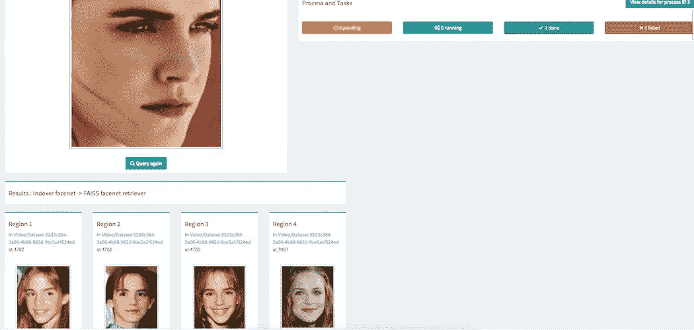

# 视频分析—深度学习版

> 原文：<https://medium.datadriveninvestor.com/video-analytics-deep-learning-edition-ae119186f6e4?source=collection_archive---------7----------------------->

/via [https://www.deepvideoanalytics.com/](https://www.deepvideoanalytics.com/)

当涉及到基于深度学习(使用谷歌)进行视频分析时，有很多东西在那里。尽管设置起来总是有点痛苦——与大多数深度学习一样，这在很大程度上是一种自己动手的情况。安装软件包，重新安装，因为你没有得到完全正确的，建立你的模型，开始训练他们，重新安装软件包，因为你没有得到 GPU 版本…你明白了，在你开始做任何事情之前，需要一段时间来做好准备。

或者说，它*用了*一段时间。感谢[阿克谢·巴特](http://www.akshaybhat.com/) , [在此为您提供一站式*深度视频分析*需求](https://www.deepvideoanalytics.com/)。在一套 docker 容器中，您可以获得进行基于 DL 的视频分析所需的一切，从导入到分析，再到搜索。

首先，你可以直接从 YouTube 或 S3/GS/etc . com 导入所有你想处理的视频。一旦你导入了它们，项目就会附带一堆预先训练好的模型(说真的，这有那么难吗？为什么别人不做？)，包括用于人脸检测的
[Zhang El al 的 MTCCN](https://kpzhang93.github.io/MTCNN_face_detection_alignment/index.html) ()，无论姿势、光照、障碍物等都非常出色。

我喜欢的部分是，当你导入视频时，你可以进行图像组(GOP)分割，然后在这些图像上进行贴图/缩小风格的工作流，以便进行分析。我认为这对于你自己的研究非常有用，例如，“*我需要找到所有包含猫的共和党片段*”等等。

无论如何，一旦视频被处理，该项目还包括各种有趣的东西来帮助你*在其中找到*的东西(说真的，这是一个经过深思熟虑的系统！).基本上，您可以设置管道来自动索引来自检测和分析阶段的输出。这些应用包括[脸书的 FAISS](https://github.com/facebookresearch/faiss) 用于相似性搜索，以及[雅虎的 LOPQ](https://github.com/yahoo/lopq) 用于近似最近邻搜索。一旦你在索引中获得了所有这些信息，这就是你想要寻找的，对吗？

还有更多，更多，包括自定义查询语言、REST APIs、GPU 和非 GPU 版本的容器、不可变操作，哦，还有很多。

整件事的[代码在这里](https://github.com/akshayubhat/deepvideoanalytics)，而 [k8s 信息在这里](https://github.com/AKSHAYUBHAT/DeepVideoAnalytics/tree/master/deploy/compose)。去看看这个项目，如果你有时间的话，看看这个项目的简报。

/via [https://www.deepvideoanalytics.com/](https://www.deepvideoanalytics.com/)

()" [*使用多任务级联卷积网络的联合人脸检测和对齐*](https://kpzhang93.github.io/MTCNN_face_detection_alignment/index.html) " —张等著
[*FaceNet:用于人脸识别和聚类的统一嵌入*](https://www.cv-foundation.org/openaccess/content_cvpr_2015/papers/Schroff_FaceNet_A_Unified_2015_CVPR_paper.pdf)—Schroff 等著。

*(* [*这篇文章也出现在我的博客上*](https://dieswaytoofast.blogspot.com/2018/09/video-analyticsdeep-learning-edition.html) *F)*