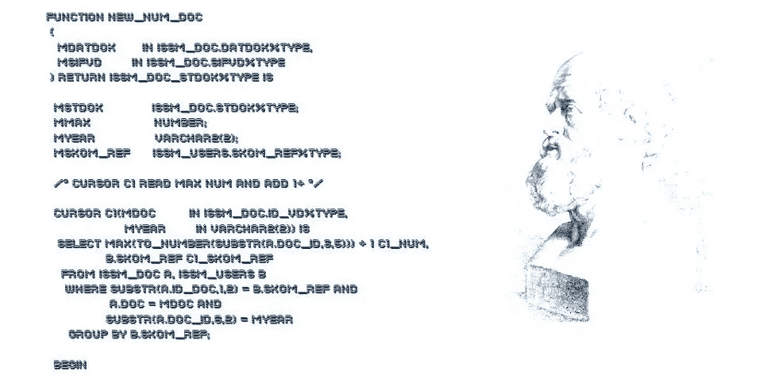

# 我们需要进行技术希波克拉底誓言

> 原文：<https://medium.datadriveninvestor.com/we-need-to-take-the-technological-hippocratic-oath-52e6d365f5ad?source=collection_archive---------9----------------------->

(Picture composed by engraving by Peter Paul Rubens, 1638)

这只是一个想法，但是…

我 25 年前开始工作。我写了一个剪报代码，我的算法首先替换了一个秘书，然后是一个带着三个孩子的年轻女人。我当时年轻，没有注意到这一切。我问他们老板为什么解雇他们。他们纠正我说，那不是他们的老板，是一台电脑。然后我在为公司编码，当我安安静静地坐着写算法的时候，公司在解雇工人，生产更多的东西。

25 年后，我读了史蒂芬·希尔的《不公平交易:优步经济和失控的资本主义是如何折磨美国工人的》一书。颠覆性的创新和无效率的政客是乍看之下社会问题的主要原因。因此，中产阶级正在崩溃。到目前为止，中产阶级是一个有固定工作、受过良好教育的阶层，因此他们能够贷款、购买、销售和促进创业。他们把时间向前推进了。

直到新的创新技术出现。

新技术需要新经济。因为[颠覆性创新](http://en.wikipedia.org/wiki/Disruptive_innovation)，新经济就是颠覆性经济。一个破坏性的经济比旧经济需要更少的工人来从事新的工作，比一百年前出现的经济需要更少的工人，而一百年前出现的经济需要越来越多的新工人来从事新的机器。不仅如此。今天的新经济需要全新的工作。新的工作不需要新的工人，他们需要新的知识和教育，我们甚至不知道是哪一种。

中产阶级失业者通常仍然拥有一些他们有工作时购买的财产，他们仍然有一些知识。那么，怎样才能鼓励他们用自己剩余的财产和知识赚点钱呢？共享经济。他们可以分享他们的财产并获得一些钱，或者他们可以使用他们的财产并通过提供服务来赚钱。

你不需要有太多的想象力来想出如何用今天的技术来经营这样一个企业。每个人都有智能手机，所以我们可以给他们发送一个移动应用程序。有了应用，人们可以用他们的“沉睡的股票”产生流量，赚点外快。他们可以分享他们的汽车、公寓、自行车、智能手机和他们仍然拥有的其他商品，即使这是他们的全部。

这里的一个问题是，人们只能在一个新的破坏性经济中用新技术来做到这一点。政府还没有开发出可以控制提供此类业务的互联网平台的技术。结果是，所有这些人都依赖于提供相同质量的平台，并开始了最低价格的竞争。史蒂芬·希尔提到他们开始了向底部的赛跑。由于缺乏政府经济监管，这些人大多不需要纳税，因此也失去了他们的社会保障。

另一方面，也有一些平台——像 LinkedIn、脸书和类似的平台——提供一场通往巅峰的竞赛。有了这些平台，人们——尽管在经营业务的同时也创造了一个破坏性的经济——处于“有效竞争环境的公平一面”。为了得到社会保险，他们必须纳税，他们为生活赚取工资和薪水，他们还为假期、孩子、房子、汽车等储蓄一些钱。

当然，如今做生意比几年前难多了。但是人们不应该竞争谁挣得少，而应该竞争谁挣得多。

我并不是不同意共享经济，在这种经济中，有些人真的赚了一些额外的钱，我写这篇文章并不是因为我读过史蒂芬·希尔的书。重点在别的地方。我现在正在做 7 个科技创业项目。我和希尔想出了同样的事情。考虑到所有的项目，我可以为每个项目建立 2 种不同的商业模式。在第一种模式中，人们竞相到达底部，在第二种模式中，人们竞相到达顶部。每种型号都能给我相同的利润。也许我不清楚，但下一个例子可以告诉你我的想法。

我可以制作一个平台模型，人们可以以尽可能低的价格提供服务或商品，但我也可以安排这个平台，让人们根据质量、询价、数量等提供价格。在第一种情况下，理论上我可以把人们推到生存的边缘，在第二种情况下，我可以把他们推向我们所有人生活水平更高的未来。

我必须把这一点说清楚。我说的是创业项目，而不是 IT 服务。从事 IT 服务的编码人员与此无关。这是 IT 创业设计师的事情。如果你创建了一个简单的商业模式，在很短的时间内从人们那里获得资金，你可能会问自己，“人们如何快速有效地做到这一点？”并为他们提供一个解决方案，告诉他们如何销售他们仍有能力提供的产品和服务。或者你可以创造一个长期的商业模式来帮助人们提高股票和生活水平，从而用金钱、进步和幸福来丰富我们共同的未来。

这是什么意思？这意味着我们作为 It 创业公司有权力制定关于人们生活方式、态度、健康和人类繁荣的规则，我们可以决定这一点。我们的工作和行为变得类似于医疗工作。在他的书中，希尔引用了霍金的观点，即技术专家需要他们自己版本的医学界 2400 年前的[希波克拉底誓言](http://en.wikipedia.org/wiki/Hippocrates)，誓言“*Primum non nocere*”——“首先，不伤害”(希尔，2016 年，第 160 页，第 3 段)。

也许我们需要一个科技版的希波克拉底誓言。它应该是一个互联网平台的一部分，我们可以在那里注册，并采取某种技术[宣言。](http://en.wikipedia.org/wiki/Declaration_of_Geneva)全世界所有有联系的人都可以看到这一点。我们可以分享我们的工作质量和对我们共同未来的认识。我认为(也许我错了)，这也可能是一种向机器发出明确信息的方式，也是向所有愿意为制造人工智能做出贡献的人发出明确信息的方式。对于人工智能来说，这可能是一个基本准则。

问题是，我们的政治家们何时会开始理解我们生活的新世界，并开始改善经济。

马特加斯·马鲁西格

*参考文献*

希尔，S. (2016 年)。不公平的交易:“优步经济”和失控的资本主义是如何折磨美国工人的。【Kindle DX 版】。从 Amazon.com 取回

维基百科。(2017).颠覆性创新。可在:[https://en.wikipedia.org/wiki/Disruptive_innovation](http://en.wikipedia.org/wiki/Disruptive_innovation)【2017 年 2 月 13 日获取】。

维基百科。(2017).希波克拉底。可在:[https://en.wikipedia.org/wiki/Hippocrates](http://en.wikipedia.org/wiki/Hippocrates)【2017 年 2 月 14 日获取】。

维基百科。(2017).日内瓦宣言。可在:[https://en.wikipedia.org/wiki/Declaration_of_Geneva](http://en.wikipedia.org/wiki/Hippocrates)【2017 年 2 月 14 日获取】。

原刊[此处。](https://www.linkedin.com/pulse/we-need-take-technological-hippocratic-oath-matjaz-marussig/)