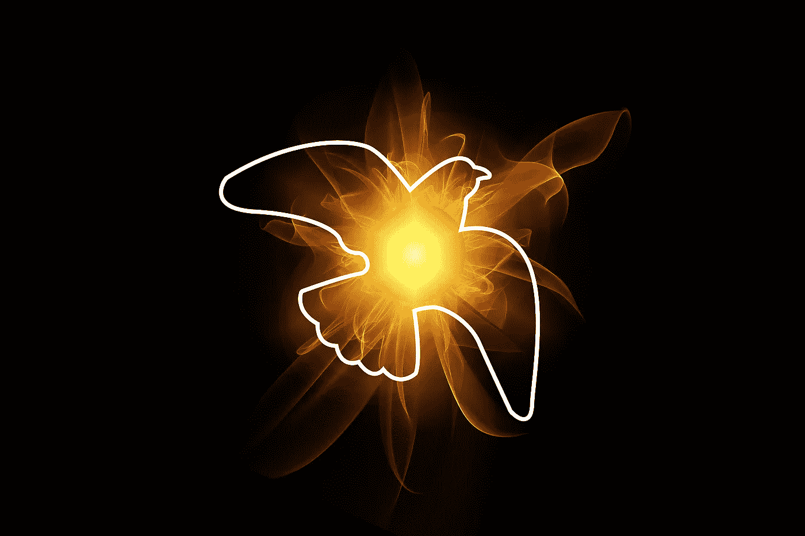

# 健康三位一体:精神、社交媒体和医疗保健

> 原文：<https://medium.datadriveninvestor.com/wellness-trinity-spirituality-social-media-and-healthcare-785ce1147f52?source=collection_archive---------0----------------------->

## 医生与人们的信仰和网上的错误信息作斗争

当灵性与医疗保健发生冲突时，八旬老人面临着两难的境地。社交媒体加剧了这一挑战，因为“如果是在互联网上，那一定是真的。”

患者可能会拒绝治疗，或者根据朋友、家人的建议和网上的诱惑，转向自己的“疗法”。

“我认为精神是‘一种神圣维度的主观体验’和‘人们赖以生存的最深刻的价值和意义’，”T2 的 jai Fred f .“Jim”Lopez 博士说。“这是我从[维基百科](https://en.wikipedia.org/wiki/Spirituality)上得到的。这是一个很好的总结。”

洛佩兹在马尼拉的圣贝达学院从事卫生政策和管理方面的研究，并教授社区医学和研究方法。

“最初，我的想法很大程度上受到我个人宗教信仰的影响，”洛佩兹说。“然而，从那以后，我可以为不同宗教信仰的人服务，也可以为没有宗教信仰的人服务。

“菲律宾人是一个有宗教和精神信仰的民族，”他说。"我认为我是这种共同特征的一部分."

# 混合中的精神

洛佩兹想知道——在这个社交媒体时代——灵性应该如何被纳入医疗保健社交媒体。

他询问其他医疗服务提供者，精神如何影响他们病人的生活。

有强烈灵性的病人可能更喜欢顺其自然。他们宁愿听天由命，也不愿服用能够帮助或治愈他们的药物——把简单的疾病变成致命的事情。

“我同意这是过度精神化的健康，”洛佩兹说。“从业者面临的挑战是，在尊重患者信仰的同时，鼓励他们。事实上，有一些研究指出了它的负面影响。

“我的病人总是说‘上帝保佑’”，他说。“发生在他们身上的任何好事，包括任何症状的改善，总是要归功于上帝。”

# 寻找答案

人们真诚地寻找解决方案。

洛佩兹说:“灵性让无法解释的东西提供答案，或者至少让患者放心，有一种更高的力量可以帮助他们度过难关。”

“精神可以建立希望和信任，但它可能会产生一些意想不到的影响，”他说。"这包括仅仅依靠祈祷而不寻求专业帮助."

Harold Trinidad 博士也是一名教育家，也是 [Better Steps Psych](https://twitter.com/BetterSteps) 的创始合伙人，他提到了一个年龄因素。

“我发现我的老年病人对灵性更开放，”他说。“它变得更受关注，尤其是当他们不再专注于抚养孩子或工作时。”

来自菲律宾杜马盖地市的精神病学家、[斯蒂芬妮·米亚科](https://twitter.com/StephMiaco)博士说，教养也是一个因素。她倡导精神健康，并谈到了完全透明及其对医患关系的影响。

“精神也与文化和信仰有关，”她说。"这与人们如何看待心理健康和生活平衡有关."

# 上帝的意志

对于非医务人员来说，很难与依靠精神信仰作为不服用处方药理由的朋友或亲戚交谈。如果不是害怕副作用，就是“如果上帝准备好了，我也无能为力。”

洛佩兹见过这样的例子。

“我通常给人们讲那些用药物补充祈祷的故事，”他说。“我解释说，这样的人会比那些只依靠祈祷的人过得更好:‘我敢肯定，吃药会让你更好。’

“我首先会问我的病人——尤其是那些患有慢性疾病的病人——你是如何对待你的诊断的？”他说。"然后我询问他们的精神信仰，看他们是否从中找到了安慰."

城市居民和农村居民之间也存在精神鸿沟。

洛佩兹说:“在农村地区，人们非常虔诚，所以精神信仰已经被赋予了。”“这就变成了赋予病人充分享受生活的权利，并利用精神力量来强化这一点。

“我们需要在挖掘患者的精神力量和促进他们进入卫生系统之间取得平衡，”他说。

# 祈祷团体

放射科医师、核医学医师和健康倡导者 Rhia Gomez 博士随时准备在精神上与患者交流。

“对于那些和我有相似信仰的人，如果需要的话，我会和他们合作，”她说。“我和病人一起祈祷，尤其是在扫描之前，如果这能安慰他们的话。我也是一个由医生和病人组成的祈祷小组的成员，他们为病人祈祷——有些病人甚至不知道我们在做什么。

“我已经按照病人的要求暂停了祈祷，”戈麦斯说。“我做核医学、PET 和 CT 扫描，还有乳腺成像。病人要求停下来向工作人员祈祷的情况并不少见。”

这是思想统治物质的时代。

特里尼达说:“如果聪明人试图用科学来解释精神层面的东西，他们总是错的。”

他说，“即使它是思想的构造，而不是能量或物质，它仍然是心灵的一部分。”“它仍然是患者非常真实的一部分。”

在这些敏感时期，社交媒体可以成为讨论精神健康的健康场所。这时，医疗服务提供者应该把病人引向网上有帮助的网站。

# 援助之手

如果任其自生自灭，人们会被魔术和奇迹疗法的轰动效应所吸引，或者“放弃所有希望”当没有人把他们的最佳利益放在心上时，伸出援助之手。

“对我来说，社交媒体是与患者联系的一种方式，”洛佩兹说。“有一些对健康有影响的人迎合了这种需求，他们经常张贴祈祷文，与人分享。但这必须伴随着教育和改善获得保健的机会。”

简而言之，医生应该向患者推荐能够将信仰体系与科学联系起来的社交媒体。

“精神健康是心理健康的一部分，”洛佩兹说。“我们必须记住，这只是我们保持和维持健康的一部分。

“剩下的部分就是利用从科学中发展出来的药物，”他说。“我相信这些来自上帝自己赋予的天赋。”

最重要的是，洛佩兹说，医疗服务提供者应该谨慎，不要做出笼统的精神假设。

“精神健康对每个病人来说都是独一无二的，”他说。“我们需要知道他们在精神旅程中的位置。然后，我们可以帮助他们导航，并在处理他们的疾病时考虑实际问题。”

**关于作者**

吉姆·卡扎曼是[拉戈金融服务公司](http://largofinancialservices.com)的经理，曾在空军和联邦政府的公共事务部门工作。你可以在[推特](https://twitter.com/JKatzaman)、[脸书](https://www.facebook.com/jim.katzaman)和 [LinkedIn](https://www.linkedin.com/in/jim-katzaman-33641b21/) 上和他联系。