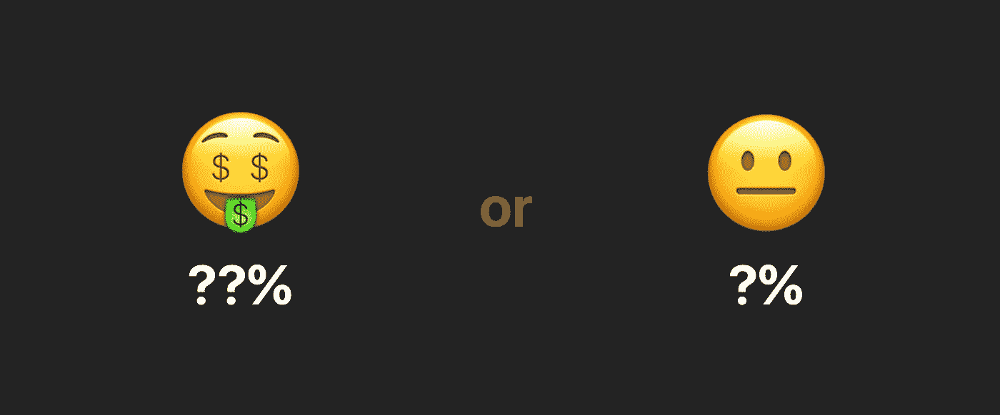

# 你期望的年回报率是多少？

> 原文：<https://medium.datadriveninvestor.com/what-annual-return-should-i-expect-efbeb19c478f?source=collection_archive---------2----------------------->

## 如何衡量溢价销售的预期回报？

这是几年前我开始交易期权时就想回答的问题。甚至乞求一个棒球场！结果发现这真的很难。这是我在 tastytrade 研究团队工作时想到的。

这很难，因为:期权有几个变量，交易者承担不同数量的杠杆，衡量相对于标的的风险是不确定的，而且交易者往往有太多的标的，以至于没有明确的基准可以映射——这只是几个挑战。

## 你会怎么解决这个问题？

您需要一个可动态扩展的解决方案，因此可以使用当前价格预测未来。足够多样化和一致的东西来依靠。以美元计算的历史平均值毫无用处，因为最明显的是，潜在价格会发生变化。

你好，百分比。

以一个 12 岁的企业为例，提供同样的产品或服务。你可以回过头来衡量它的利润率，得到一个大概的平均值。因为利润率是一个百分比，所以你可以将它与当前或未来的收入预测结合起来，以美元估算净利润。够大了。在某种程度上，我们可以通过期权交易做到这一点。

## 衡量溢价销售的利润率

不久前，我进行了两项研究，分别是“间谍期权的定价有多高”和“T2”的“裸溢价利润率”，研究发现，利润是过去 12 年里每笔交易的初始信用额的百分比。然后，平均这些百分比，得出一个粗略的估计，随着时间的推移，你可以期待什么样的利润。

**1 S.D .扼死:**信用的 25%

**自动柜员机交易:**信贷的 12.5%

自动柜员机放入:信贷的 15%

*解释:*以 1.00 美元的价格出售一个 1 . s . d .扼死，随着时间的推移，在所有赢家和输家中烘烤，有理由期望平均每个扼死净赚 0.25 美元。

## 推断结果

我承认，围绕这些结果有很多变化，需要很长时间才能达到可靠的平均值。还有，“过去的表现……”等等。然而，这些数字可能更高，我可以保持乐观——你会明白为什么。

我们可以根据当前的定价、期望的杠杆比率，得出一个大概的年回报率预期。这是一个如此大/慷慨的大概范围，以至于试图确定你应该期待 10%还是 30%，而不是争论 15%还是 18%。

## 示例#1 —一般市场 ETF 中的 1 个 S.D .扼制投资组合

**设置:** 1 S.D .扼杀在间谍，45 DTE，管理在 50%的赢家或 200%的输家。

假设 26，800 美元的投资组合(与 SPY 1:1 匹配)。

268 号间谍。

历史利润率:25%

根据上面提到的研究，这个交易设置和管理的平均交易持续时间为 23 天。目前的市场价格是 3.53 美元。

**Avg。盈利预期:** $353 * 25% =每份合约$88.25。

**平均每年交易次数:** 365/23 = 15.9

**平均年度利润预期:**15.9 * 88.25 美元= 1403 美元

现在是名义杠杆发挥作用的时候了。如果你有现金担保(1x)，你会在 26800 美元的投资组合中做这些间谍合同中的一个。这将意味着你的年预期回报率是 1403 美元/$ 26800 =**5.23%**。而这是在我们有一个 21 岁的膨胀的 VIX——一个 13 岁的 VIX 的可悲数字。

2 倍的名义杠杆怎么样(在这个投资组合中，2 份合约)？为了简单起见，将这个数字翻倍——10.5%。一旦你超过 2 倍或 3 倍，它的增长比例就会降低，甚至可能开始恶化，因为投资组合的损失太大，无法很好地恢复——所以我不会使用这种技术。

## 示例 2 —一般市场 ETF 中的自动柜员机看跌组合

**设置:** ATM 放入 SPY，45 DTE，以 50%赢家或 200%输家管理。

同样是 26800 美元的投资组合和 268 间谍。

历史利润率:15%

平均持有时间:20 天

当前市场价格:7.80 美元

**平均利润预期:** $780 * 15% =每份合同$117。

**平均每年交易次数:** 365/20 = 18.25

**平均年度利润预期:**18.25 * 117 美元= 2135 美元

做一个现金担保的 ATM 看跌期权(1 倍名义值)能让你获得 8%的预期年回报率(2135 英镑/26800 英镑)。

去 2 倍，承担一些真正的风险？假设这辆漂亮的 21 VIX 还在，你的目标是 16%。再一次，超过 2 倍进入了无法从 2008 年这样的重大事件中恢复的领域，所以我不会应用同样的外推技术。

## 很难战胜市场

出于某种原因，人们觉得如果他们卖出溢价，就一定会跑赢市场。实际上，这相当困难。期权的最终目的是让你可以利用。这是杠杆将负责更高的回报(潜在的)，而不是期权固有的任何魔法酱——市场太聪明了。

我的猜测是，你可能会获得每年 10%的回报，而不是 20%到 30%以上，除非你的杠杆率很高，在这种情况下，这可能只会持续几年，然后就会破产。

## 当您考虑例外情况时的免责声明列表，以及为什么这不准确/不适用于您

1.  就基础和策略而言，你的投资组合没这么简单。如果你通常交易 ETF 的溢价，这仍然给你一个大概的数字。
2.  你以不同的方式管理交易，运用对冲，或者擅长选择方向。太好了！我仍然认为，考虑到任何基本的市场效率，随着时间的推移，你会在这个范围内下跌。
3.  *“ETF 的溢价远低于个股。如果我把这些百分比应用到股票上，回报率会大幅上升！”*根据我的研究和 tastytrade 的其他研究，考虑到异常事件、缺乏多样化，以及由于上述原因，随着时间的推移，平均利润往往会与 ETF 相匹配，个股的百分比会更低。我不会把这些百分比应用到股票上。
4.  *你与众不同的其他原因。*这么简单的分析不可能代表所有人说话，但这篇文章的重点是为广大溢价卖家设定期望。如果不进行大量的杠杆操作，方向正确，并让市场适应一段时间，你不可能在未来几年内每年获得 20%以上的回报。顺便说一下，随着时间的推移，每年达到 12%是惊人的——不要忽视这一点——尤其是如果你能用最少的时间/精力做到这一点。

## 检查你自己

一旦你算出了一个预期回报的大概数字，就用它和被动投资的预期一般市场回报之间的差额(假设是 7%)。还不如调整保证金账户中的短期资本利得税，而不是几十年后被动的长期资本利得税。这是你积极交易的预期增量收入。

问问你自己，这值得我花时间吗？我这样做是出于爱好吗(因此不在乎时间，因为你喜欢它)？削减时间要求和调整方法是否值得？我还能做些什么(创业、学习技能、家庭时间、个人时间)来代替呢？

## 有问题吗？改进？

Twitter 上的@benlatz，或者[邮箱](http://ben@wingmantracker.com)。期待讨论。

如果你对我在 tastytrade 做的其他 51 个片段感兴趣，这里有一个目录:[benlatz.com/research](http://benlatz.com/research)。

*这有助于你建立期望吗？知道还有谁也在疑惑吗？分享这篇文章，让讨论继续下去，并获得一些不同的观点和想法。*