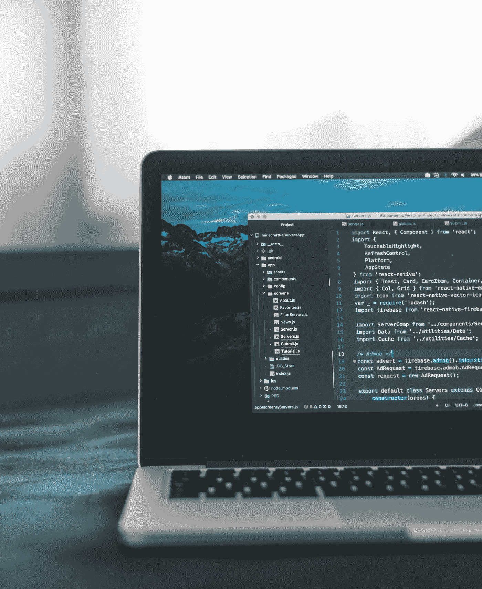

# 他们在谈论什么？用 Python 进行主题识别

> 原文：<https://medium.datadriveninvestor.com/what-are-they-talking-about-topic-identification-with-python-c3866aeaf0ef?source=collection_archive---------0----------------------->



Photo by [Fabian Grohs](https://unsplash.com/photos/zE007SNgcdE?utm_source=unsplash&utm_medium=referral&utm_content=creditCopyText) on [Unsplash](https://unsplash.com/?utm_source=unsplash&utm_medium=referral&utm_content=creditCopyText)

本文探索了使用 Python 中的聚类技术来识别文本语料库中的主题的过程，比如电子邮件或新闻文章。

我们首先执行基本的文本清理，为模型准备文本数据，最后我们使用 sklearn 构建一个模型。

在这个例子中，我们将使用 sklearn 的 20 个新闻组数据集。由于这些方法是无监督的技术，也就是说，它们不依赖于标记的数据——这些技术可以扩展到其他文本数据的主题识别，如电子邮件、推文、书籍等。

我们可以得到我们的训练和测试数据如下:

```
from sklearn.datasets import fetch_20newsgroups
import pandas as pdcategories = [
    'talk.politics.mideast',
    'rec.motorcycles']data_train = fetch_20newsgroups(subset='train', categories=categories)data_test= fetch_20newsgroups(subset='test', categories=categories)
```

# 数据清理

当打印数据时，您会注意到输出是混乱的，有格式问题，填充词，我们想要删除。当清理任何文本数据时，我会努力记住这些原则:

*   我们希望删除格式注释(例如:\n，\r 等)
*   我们希望删除停用词(例如:a、the、to 等)
*   我们不想去除价值

记住这一点，我们将使用 [NLTK](http://www.nltk.org/) 来删除停用词，并使用一些简单的正则表达式来删除格式。

```
import nltkdf = pd.DataFrame({'col':train}) # makes a dataframe with our training datadf['col'] = df['col'].str.lower().str.split() # This splits words by space*# Remove stopwords from text using NLTK.*stop = stopwords.words('english')
df['col'] = df['col'].apply(**lambda** x: [item **for** item **in** x **if** item **not** **in** stop])df['col'] = df['col'].str.replace(r'\W', ' ', case = False)
df['col'] = df['col'].str.replace(r'[.,?<>-]', '')
```

# 最后。有趣的是…

既然所有的数据收集和清理都已经完成，我们终于可以开始测试我们的模型了。

不管我们选择什么算法，我们都不能给模型输入我们清理过的文本，然后期待一个输出。相反，我们需要一种用数字格式表示文本的方法。

最简单的方法是计算每个文档的字数，并用如下所示的向量来表示。我们可以通过使用 CountVectorizer 在 sklearn 中轻松做到这一点。

还有其他方法，如 TF-IDF、word2vec 等。出于本文的目的，我们不会探究这些选项，但是在所附的完整代码中使用了 TF-IDF。

```
vectorizer = CountVectorizer() # initialise vector
X = vectorizer.fit_transform(df['col'])
```

X 的输出是一个向量，你可以把它想象成一个巨大的电子表格，其中的行是观察结果(每篇文章)，每列代表一个单词。

这个向量中的值代表词频。

## 这次的模特，我保证…

选择算法很大程度上取决于你的目标和你拥有的数据类型。

在这种情况下，我们的数据是未标记的，因为我们有一堆新闻文章，我们希望确定主题并用新发现的主题标记这些文章。

看一下 [sklearn 关于选择正确算法的精彩图表](http://scikit-learn.org/stable/tutorial/machine_learning_map/index.html)，我们可以看到我们处于聚类泡沫中，对于这个例子，我们将使用经典的 K-Means。


What algorithm do I need? [Sklearn’s wonderful diagram](http://scikit-learn.org/stable/tutorial/machine_learning_map/index.html)

K-Means 聚类的工作原理是根据特征相似性将数据点分配给质心。一个展示 K-Means 的很棒的 GIF 可以在[这里](http://www.datamilk.com/kmeans_animation.gif)找到。也就是说，K-均值聚类是这样工作的:

*   K Means 估计关于质心应该在哪里的初始位置(随机猜测，或者可以指定)
*   每个数据点被分配到其最近的质心
*   通过取分配给每个质心的所有数据点的平均值来更新质心位置
*   重复。

这样做的结果是，你留下了基于彼此相似性的标记数据点。

在我们的例子中，我们试图识别那些彼此相似的电子邮件，以推断该电子邮件的主题。让我们用我们的例子来验证一下。

```
k_clusters = 2 # Number of Centroids we want.model = KMeans(n_clusters=k_clusters, max_iter=100, n_init=1)model.fit(X)
```

我们有了它，我们的模型现在已经符合数据。您会注意到，在上面的代码中，我们必须指定我们需要多少个集群。在这个例子中，我们知道我们导入了两种类型的新闻文章:中东和摩托车，所以很自然地猜测会有两个主题。

然而，在大多数情况下，你不知道有多少个主题，所以选择最合适的依赖于你在一些集群上尝试算法并比较结果。

现在，我们已经建立了一个模型并对数据进行了分组，我们可以使用我们的模型来标记所使用的训练数据，还可以对测试数据或任何新数据进行预测，以对主题进行分类。

# 结果！

现在，让我们用下面这段代码来看看我们的结果。

```
print("Top terms per cluster:")
order_centroids = model.cluster_centers_.argsort()[:, ::-1]
terms = vectorizer.get_feature_names()
for i in range(true_k):
    print("Cluster %d:" % i),
    for ind in order_centroids[i, :10]:
        print(' %s' % terms[ind]),
    printprint("\n")
print("Prediction")Y = vectorizer.transform(["This Motorbike has the best chain"])# Enter phrase to predict
prediction = model.predict(Y)
print(prediction)Y = vectorizer.transform(["Turkey is close to Israel"])
prediction = model.predict(Y)
print(prediction)-- Output: --Top terms per cluster:
Cluster 0:  bike  it  one  get  like  ride  would  know  go  udont
Cluster 1:  israel  armenian  isra  arab  jew  peopl  turkish  would  said  killPrediction
[0]
[1]
```

你有它！K-Means 提取主题的一个相对简单的实现。本文有望成为您自己的分析以及更深入地研究调优参数的良好起点。

正如我前面提到的，[看一下 Github 的完整代码](https://github.com/JamesTrick/Medium/blob/master/cluster_example.ipynb)，并使用 Python 亲自尝试一下。

请继续阅读进一步的更新，我们将了解统计主题建模，直到使用深度学习来标记文本数据。

欢迎在下面留下任何评论或问题。