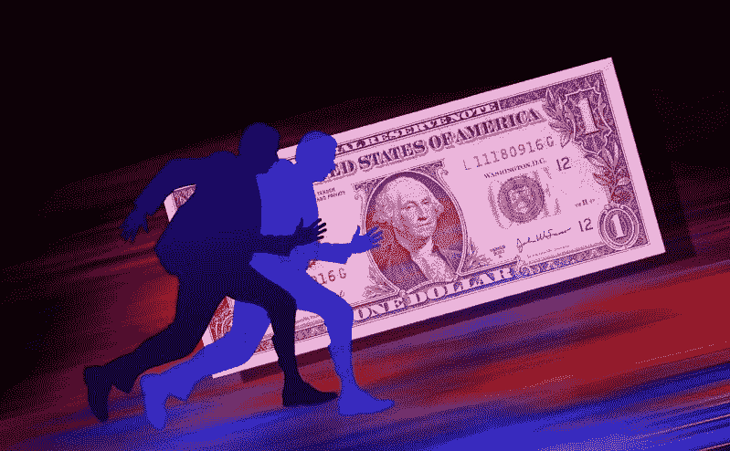
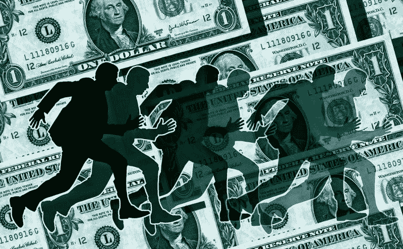
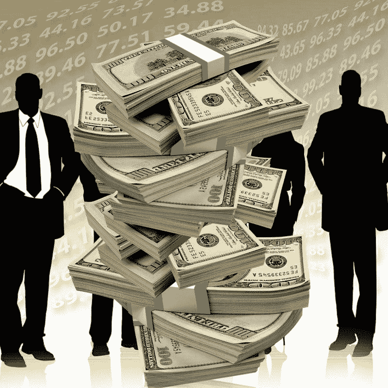

# BNY·梅隆能告诉我们什么是经济——市场疯人院

> 原文：<https://medium.datadriveninvestor.com/what-bny-mellon-can-tell-us-about-the-economy-market-mad-house-d758f4786fa6?source=collection_archive---------6----------------------->

BNY 梅隆银行最近过得很艰难。纽约梅隆银行的收入和收入增长率下降了，而对冲基金的兴趣却增加了。

例如，BNY 梅隆的季度收入从 2018 年 12 月 31 日的 40.07 亿美元降至 2019 年 3 月 31 日的 38.99 亿美元。然而，这些季度收入在 2019 年 6 月 30 日小幅上升至 39.24 亿美元，但在 2019 年 9 月 30 日降至 38.61 亿美元。

与此同时，Stockrow 估计，BNY 梅隆银行经历了连续三个季度的收入大幅缩水。纽约梅隆银行报告 2019 年 3 月 31 日的收入增长率为-6.68%，2019 年 6 月 30 日的收入增长率为-5.11%，2019 年 9 月 31 日的收入增长率为-6.68%。

# BNY·梅隆赚了多少钱？

奇怪的是，毛利润和收入缩水对 BNY 梅隆的收入几乎没有影响。澄清一下，像纽约梅隆银行这样的大银行，毛利和收入是相同的数字。

事实上，BNY 梅隆大学的净收入在 2019 年有所增长。为了说明这一点，BNY·梅隆大学年初的季度净收入为 8.32 亿美元。该季度净收入于 2019 年 3 月 31 日增长至 9.1 亿美元；2019 年 6 月 30 日为 9.69 亿美元，2019 年 9 月 30 日为 10.02 亿美元。

同期，季度营业收入从 2018 年 12 月的 10.31 亿美元增长到 2019 年 9 月的 12.84 亿美元。具体来说，BNY 梅隆公司 3 月份报告的季度运营收入为 11.83 亿美元，6 月份为 19.32 亿美元。

# BNY·梅隆有多少现金？

因此，BNY 梅隆产生的收入更少，但是收入更少。**纽约梅隆银行(NYSE: BK)** 仍在产生大量现金；然而。

例如，BNY 报告 2019 年 9 月 30 日的季度运营现金流为 50.81 亿美元。该季度运营现金流从 2019 年 6 月 30 日的 15.65 亿美元增长。

此外，BNY 梅隆银行于 2019 年 9 月 30 日报告了 61.56 亿美元的季度投资现金流。运营现金流从 6 月份的-321.96 亿美元。有趣的是，BNY 梅隆公司 3 月份报告的季度投资现金流为 208.10 亿美元。

此外，BNY 梅隆银行于 2019 年 9 月 30 日报告了-97.91 亿美元的季度融资现金流。这一数字较 6 月份的 330.82 亿美元有所下降。最后，纽约梅隆银行于 2019 年 9 月 30 日报告了 46.86 亿美元的自由现金流。这一数字高于 2019 年 6 月 30 日的-20.18 亿美元。

# BNY·梅隆有很多现金

BNY 梅隆银行的钱柜里仍然有大量现金，并且一直保存着这些现金。重要的是，纽约梅隆银行在 2019 年 9 月 30 日拥有 959.46 亿美元的现金和等价物。这一数字高于 2019 年 6 月 30 日的 907.47 亿美元和 2019 年 12 月 31 日的 880 亿美元。

然而，自 2019 年 3 月以来，BNY 梅隆一直没有报告短期投资；当时它公布的短期投资为 720.67 亿美元。2019 年 3 月，BNY 梅隆公司报告称，现金和短期投资为 1524.27 亿美元。这一数字超过了纽约银行 1，351.27 亿美元的流动资产总额。

我喜欢 **BNY 梅隆(NYSE: BK)** 因为它便宜，有很多现金。2019 年 12 月 5 日，BNY 梅隆的股价为 49.76 美元。此外，市场先生在同一天给了纽约梅隆银行 458.89 亿美元的市值。

# 对冲基金为什么要买 BNY 梅隆？

因此，很容易理解为什么对冲基金对 BNY 梅隆感兴趣。解释一下，雅虎！金融[声称](https://finance.yahoo.com/news/hedge-funds-buying-bank-york-141046820.html)对冲基金正在购买 BNY 股票。

我认为对冲基金经理正在买入 BNY 梅隆，因为他们想要拥有大量现金的公司。我怀疑对冲基金的老板们想要现金充裕的公司，因为他们认为市场调整或市场动荡即将来临。

现金充裕的公司在动荡的市场和熊市中茁壮成长，因为它们可以购买其他廉价的业务和资产。此外，现金充裕的公司发现，在通胀较高或利率较低的时候，借钱更容易。

# 美国企业正在囤积现金

在这样的环境下，投资者和投机者需要关注现金充裕的公司。现金充裕的公司包括:

B **erkshire Hathaway(纽约证券交易所代码:BRK。b)**——2019 年 9 月 30 日 747.76 亿美元现金及等价物。

A **lphabet(纳斯达克股票代码:GOOGL)——**2019 年 9 月 30 日 1211.77 亿美元现金和短期投资。

M **微软(纳斯达克股票代码:MSFT)——**2019 年 9 月 30 日 1366.36 亿美元现金和短期投资。

O **racle(纽约证券交易所代码:ORC)——**2019 年 8 月 31 日 357.04 亿美元现金和短期投资。

F **acebook(纳斯达克股票代码:FB)——**2019 年 9 月 30 日 522.69 亿美元现金和短期投资。

B **美国银行(NYSE:BAC)——**2019 年 9 月 30 日 4362.46 亿美元现金及等价物。

A **mazon(纳斯达克股票代码:AMZN)——**2019 年 9 月 30 日 434.01 亿美元现金和短期投资。

G

W **埃尔斯法戈&公司(纽约证券交易所:WFC)——**2019 年 9 月 30 日 1487.31 亿美元现金及等价物。

F **ord(纽交所代码:F)—**2019 年 9 月 30 日 373.31 亿美元现金及等价物。

A **pple Inc .(纳斯达克代码:AAPL)——**2019 年 9 月 30 日 1005.7 亿美元现金及等价物。

# **为什么公司会囤积现金？**

不同行业的许多公司都在囤积现金。因此，普通美国人会担心。

公司囤积现金的一个显而易见的原因是，今天的高管经历了 2007-2008 年金融体系崩溃时的经济大崩溃。结果，高管们表现得像《大萧条法案》的幸存者。

“只买那些如果市场关闭 10 年你会非常乐意持有的东西。

高管们堆积现金和短期投资的原因与你祖父把现金藏在床垫里的原因一样。商业领袖不信任金融体系，希望在下一次危机中幸存下来。

此外，高管们希望效仿沃伦巴菲特(Warren Buffett)，在时局变坏时去购物。2008 年股灾后，伯克希尔哈撒韦公司收购了伯灵顿北圣达菲铁路公司。

# 为什么亿万富翁都在囤积现金？

当别人贪婪时要恐惧，当别人恐惧时要贪婪。

值得注意的是，最大的现金囤积公司之一是微软。联合创始人和巴菲特的好友比尔盖茨仍然帮助运行微软。

雷德蒙[报道](https://redmondmag.com/blogs/scott-bekker/2018/10/gates-behind-the-scenes-at-microsoft.aspx)盖茨仍在微软幕后工作。此外，盖茨还是微软首席执行官塞特亚·纳德拉的重要顾问。

因此，一些非常聪明的人，包括沃伦·巴菲特、塞特亚·纳德拉、比尔·盖茨、马克·扎克伯格、甲骨文首席执行官拉里·埃里森和杰夫·贝索斯都在囤积现金。普通人需要问为什么。

# 为什么亿万富翁会害怕？

我认为最明显的原因是害怕经济衰退。其他的担忧可能包括通货膨胀、滞胀和零利率(T21)。我相信[滞涨](https://www.investopedia.com/terms/s/stagflation.asp)；这发生在没有经济增长和通货膨胀是最大威胁的时候

贸易战，以及总统选举、弹劾和对美国参议员伯尼·桑德斯(I-Vermont)等左翼政治家的恐惧所产生的政治动荡。我认为桑德斯是民主党初选中最强的候选人，我相信桑德斯可以在大选中击败唐纳德·j·特朗普总统(纽约州共和党人)。

加剧担忧的是，互联网和社交媒体上所有关于针对特朗普总统的“情报界政变”的传言。我相信情报政变是一个幻想；但是包括记者[马特·泰比](https://www.investopedia.com/terms/s/stagflation.asp)在内的一些聪明人认为这个想法是可信的。可怕的是，没人知道市场先生会对情报政变或弹劾做出什么反应。

所有这些原因让亿万富翁们有理由害怕。我认为这种担心解释了为什么对冲基金对 **BNY 梅隆银行**感兴趣。对冲基金和亿万富翁们正在对冲美国的失败或危机。

# BNY 梅隆是价值投资吗？

我认为，当前的恐惧气氛让 BNY 梅隆这样现金充裕的公司重视投资。解释一下，随着政治和经济动荡的加剧，对廉价现金充裕企业的需求将会增长。

BNY 梅隆银行(纽约证券交易所代码:BNY) 股价低廉，股息丰厚。纽约梅隆银行的股票于 2019 年 10 月 25 日支付给 31₵。

与此同时，Stockrow [在 2019 年 12 月 5 日将 2.52%的股息收益率、1.24 美元的年化派息和 28.15%的派息率记入](https://www.dividend.com/dividend-stocks/financial/money-center-banks/bk-bank-of-new-york-mellon/) BNY 梅隆。BNY 梅隆大学也提供了六年的股息增长。

我认为股息数据显示了对冲基金购买纽约梅隆银行的另一个原因。基金经理正在寻找收入来代替银行和债券利息。澄清一下，经理们害怕零利率，所以他们希望安全的股息收入来代替损失的债券和银行利息。

我建议普通人考虑同样的策略，因为美国消费者新闻与商业频道声称唐纳德·特朗普总统(纽约州共和党人)喜欢零利率。如果唐纳德明年赢得连任，他可能会实施零税率。

在今天的环境下，BNY 梅隆是一项价值投资。然而，**如果政治和金融动荡不发展，纽约梅隆银行(NYSE: BK)** 可能会迅速下跌。

*原载于 2019 年 12 月 6 日*[*【https://marketmadhouse.com】*](https://marketmadhouse.com/what-bny-mellon-can-tell-us-about-the-economy/)*。*