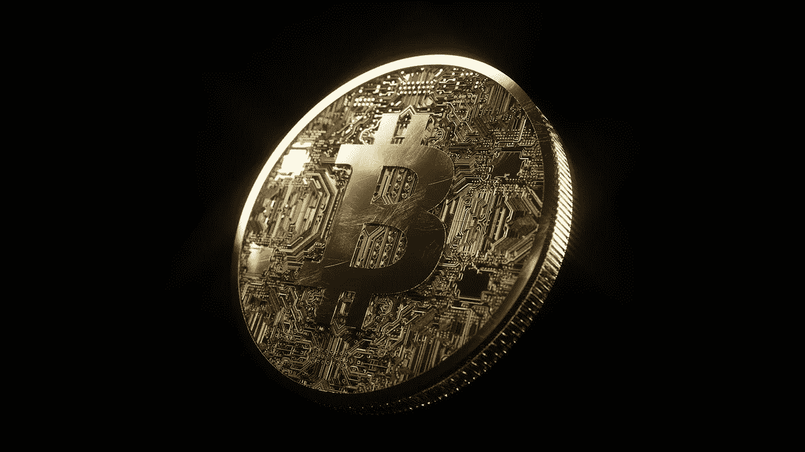

# 什么是加密货币？

> 原文：<https://medium.datadriveninvestor.com/what-is-cryptocurrency-20fb4009e718?source=collection_archive---------2----------------------->

# 数字，数字和更多的数字

“加密货币”一词来源于这样一个事实，即货币通过加密技术得到保护。什么是密码学？现代密码学是一个纯粹基于数学的系统，其中随机性和概率阻止了可预测性，从而提供了无与伦比的安全性。数字是一种客观的、通用的语言，使人类能够量化信息。如此普遍，甚至计算机和技术也能理解数字。它们能够构建数字壁垒，是使加密成为如此安全的系统的基础。

密码学已经存在了几千年，允许使用需要密钥才能解码的符号或数学难题来保护信息。在某些情况下，加密是不可逆的，这意味着您无法解码消息。这可能是一条单行道，这就是为什么加密是保护和验证信息完整性的理想方法。

将这些客观的加密概念应用于数字货币系统允许在对等网络上进行全球的、不可信的和安全的价值和信息交换，而不需要中间人。现代技术的进步使得这些加密技术可以转移到计算机上，从而在一个被窥探的互联网上建立起保护你的宝贵资产所需的不可逾越的数字屏障。因此，概括地说，加密货币是一个通过密码学或复杂的数学难题来交换、创造和保护价值的系统，用于在计算机网络上建立一个数字保护堡垒，没有中间人或中央权力机构。那么我们为什么需要这种加密货币呢？

## **抱歉，银行家们，演出结束了**

只要我们还活着，我们就一直生活在中央集权的统治之下。在他们的统治下，国家一次又一次地兴衰。是什么让这些当局掌权？货币。这种货币是在哪里发行和创造的？银行。为什么一小部分人有权控制这种货币？为什么我们，人民，不参与货币的创造和分配呢？我们为之努力工作，日复一日地为之工作。为什么我们没有发言权？加密货币将所有这些问题和概念颠倒过来，提出最后一个迫切的问题。*你是更愿意依靠已被证明有效的客观数字分散系统，还是依靠已被证明无效的主观贪婪的人的集中系统？*

## 权力属于人民

加密货币赋予个人权力。它允许一个不可信的价值交换系统直接从一个人到另一个人，没有任何人告诉你们中的任何一个人什么时候，谁和多少你可以发送或接收。比特币是由匿名个人/团体中本聪在 2008 年创建的“点对点电子现金系统”，是不可信加密货币在大规模成功实施的最佳知名例子。它给你自由、安全和内心的平静，你不会被利用或以任何方式被篡改。如果您拥有自己的密钥，您就真正直接拥有了您的加密货币。事实上，由于数字的客观性，加密货币不可能剥夺你的这些基本人权。数字不能说谎、欺骗、窃取或欺骗，这是加密货币成为革命性概念的核心。

## 价值的信仰体系

一个货币体系只不过是一大群相信某个实体有价值的人。它不一定需要任何物质的支持。它需要的只是信念。如果有足够多的人相信郁金香有价值，那么他们可以与其他相信郁金香也有价值的人交换商品、服务甚至是另一种形式的货币。然而，必须做一些工作来创造和获得这些郁金香，并确保没有郁金香被同一个人交易两次或被称为“双重消费”。

加密货币首次以分散的方式成功解决了任何货币系统都面临的臭名昭著的双重支出问题。分散化是因为网络或区块链是由世界各地成千上万的人在解决数学难题，从而验证和记录他们的计算机的交易。加密货币的交易历史是区块链出现的地方，然而，这是另一篇文章的讨论。

加密货币对于区块链就像钱对于会计师一样。钱来自某个来源，被验证为合法并被记录。以分散的方式跟踪这些交易信息，并让每个人就所述交易的合法性达成共识，这是防止欺诈活动的方法。在一个小壁橱里(银行)偷糖果比在一屋子人都盯着你看要容易得多(区块链)。关键是，欺诈/重复消费在区块链几乎是不可能的。不管怎样，让我们回到郁金香上。

## 郁金香花园，很多。

想象一下，全世界有数百万人拥有自己的郁金香花园。他们需要投入工作来种植这些郁金香，从而赋予它们价值。然后，这些郁金香与其他认为它们有价值的人交换，并在越来越多的人之间分配，直到经济发展(这与给印有总统的纸片赋予价值没有太大区别)。这对于加密货币来说没有什么不同。一大群人带着一堆电脑(郁金香花园)聚在一起，开始用他们的电脑解决数学难题(种植郁金香),互相交换这些数学难题(郁金香)的答案，并与那些相信他们的工作(园艺)有价值的人交换答案。

这个用计算机解决数学难题并创造加密货币的过程被称为挖掘。但是为什么是数学智力题呢？因为数字是计算机的语言，能够建立强大的数字壁垒。这些数学问题的复杂性和难度就是这些数字壁垒是如何产生的。产生随机性的复杂数学问题妨碍了可预测性，因为猜测这些复杂数学问题将产生什么数字的概率极低。难度根据矿工解决数学难题的速度自动调整。如果这些可调整的壁垒不存在，任何人都可以轻而易举地创造加密货币，也就不会有价值、竞争或安全。

**加密货币的价值来自:**

1.  为解决这些数学问题所做的工作
2.  创建单位的速率
3.  允许流通的单位总数
4.  矿工之间的竞争
5.  加密货币解决的具体问题

哇，太多了。让我们回顾一下

## 神奇的互联网货币

因此，加密货币是足够大的一群拥有计算机的人走到一起的结果，因为我们当前的中央银行系统是多么腐败，并且用这些计算机解决数学问题，以创建一个安全和分散的价值交换系统。这种加密货币然后被分发，可以在几个小时，有时是几秒钟内，不经过中间人或银行，直接从我这里发送到你这里。你拥有和交易加密货币有助于它的传播。参与的每个人都是经销商。加密货币是数字价值的代表，而区块链记录着这种数字价值的移动，同时激励个人参与支持网络。是的，这就是加密货币。

加密货币的美妙之处在于没有腐败的中央发行机构，没有印钞机。加密货币有硬上限，因此具有通缩性。你猜对了，除了一开始计算机代码中指定的内容之外，任何人都无法控制数字和数学问题。任何拥有适当计算机资源的人都可以开始挖掘加密货币，并因此获得加密货币报酬，从而激励人们参与网络。

没有人能告诉你，你不能在自己家里用电脑硬件开矿和解决数学问题来赚钱。世界各地的这些矿工相当于加密货币银行。最大的区别是，没有人拥有这家银行，告诉用户何时何地可以花他们的加密货币，他们可以发送给谁，以及他们可以发送多少。也没有人控制这家银行的货币创造和发行。无法窃取、撒谎、欺骗或审查的客观数字为我们做到了这一点，因此加密货币具有不可信的性质。

下面列出了加密货币与互联网上使用的传统法定货币的区别:

**点对点。**加密货币是点对点或者直接从我这里转到你这里，不经过中间人。

**不可改变的。**交易一旦确认，就不能撤销。央行可以也确实进行了反向交易。

**伪匿名。**用户无需提供任何身份信息即可使用加密货币。虽然技术上是可追踪的，但是用户可以放心，即使交易是公开的，交易的身份也是未知的。

**问责。每笔交易都被永久记录在区块链上。这些信息不能被篡改，因此提供了一个防篡改系统。这种防篡改网络适用于许多情况，如投票、公司支出、合同协议等。**

**无权限。使用加密货币不需要任何形式的许可。没人能告诉你可以发送或接收多少，或者什么时候可以使用加密货币。这是一个全天候的全球市场。所需要的只是一个互联网连接和一台计算机/智能设备来开始发送和接收加密货币。**

**安全。**加密货币通过已存在数千年的加密技术进行保护。这是不可能打破的，目前，这是什么有助于你，只有你真正拥有你的货币/数据。

**快捷、廉价&无国界。**相对于传统系统，发送和接收加密货币非常快速且便宜。从美国向中国发送 10 万美元的比特币需要一两个小时，成本不到 10 美元。其他加密货币甚至更快更便宜。

# 全球采用加密货币的障碍

## 集中交易所

与任何系统一样，加密货币并不完美。在撰写本文时，必须通过集中交易所直接购买、交易或液化自己的加密货币。这些交流还需要漫长的 KYC(了解你的客户)程序，可能需要数周时间来验证一个新来者。对于那些没有身份证件或合法地址/银行账户的人来说，这是一个巨大的障碍。这些集中式交易所可以收取高额费用，拥有你的加密货币，进行欺诈，在我看来，它们与集中式银行没有太大区别。在分散式交易所变得更具流动性和无处不在之前，我认为全球范围内的采用不会像我希望的那样快。

## 可量测性

要成为全球通用货币，可伸缩性是必不可少的。加密货币网络能在多大程度上处理大量交易？这是每个加密货币都面临的问题，也是一些排名靠前的加密货币非常关注的问题。当比特币和以太坊的价值在 2017 年 12 月分别飙升至 20，000 美元和 1，300 美元时，它们都经历了高度的网络堵塞。交易价格大幅上涨，交易速度放缓至停滞状态。正在为这两个平台开发有前景的解决方案，并且还有其他加密货币，如 EOS 和 BitShares，可以毫不费力地处理这些交易负载。如果比特币和以太坊没有赶上，它们可能会失去排名第一和第二的加密货币的地位。

## 缺乏治理

是的，我同意。我认为将治理引入区块链违背了区块链的整个精神。然而，对于区块链/加密货币的发展方向，以及为什么在没有 forks 的情况下，它会在全球范围内被企业采用和使用，需要某种程度的指导和监督。如果比特币社区出现分歧，就会出现分叉。对于我们所有人对这些改变世界的产品的不可避免的观点差异，需要有一个适当的指导系统，以及一种在个人基础上表达这些不同观点的方式。

例如，EOS 是第一个大规模尝试区块链治理的公司。EOS 允许代币持有者投票和发表意见。他们的制度存在一些问题，但是，他们已经展示了在区块链成功实施治理的许多实例。EOS 是被称为“链上治理”的一个例子。它们说明了如何在区块链/加密货币上实现监管模型。

## 波动性

这可以被视为一件好事和坏事。加密货币领域可以而且已经取得了难以想象收益。但是，要实现全球采用，需要有稳定性。如果比特币要成为远离中央控制的价值储存手段，它需要保值。在撰写本文时，24 小时内 10–20%的价值波动是常见的。在某些情况下，这种波动甚至会更加严重，是全球采用的又一个障碍。

# 结论

正如所展示的，加密货币提供了一种比传统银行系统更快、更便宜、更直接、更高效、更自由的交易方式。比特币是第一种出现的加密货币，自 2008 年问世以来，其认知度一直呈爆炸式增长。这是一个令人难以置信的创新和开拓性项目，是加密货币的典范。还有更多极具创新性的加密货币项目的例子，这些项目似乎在发展，并利用了之前项目的缺点。加密货币和区块链技术正在承担挑战当前世界秩序的艰巨任务。需要像比特币、以太坊和许多其他事物背后的勇敢先驱来赋予个人权力，而不是议程驱动的国家。

**参考资料**
Alstyne，M. V. (2014)。比特币为什么有价值。美国计算机学会的通讯，57(5)，30-32。doi:10.1145/2594288

Hayes，A. (2017)。加密货币的价值形成:一项实证分析，导致比特币估值的生产成本模型。远程信息处理和信息学，34(7)，1308–1321。doi:10.2139/ssrn

Narayanan，a .，Bonneau，j .，& Felten，E. (2016 年)。比特币和加密货币技术:全面介绍。2018 年 8 月 6 日检索，来自[https://books.google.com/books?id=LchFDAAAQBAJ&dq =加密货币&lr =&source = GBS _ nav links _ s](https://books.google.com/books?id=LchFDAAAQBAJ&dq=cryptocurrency&lr=&source=gbs_navlinks_s)

中本聪(2008 年)。比特币:一种点对点的电子现金系统。1–9.从[https://bitcoin.org/bitcoin.pdf](https://bitcoin.org/bitcoin.pdf)取回。

维格娜 p .和凯西 M. J. (2016)。加密货币时代:比特币和数字货币如何挑战全球经济秩序？纽约:皮卡多。

*修改自早先版本的文章*[*【steemit.com*](https://steemit.com/cryptocurrency/@perricita/what-is-cryptocurrency)