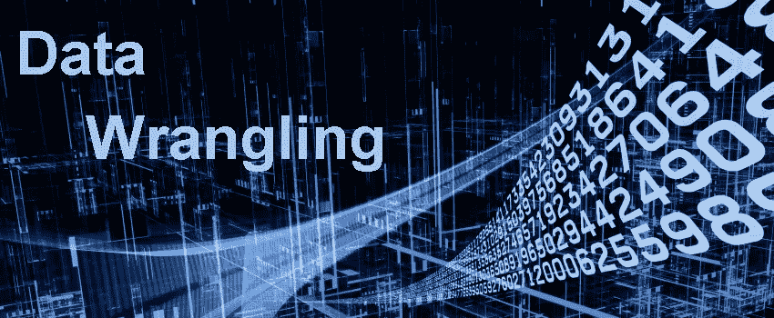
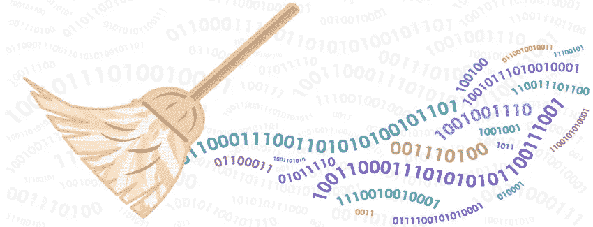

# 什么是数据争论，为什么需要这么长时间

> 原文：<https://medium.datadriveninvestor.com/what-is-data-wrangling-and-why-does-it-take-so-long-eccde60024fd?source=collection_archive---------1----------------------->

数据争论是收集、选择和转换数据以回答分析问题的过程。也称为数据清理或“munging”，传说这种争论花费了分析专业人员多达 80%的时间，只剩下 20%的时间用于探索和建模。为什么要花这么长时间来整理数据，使其可用于分析？

# 为什么数据争论是必要的？

争论产生的分析数据集通常有四种结构。第一种是数据科学中最常见的:

1.  **分析基础表(ABT):**ABT 用于机器学习。表中的每一行都代表一个唯一的实体(如个人、产品、索赔、车辆、批次等。)与包含特定时间点的实体信息(输入)的列:其属性、历史以及与其他实体的关系。如果 ABT 将用于受监督的机器学习，它必须包括晚于其输入的结果。监督机器学习分析表格，寻找预测预期结果的一致模式。
2.  **非规范化事务:**事务信息用于组织的业务操作，例如:

*   演示之前与客户的联系，包括在过去的通话中所做的笔记和操作，以解决当前通话中的问题
*   特定订单中的行项目，包括完整订单的信息和详细的产品信息
*   牙根管的牙科记录以及历史和当前的 x 光片进行比较，以确保牙齿为牙冠做好准备

出于分析目的，这些交易被汇总用于在线分析处理( [OLAP](https://en.wikipedia.org/wiki/Online_analytical_processing) )数据集市，供管理人员的商业智能使用。或者，这种交易结构是 ABT 的前身。

1.  **时间序列:**特定实体随时间变化的一个或多个属性。对于标准的时间序列分析，观测值必须分成一致的时间增量(秒、周、年等)。).通常，实体及其趋势属性是一段时间内的聚合，例如标准普尔 500 指数的月平均值。
2.  **文档库:**一致的文档语料库，主要是文本，用于通过文本挖掘进行分析。

人们很容易低估生成这些分析数据结构的难度，尤其是当一个组织多年来在数据基础设施上投入大量资金时。分析团队领导、客户支持者和其他项目利益相关者通常会对数据科学家估计的建模开始前需要多长时间来处理数据感到惊讶。一些利益相关者，比如相应的 OLAP 数据集市的用户，可能认为他们应该使用自己喜欢的仪表板数据来尝试这样做。本质区别在于，OLAP 查询回答了关于交易总量的问题，而分析模型必须对每笔交易的唯一预测。

# 数据争论挑战

准备建模过程中使用的数据面临许多挑战:

1.  **阐明用例:**因为所需的数据完全取决于您试图回答的问题，所以数据集市视图很难满足需求。为了阐明用例，我们必须考虑这些问题:什么样的实体子集是相关的？你是在预测一个事件的可能性还是在估计未来的数量？在什么时间段内，在什么条件下？如果模型结果将推动一项行动，你知道该行动和预期结果之间的因果关系吗？
2.  **获得对数据的访问:**如果数据科学家或分析师获得了直接访问相关数据的许可，这是最容易的。否则，他们必须为“清洗”的数据提交精确的指令，并希望他们的请求将被批准和正确执行。跨越这些政策界限既困难又耗时。
3.  **解析关键实体:**对于什么实体是相关的，不能有歧义。虽然这听起来很容易，但并不容易。以实体“客户”为例。确切地说，谁是顾客？在方便的表中可能有一个*客户 ID* ，但是如果一个客户离开并返回，他们可能会获得一个新的*客户 ID* 。约翰·史密斯、约翰·R·史密斯和 J.R .史密斯是同一个客户吗？如果一个人有企业账户和个人账户，是两个客户还是一个？一个人可以有多个账户，试图掩盖他们的身份吗？是否有其他家庭成员使用同一个账户？客户的层级组织呢？这个清单还在继续。
4.  **确定源数据的范围和关系:**这是数据仓库最佳实践非常有用的地方，尤其是在已经构建了适当的视图的情况下。如果没有这种奢侈，发现实体的自然键结构如何联系在一起可能需要大量的数据探索，然后这些隐含的规则必须由数据所有者验证。不可避免的是，分析模型需要知道数据在过去某个特定日期的情况，因此数据存储必须支持“历史快照”。此外，如果数据(即元数据)的含义随时间发生了变化，分析的可信度可能会急剧下降。
5.  **获取相关治疗数据:**由于模型的目的是决定哪些实体应该接受治疗(即采取行动)，因此治疗的历史记录至关重要。治疗取决于使用案例——从客户根据订单打电话的任何事情，到决定是否[安装井下泵以防止气井冻结](https://www.elderresearch.com/company/blog/predictive-maintenance-for-gas-wells)——可能性是无限的！但是，通常这种处理是在其他操作数据的领域之外构思和实现的，例如在文档和电子表格中。这些分散的文件需要完全编译并集成到 ABT 中。最后，应建立新的流程，将后续治疗记录存储在主数据源中，供未来的分析项目使用。
6.  **避免选择偏差:**在模型失败之前，选择偏差是数据科学的一个重大问题。[选择偏差补救](https://www.elderresearch.com/company/blog/what-is-bias-in-analytics)可能是一项艰巨的任务。确保训练样本数据代表实现样本是很重要的。为自举抽样(生成无偏样本的一项重要技术)寻找正确的权重可能需要为此目的建立一个模型。
7.  **特征工程:**在监督学习阶段之前，需要将原始模型输入转换成适合机器学习的*特征*。这就是数据科学的“艺术”。什么应该是名义上的，什么应该是连续的？名义水平应该如何组合？需要对哪些确定性关系进行编码？而且，不要忘记约会纪律对[防止未来泄密](https://www.elderresearch.com/company/blog/avoid-leaks-from-future)至关重要。需要安全措施来防止特征在观察的“快照日期”之后继承泄漏。此外，将在生产中评分的模型构建的每个实体必须具有与其他实体相同的历史。最后，目标结果持续时间或时间窗口对于用于训练模型的所有观察必须是相等的。
8.  **探索数据:**相关性分析应该在开始模型构建之前完成。在探索与最终结果的关系之前，删除数据中的冗余非常有帮助。跳过这一步，你以后会为此付出代价。通常，在宽文件中，一组列是高度相关的，这意味着它们包含冗余信息，这只会使特征和模型选择更加困难。尽管这种冗余可能由高相关系数来证明，但有时并非如此。例如，如果*颜色*有两列，一列是该颜色的西班牙名称，另一列是英文名称，它们包含相同和冗余的信息。通常冗余更微妙。可变重要性度量将报告两个相关的输入都是重要的，但是自然会发现很难在模型中选择两者之间的平衡。未能在建模前补救这种情况会导致混乱(和过于复杂)的模型。

# 数据争论值得努力吗？

这些数据争论挑战只会加剧其他项目延迟，如工作优先级竞争、资金延迟和人员变动。适当的数据争论需要大量的工作和时间。有些人可能会质疑这是否值得。在此期间，可能很难为工作辩护，因为有时很难展示艰苦的劳动，不像在建模阶段随后出现的一连串结果。在其他时候，争论阶段会有非常有价值的重大发现——有时会改变整个项目的方向。考虑这个类比；摩天大楼的地基是昂贵的，并且在地面建筑开始之前需要很多时间，但是这种坚实的地基对于建筑物的生存和为后代服务是必要的。一旦代码和数据基础设施为数据争论做好了准备，只要用例是相关的，它将很快交付结果(在许多情况下，几乎是即时的)!另一方面，跳过必要的数据争论步骤将导致错误的模型，损害组织内分析的声誉，并扼杀分析创新。

[**下载我们最新的电子书**](https://www.elderresearch.com/download-mining-your-own-business-ebook) **，了解领导数据分析计划的关键考虑因素和最佳实践。**

# 有关系的

查看我们的培训课程[R 中的数据争论](https://www.elderresearch.com/data-wrangling-in-r-course)

下载白皮书[成为数据侦探](https://www.elderresearch.com/be-a-data-detective)

阅读博客[分析 101:评估项目价值](https://www.elderresearch.com/company/blog/assessing-analytics-project-value)

*原载于*[*www.elderresearch.com*](https://www.elderresearch.com/company/blog/what-is-data-wrangling)*。*