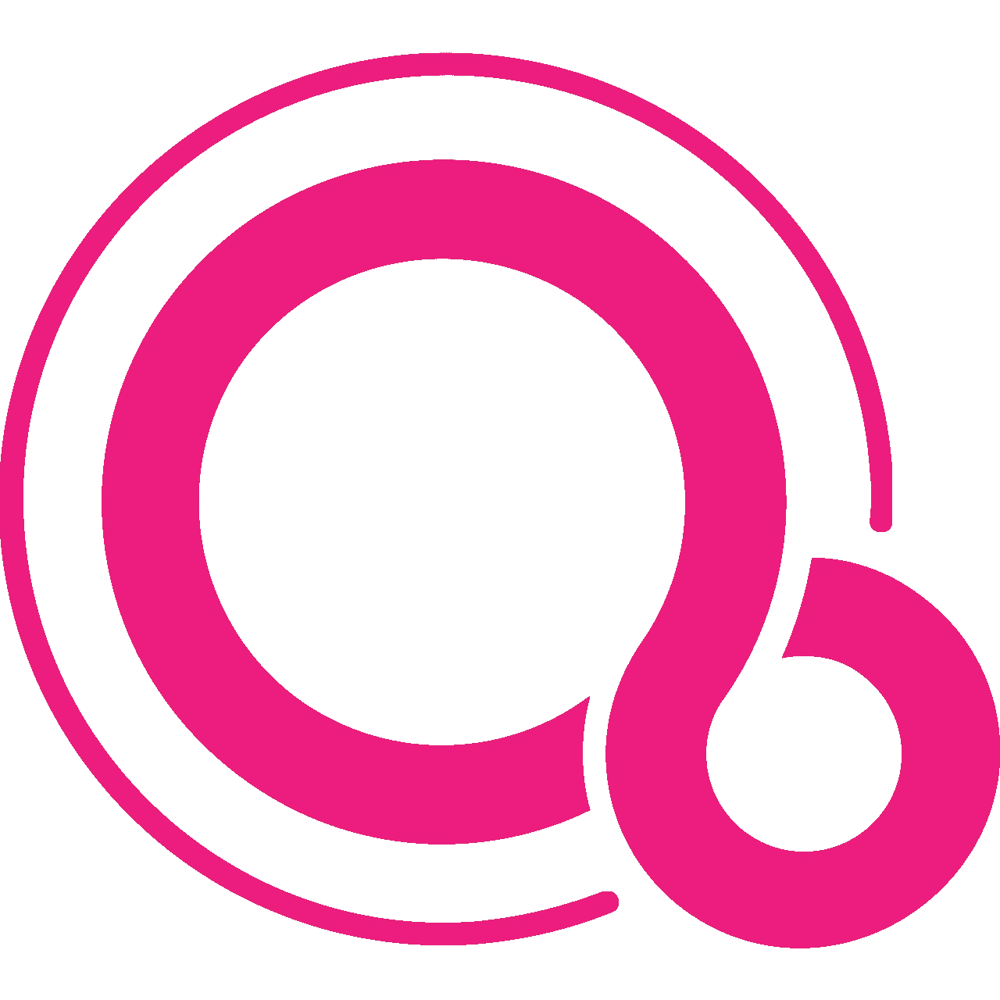

# Fuchsia OS 是什么？

> 原文：<https://medium.datadriveninvestor.com/what-is-fuchsia-os-654077300f3e?source=collection_archive---------13----------------------->

首先，紫红色是一种“鲜艳的紫红色”然而，我所说的 Fuchsia 是我们在 2016 年首次听到的谷歌秘密操作系统的名称。从那以后，我们只听到了关于这个新操作系统的泄露、谣言和预测。我们一次又一次地看到它出现在 Github 上，但很快就被撤下了。我们已经看到它的概念和演示到处出现，就在几个月前，我们看到一个用于开发和文档的[网站](https://fuchsia.dev/)出现。

所有这些导致了谷歌的新操作系统——Fuchsia OS。但这就回避了问题，这个神秘的操作系统是什么？它将在哪些设备上运行？

 [## 2019 年即将改变世界的技术|数据驱动的投资者

### 很难想象一项技术会像去年的区块链一样受到如此多的关注，但是……

www.datadriveninvestor.com](https://www.datadriveninvestor.com/2019/01/17/the-technologies-poised-to-change-the-world-in-2019/) 

所有这些都是很好的问题，然而大多数问题都无法回答，因为我们真正知道的太少了。到目前为止，我们所知道的是 Fuchsia 的开发者希望它能在尽可能多的设备上运行。他们希望它取代 Android 和 Chrome 操作系统，进一步统一它们。然而，高层只是认为 Fuchsia 是一个“开源实验”

大约一年半以前，Ars Technica 确实设法编译了一个 Fucshia 版本，并把它放到了 Pixelbook 上。正如预期的那样，大多数事情并没有真正发挥作用，但看到谷歌试图用这个新的操作系统完成什么仍然令人惊讶。与 Android 不同，Fuchsia 不是基于定制的 Linux 内核。虽然这肯定会有助于应用程序和操作系统本身的兼容性，但仍然不知道谷歌为什么决定走这条路。然而，锆石微内核将有助于不同设备的应用程序之间的兼容性。据说 Fuchsia 将从一开始就与 Android 应用程序兼容，考虑到已经有数百万应用程序存在，这肯定会有所帮助，并确保 Fuchsia 从一开始就对更多人更加友好。

 [## Pixelbook 上的紫红色

### Ars Technica 的 Ron Amadeo 正在玩运行在谷歌 Pixelbook 上的谷歌 Fuschia 操作系统。

video.arstechnica.com](https://video.arstechnica.com/watch/fuschia-demo) 

就我个人而言，我很高兴看到谷歌计划对 Fucshia 做什么。虽然起初它被认为是专门为物联网设备打造的，但 Pixelbook 的端口(它是对手机显示屏和方向的怪异模拟)确实表明了其他情况。它可能还要再过 3-5 年才会发布，但这仍有待讨论。

你认为 Fuchsia 有潜力取代 Android 和 Chrome 操作系统吗？或者它会是谷歌不再支持的另一个项目？