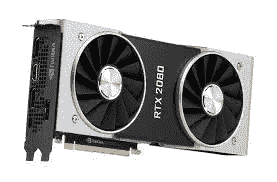

# PC 游戏的下一步是什么？

> 原文：<https://medium.datadriveninvestor.com/whats-next-for-pc-gaming-2ee4adbc38a6?source=collection_archive---------45----------------------->

最近，英伟达发布了 RTX 2080 和 2070。这些显卡是一个新的里程碑，性能比上一代显卡快 6 倍，全新的 RTX 平台，图灵架构，以及光线跟踪和人工智能增强图形等字幕功能。自然，这些卡片并不便宜。RTX 2080 创始人版在英伟达网站上的售价为 799.99 美元，远高于 GTX 1080 创始人版 549 美元的价格，后者以前是一款旗舰显卡。在显示器部门，宏碁和华硕发布了具有高刷新率和英伟达 G-Sync 技术的 4K 显示器。这些结合了 4K 显示器的色彩和图像质量与游戏显示器的快速响应时间和高刷新率，但价格昂贵。这两款显示器的价格都超过了 1000 美元，这对任何显示器来说都是一个难以置信的数字。

英伟达 1，AMD 0，英特尔(是的，有 3 个玩家)0

AMD 迅速做出了回应，宣布了他们的下一代 EPYC 处理器，新的 7 纳米 Vega 显卡架构，并发布了新的 RX 590 显卡。这张卡没有使用织女星架构，而是求助于 10 纳米北极星架构。然而，AMD 计划在今年年底发布一款使用新 Vega 架构的显卡。就我个人而言，我认为这是一种对抗英伟达 RTX 系列的尝试，但 EPYC 处理器带来了一些新的东西，可能为 AMD 的反击开辟了一条道路。然而，AMD 凭借其革命性的 Threadripper 处理器在处理器市场领先英特尔。这款 32 核处理器绝对是一个庞然大物，但它的价格约为 1730 美元。我不知道怎么会有人买得起这种处理器，更不用说一台基于它的电脑了。

英伟达 1，AMD 1，英特尔 0

在我写这篇文章的几个月前，我已经建造了一台配备 i5–8600k 处理器和千兆字节 GTX 1060 的计算机。它给了我一个进入电脑游戏和组件世界的大门。这次经历让我的生活变得更好，也让我接触到了一个我一无所知的社区。当这个构建正在进行中时，我计划使用锐龙 5 2400X 处理器。当时，这款处理器比英特尔面向预算的替代产品酷睿 I3-8100 贵 40 美元。相比之下，经济型锐龙处理器锐龙 3 2200G 比英特尔经济型酷睿 I3 处理器便宜 8535 美元。从那以后，酷睿 I3–8100 的价格已经“ryzen”(完全是双关语)到了 130 美元。后来，我决定使用英特尔处理器，特别是 I5–8600k，这就是最终的版本。

最新一代处理器的新英特尔芯片组正在缓慢集成，最新一代处理器仅限于过度昂贵的 I9、高端、不太过度的 I7 和主流 I5。这一代英特尔处理器没有预算选项，导致包括我在内的一些人得出结论，AMD 的锐龙芯片提供了更好的选择。现在，所有这些部件都已发布，全世界的 PC 制造商将能够以大幅降低的价格购买其产品线的旗舰组件，并使面向更有预算意识的组件成为绝对的便宜货。这就引出了一个问题:PC 游戏的下一步是什么？