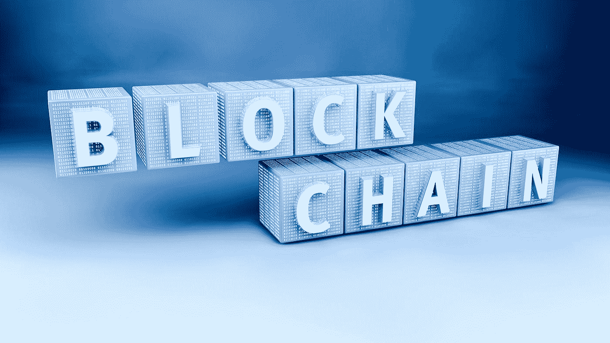

# 闪电网有什么惊人之处？

> 原文：<https://medium.datadriveninvestor.com/whats-striking-about-the-lightning-network-13f5bdb3200c?source=collection_archive---------2----------------------->

*“你可以把比特币区块链想象成一条路，很多车都想上路。现在，交通流量很大。”* [Elizabeth Stark，闪电实验室的首席执行官和联合创始人](https://youtu.be/V7_BtlYzuJc?t=14)。

大约九年前，中本聪出版了备受尊崇的[比特币白皮书](https://bitcoin.org/bitcoin.pdf)，描绘了一个“纯粹点对点版本的电子现金”的愿景，它将“允许在线支付直接从一方发送到另一方，而无需通过金融机构”。但如今，人们可以合理地得出结论，比特币技术开始显示出它的年龄。交易速度很慢(事实上，最近他们已经下降到每秒三笔交易，特别是与莱特币、Ripple 和比特币现金等加密货币项目以及 PayPal 等知名跨境支付系统相比，后者每秒可以处理超过 100 笔交易；Visa 每秒钟可以处理近 4000 笔交易。

比特币的局限性正在其网络上产生大量积压，这反过来又将交易费用推高至 5 美元以上，因为用户向矿商提供越来越多的财务激励，以优先处理他们的交易，这大大延迟了交易确认时间。随着其他硬币采用更新的技术，并表现出更加令人印象深刻的吞吐率，比特币社区现在更加迫切地要求采取一些措施。事实上，已经做了几件事。在过去的几个月里，与 hard forks 相关的广为人知的戏剧性事件在很大程度上是对社区试图就适当的扩展解决方案达成共识的回应。但是，由于矿工、开发者和用户彼此不和，我们看到了不同派别之间无休止的、往往令人恼火的战争。

也就是说，现在已经出现了一个扩展提案，社区对此相当支持，即[闪电网络](https://lightning.network/lightning-network-paper.pdf)。这意味着，那些因为比特币的劣质凭证而被预先警告比特币即将灭亡的人可能只是想推迟撰写他们的最终讣告。

# 闪电网络是如何工作的？

正如 Lightning 的创造者伊丽莎白·斯塔克(Elizabeth Stark)所观察到的那样，“我们在比特币的基础上创建了这一层，可以缓解拥堵……因此，你可以更快地交易……”。闪电网络背后的主要想法是，小额的日常比特币交易不必存储在比特币区块链上。其核心是为那些希望进行小额交易的人提供一个支付渠道。但 Lightning 不是一个改变每个块的内容或增加块大小的 fork 相关解决方案，而是比特币区块链上的一个独立协议。这是一个多层解决方案，区块链顶部的第二层和第三层将允许用户几乎立即执行小额比特币交易，交易费用为零。

假设人 A 想要向人 b 发送 0.5 BTC。在当前环境中，人 A 将通过从她的钱包建立交易，然后使用她的私钥来授权该交易来实现这一点。在交易被人 A 签名后，它随后被广播给比特币网络上的其他同行，然后被挖掘并放置到链上即将到来的块中(或者在今天的气候下更准确地说，被放置到等待写入链的长交易队列中)。然而，通常情况下，个人 A 创建和签署交易的过程可以在网络不知道的情况下离线完成——当交易随后被广播时，网络只在*和*拾取它以进行挖掘并最终写入区块链。

然而，闪电层的加入使得双方可以在区块链的*外*进行互动；取而代之的是，他们可以在网络不知道的情况下直接进行交易。这种设施被称为“支付通道”，双方通过这种方式创建一个名为“多签名地址”的共享账户，每一方都向其中投入约定数量的比特币，并要求双方使用各自的私钥进行签名。将 BTC 放入多重签名地址的过程打开了支付通道，并且正是在这个单一的时间点，双方与区块链网络进行交互。网络被访问的唯一其他时间是当通道关闭并且双方准备从通道赎回他们的 BTC 时。*只有在这两种情况下*,矿工才能够将交易添加到区块链中——然而，在打开和关闭支付通道之间，人 A 和 B 可以在不涉及网络的情况下任意次数地相互交易。一旦通道关闭，比特币按照商定的交易在双方之间进行适当分配，这些交易的最终状态就会被矿工获得并写入区块链。

这最终意味着交易可以在不使用拥挤的比特币区块链的情况下进行。鉴于网络参与交易的时间点只有两个(即通道打开和关闭)，闪电网络被认为是比特币的“链外”扩展解决方案。正如闪电网络白皮书的作者解释的那样，“如果只有两个参与者关心每天重复发生的交易，那么比特币网络中的所有其他节点就没有必要知道该交易”。

但是为什么仅仅停留在两个参与者上呢？事实上，闪电概念可以扩展到更多方面，这反过来创造了一个支付渠道网络，同时允许与比特币区块链进行很少的互动。因为拥挤的区块链不会被频繁访问，所以交易可以以“闪电般”的速度进行。因此，在三个人 A、B 和 C 的情况下，使得在 A & B 之间存在支付渠道，并且在 B & C 之间创建一个支付渠道，如果人 A 想要向人 C 发送 1 BTC，她将要求 B 经由 B/C 支付渠道转账 1 BTC，然后她可以经由 A/B 支付渠道偿还 B。

闪电网络的成功运行也依赖于隔离见证(SegWit)，这是比特币社区在 2017 年 8 月采用的。这种扩展实现提高了每个事务块的容量。它还解决了一个被称为“交易可塑性”的问题，即如果一方签署了一项交易，其他人可以假设生成另一项相同的交易，但具有不同的有效签名。并且改变签名会改变整个交易 ID，这意味着依赖于尚未提交给区块链的交易 ID 的闪电网络可能会被潜在的破坏破坏。但是 SegWit 解决了这个可伸缩性问题，从而使 Lightning 网络的实现更加有效。

# 闪电网络的实施对比特币和加密货币的未来意味着什么？

现在，全世界的加密货币用户都非常期待闪电网络将全面改变比特币的功能。它将有望让世界上最有价值的加密货币作为其创造者最初打算的高速支付机制运行，并使其能够与该市场的现任领导者竞争，如 Visa 和 PayPal，以及莱特币和比特币现金等。事实上，闪电网络的成功实施也将大大有助于确保未来不再需要硬分叉比特币现金来解决比特币的规模问题。闪电可以很好地促进潜在的巨大支付渠道网络，将能够使数百万笔交易脱离链条，从而释放比特币持有者目前正在经历的痛苦积压。

由于在闪电网络上不会出现长时间确认的问题，所以几乎即时的交易可以在几秒钟内完成。此外，作为一个链外解决方案，闪电网络允许非常低的费用。事实上，该网络的创建者 Joseph Poon 和 Tadge Dryja 认为费用将接近于零，Poon [最近表示](https://bitcoinmagazine.com/articles/bitcoin-lightning-network-creators-fees-will-be-effectively-zero-1459955513/)“人们将收取的费用实际上将接近于零。如果你真的为了很多支付而博弈，一个 satoshi 太高了；这才是我们真正关注的。”

新兴的小额支付用例也将在闪电网络上得到支持，这意味着人们应该能够发送低至 0。00000001 无保管风险的比特币。相比之下，根据[项目的官方总结](https://lightning.network/lightning-network-summary.pdf)，比特币区块链目前“强制执行高出数百倍的最小输出规模和固定的每笔交易费用，这使得微支付不切实际”。

但是，尽管闪电确实似乎是比特币的天赐之物，鉴于人们最近经历的越来越多的挫折，这种新的解决方案也有局限性。原则上，它是为小额交易而设计的，这意味着它不太适合执行大额支付。事实上，使用闪电支付被限制在最高 0.042 BTC；矿商根据交易重量收取交易费用，而闪电则根据发送的数量按比例收取费用，采用固定费用+递增百分比的系统。因此，更大的数量总是更便宜的发送链，而不是闪电。虽然闪电网络可能作为第二层解决方案，但它仍然完全依赖于比特币——也就是说，如果比特币失败，那么闪电也会失败。

Lightning 也正在为以太坊设计，这表明如果它被证明是成功的，每秒数百万(甚至数十亿)交易的潜力可能很快就会在越来越多的著名区块链项目中成为现实。也就是说，以太坊创始人 Vitalik Buterin 已经[表明了他对链上扩展解决方案的偏好](https://cointelegraph.com/news/buterin-gives-modest-proposal-for-ethereum-future-sharding-named-scaling-solution)；特别是，以太坊希望引入一种称为“分片”的过程，以实现这一目标。但是，尽管这样的提议还远未准备好，相比之下，闪电网络已经可供公众测试。

事实上，12 月初见证了闪电网络开发者成功发送[“有史以来第一次使用真实比特币的可互操作闪电交易。”](https://twitter.com/starkness/status/938464643713941504)就在年底，在移动充值服务 BitRefill 的帮助下，[在闪电网络上完成了第一笔使用比特币进行支付的交易。因此，事情似乎进展很快，尽管](https://twitter.com/alexbosworth/status/946175898029395968)[根据 Lightning 开发者的官方帖子](https://medium.com/@lightning_network/lightning-protocol-1-0-compatibility-achieved-f9d22b7b19c4)，虽然我们离正式发布越来越近，但还需要做更多的工作，特别是在确保网络的安全性和稳定性方面。

最近几周，由于同行 Ripple、以太坊和比特币现金取得了一些惊人的收益，比特币在加密货币市值中的份额已从 50%以上降至今天的 35%左右。关于比特币能否继续与此类项目的交易吞吐量能力相匹配的问题仍然层出不穷；事实上，这种担忧或许正在影响比特币的价格走势。但随着这种备受期待的解决方案即将以闪电网络的形式应用于世界领先的加密货币，比特币在未来一段时间内很可能仍将是“加密之王”。

*原载于 2018 年 4 月 13 日*[*【www.datadriveninvestor.com】*](http://www.datadriveninvestor.com/2018/04/13/the-lightning-network/)*。*