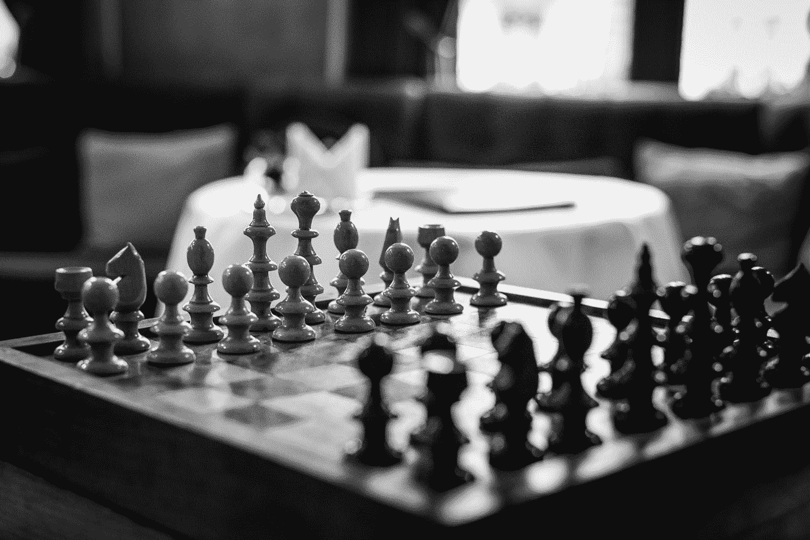

# 你是什么水平？(k 级理论解释)

> 原文：<https://medium.datadriveninvestor.com/whats-your-level-level-k-theory-explained-3b725ad8472b?source=collection_archive---------12----------------------->

Photo by [Jez Timms](https://unsplash.com/@jeztimms?utm_source=medium&utm_medium=referral) on [Unsplash](https://unsplash.com?utm_source=medium&utm_medium=referral)

想象一下，一个教室里大约有 30 名学生。这门课是关于神经经济学的讲座，学生都是行为科学家或行为经济学家。我们的讲师(也是一位神经经济学家)突然转过身来，建议我们玩一个小游戏。房间里的紧张气氛上升了。人们或兴奋或警惕地看着对方。“我们来玩选美吧。”

现在不要认为我的神经经济学讲师是某种类型的讨厌鬼。如今，选美比赛与参赛者的实际长相无关。让我解释一下。

选美比赛是约翰·梅纳德·凯恩斯在其著作《就业、利息和货币通论》第 12 章中提出的概念，该书于 1936 年出版。在这里，他概述了股票市场的价格波动。但是他用了一个更容易理解的类比:选美比赛。

 [## 为什么包容性财富指数比 GDP 更能衡量社会进步？|数据驱动…

### 你不需要成为一个经济奇才或金融大师就能知道 GDP 的定义。即使你从未拿过 ECON 奖…

www.datadriveninvestor.com](https://www.datadriveninvestor.com/2019/03/08/why-inclusive-wealth-index-is-a-better-measure-of-societal-progress-than-gdp/) 

选美比赛是一项选择比赛，人们必须从刊登在一份虚构报纸上的 100 张照片中进行选择，选出 6 张最有魅力的面孔。选出最受欢迎面孔的人有资格获得奖励。这场竞赛纯属虚构，完全源于凯恩斯的想法。

Photo by [Dariusz Sankowski](https://unsplash.com/@dariuszsankowski?utm_source=medium&utm_medium=referral) on [Unsplash](https://unsplash.com?utm_source=medium&utm_medium=referral)

但是让我们看看你如何赢得这场比赛。你会选择最吸引你的 6 张脸吗？嗯，你可以，但是如果你的品味不能代表其他人的品味，你就不会赢得这场比赛。不，这个游戏的目的是进入其他人的大脑。弄清楚他们喜欢什么。并相应地调整你的投票。但是当然，你必须知道其他人喜欢什么。你不知道别人真正喜欢什么，你只是认为你知道你喜欢。是你对别人喜好的感知，而不是他们的实际喜好。如果我们都只知道其他人的偏好，那么，他们可能是错误的。因此，我们应该调整得更多一点。在你知道之前，我们已经做了三个不同的调整，我们有 5 级深。

是的，水平。这个概念和这种思维模式产生了 k 级理论。一种理论，其中关系到我的想法和选择，你的想法和选择，我认为你的想法和选择，以及你认为我的想法和选择。所以它非常:“我知道，你知道我知道，我知道你知道我知道，你知道我知道你知道我知道……”等等，等等。我保证，你可以坚持一段时间。

那么，在 k 级中，级别代表什么？嗯，0 级似乎是这里的主要问题。要么是随机选择:如果我让你从 100 张脸中随机选择，你只要闭上眼睛，伸出手指就行了。或者，第 0 级的另一个选择是只使用你自己的核心偏好:从 100 张面孔中，你会挑选出你实际上认为最有吸引力的六张，而不考虑你需要考虑其他意见来实际赢得比赛。

现在 level-k 假设我们是理性的代理人(毕竟是经济理论)。所以 0 级是不够的。我们知道我们必须考虑到其他人。但是如果我们是 1 级，我们认为其他人都是 0 级。所以作为一个一级特工，我们必须弄清楚其他人的 0 级选择是什么。那么，我们认为与我们竞争的每个人的实际核心偏好是什么呢？

现在，我们假设我们是唯一的一级玩家。但是，如果我们这么容易就达到了第一级，其他人不也能达到吗？所以，现在让我们假设其他人都是一级玩家，我们是二级玩家。我们认为他们的一级偏好是什么？这些喜好不再是自己的，而是自己的+别人可能会怎么想。第二级，我们的级别，是我们自己的偏好+其他人可能会怎么想+对思考其他人怎么想的一种调整。但是我们会停留在第二层吗？

这里的问题是我们不知道我们要走多远。理性的经济理论认为，这一切最终都会收敛到一个均衡状态。就 100 个面中的 6 个面来说，均衡不是很容易理解。所以让我们用数字来做这件事。

我们回教室吧。我们的选美比赛是在 0 到 100 之间选择一个数字，估计其他人会选择的数字的一半。最接近的人赢得了比赛。这与凯恩斯提出的游戏不同，更确切地说，这是 50 年后的 1986 年由穆林提出的。你能看出这里的问题吗？如果没有，让我告诉你怎么做:

随机抽样，0-100 之间的数字的期望值平均为 50。选择 50 或任何其他随机数(最好低于 50)将是 0 级。现在一级玩家会拿一半，所以是 25。二级知道所有一级玩家都选 25，所以他们调整到 12 或 13，为了方便起见，假设是 12。如果 3 级也知道这一点，他们会选择 6。4 级会选择 3，5 级会选择 1，最终你得到的期望值是 0。如果我们都是理性的代理人，就会发生这种情况。

这里发生的事情是，我们正在把对方推下去，但我们不知道我们应该把对方推下去多远。班上有些人一开始就选了数字 0，这是终极的，数学上精确的均衡。但它假设了一些相当核心的东西:理性的代理人在玩这个游戏。尽管作为行为科学家，我们比普通人更能意识到自己的偏见和其他缺点，但我们并不理性。可以肯定地说，我们从未达到过那种平衡。

有些人误解了，甚至选了 50 以上的数字。很多人选择 25 左右的数字，与选择 0 的人相比，这提高了数值。我记得我选了 16 个。这个游戏的赢家选了 8 这个值。我太肤浅了。哦好吧。

课堂上的例子表明，很难估计每个人的思维过程。有些人不眨眼就升到了第 6 级，有些人勉强通过了第 0 级或第 1 级。这就是为什么我们经常需要调整我们对他人信念的看法，但我们仍然可能是非常错误的…

现在超越选美，Level-k 做什么？凯恩斯的书从来不是关于找出谁是最漂亮的，他也不关心教室里的数字预测。不，他的书关注的是股票市场。

凯恩斯认为，类似的行为也存在于股票市场，正如我刚刚为选美比赛所解释的那样。人们给股票定价不是基于他们认为自己的基本价值是多少，而是基于他们认为其他人认为自己的价值是多少，或者其他人预测的平均价值是多少。这也是为什么进入股市是一个如此混乱的过程的另一个原因。

所以你有它的乡亲。k 级，一种经济理论，假设我们改变对他人的信念以更接近真相是合理的，但表明在这个过程中，我们经常悲惨地失败。我们是多么不理智啊！

*原载于 2019 年 11 月 12 日*[*【https://www.datadriveninvestor.com】*](https://www.datadriveninvestor.com/2019/11/12/whats-your-level-level-k-theory-explained/)*。*