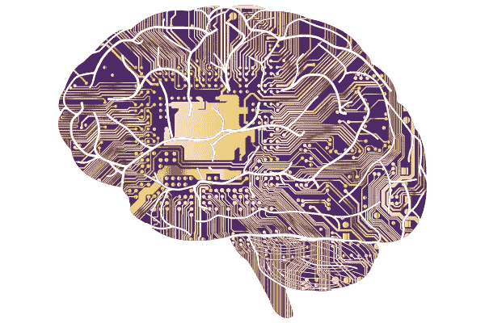
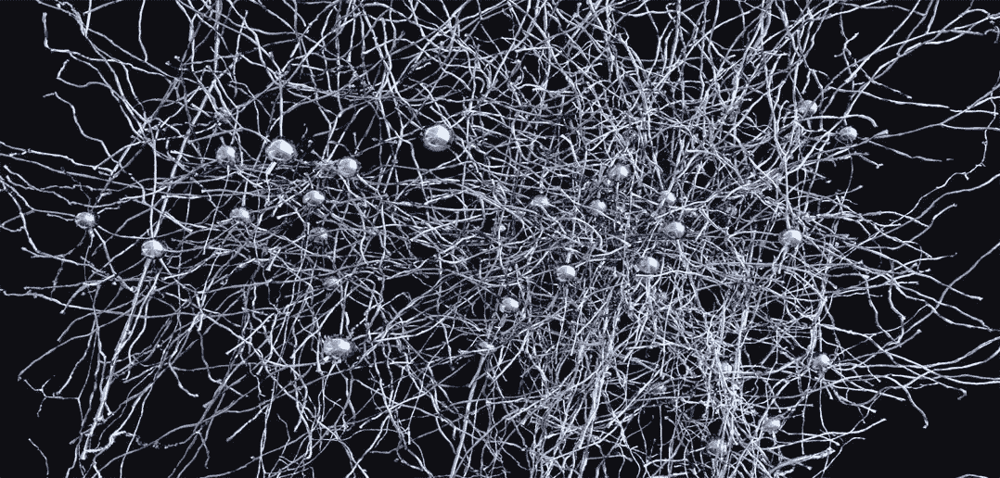
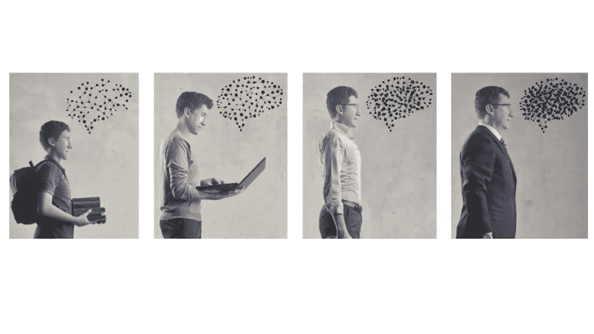
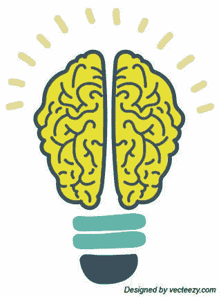

# 当自然智能击败人工智能时

> 原文：<https://medium.datadriveninvestor.com/when-natural-intelligence-blows-artificial-intelligence-out-of-the-water-3c2c9fc159ee?source=collection_archive---------6----------------------->

据说*“科技在看不见的时候处于最佳状态”*。

如果我们把什么是“技术”放在桌子上，并考虑第二种自然智能(相对于人工智能)作为正在讨论的技术，我们将被我们头盖骨下惊人数量的“生物技术”震惊。

科技使得学习和适应一个不断变化的世界变得如此流畅和天衣无缝，以至于对这些机器的主人，我们人类来说，几乎是看不见的。

只有了解自然智能是如何工作的，以及它的奇妙之处，我们才能真正与人工智能进行有意义的比较，并真正意识到它的局限性。

# 我们大脑中不断发生而我们却没有意识到的事情是什么？

让我们更仔细地看看我们的大脑每天都在发生什么。

自然智能的“计算核心”是神经元，在典型的大脑中，人类平均拥有大约 100 个神经元。

神经元通过尖峰信号(低压电流的小脉冲)相互通信，其中神经元尖峰信号可以参与表示图像特征的存在(例如，苹果中的“红色”)。当神经元倾向于被一起激活时，它们之间的连接，称为突触，倾向于得到加强。这就是为什么“红色”往往与“苹果”联系在一起:它们的重复出现导致编码这些特征和物体的神经元之间的突触联系在一起——这是解释我们倾向于统计的大脑如何工作的机械基底:它帮助我们在我们原本混乱的世界中找到规律性。

这些“连线”——或学习——事件从形成的那一刻起，就一直在我们的大脑中发生。让我们估计一下这些个体学习事件在人类生活中发生了多少次。

假设一个典型的人平均有 1000 亿个神经元，500 万亿个突触，平均 20 亿秒的寿命，并假设大脑中的每个神经元每秒发出一个尖峰信号(这是一个较低的估计…我们的神经元比这更活跃！)，它使大脑中能够改变突触(阅读:引起学习)的棘波总数达到惊人的 700 亿次！

也就是说，我们大脑中一个学习片段的次数至少等于，或者多于 1 后面跟着 24 个 0…..巧合的是这也是宇宙中恒星的估计数量。

这意味着当你读完这篇文章时，你的大脑已经学习了数千次。

为什么？如果不是这样，请想一想！以技能学习为例，技能学习被定义为通过训练获得和提高感知、认知或运动能力的能力。技能学习是所有动物生存的一种基本能力，这一事实证明了人类可以在迄今为止认知和行为心理学测试的几乎每项任务中通过实践来提高。

虽然学习发生的时间尺度在几分钟到更长的时间尺度之间变化，但是上面概述的基本神经和突触机制是潜在学习机制的基础。我们的神经元不停地激活和重组我们大脑中的突触。

让我们举一个平凡的例子:学习个体的视觉身份。一个人可能会错误地认为，你所需要做的就是看和学习一张脸的图片，你就完成了。但是，不出所料，人会随着时间而改变(见图)。

在这个例子中，如果你遇到了 30 出头的唐纳德·特朗普，而不是他担任美国总统的日子，你可能会有片刻的停顿和不和谐，但你的大脑会迅速适应并“封装”唐纳德·特朗普在你个人对美国总统的描述中的新形象。

这个不断调整一个人的表象的例子——这些表象是感性的，但也是运动的和认知的——在我们的大脑和生活中是规律而不是例外。我们的家、工作场所、我们交往的人、我们需要更新的技能，都在随着时间而变化:没有什么是真正稳定的。

虽然生物进化已经想出了如何设计我们的自然智能来应对现实，但今天的人工智能肯定没有。

设计可以展示这种“持续”(或终身，或持续)学习的人工智能是一个未解决的问题，其中人工智能可以在预定数据集的情况下被训练以实现高水平的性能，但不能在人类居住的典型世界中持续学习。在我们的世界中，来到我们面前的数据并不是整齐地准备在数据集中，而是出乎意料地、毫无预警地来到我们面前。没有人告诉我们‘听着，鲍勃，我将向你展示 300 幅西红柿的图片，学会它’。西红柿会毫无预兆地来来去去……我们需要把它们都学会！

最终，需要在具有挑战性的部署场景中与人类共存的机器以及更多通用人工智能系统，将需要展现出与人类相同的惊人学习能力。目前，传统设计的人工智能无法做到这一点，这不仅限制了机器与人类并肩工作的能力，还限制了机器向智能领奖台的最高台阶挑战的能力。