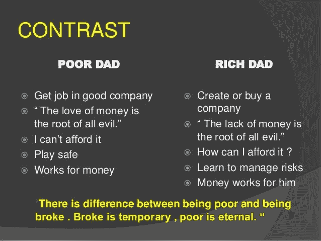

# 你是变得富有还是继续贫穷，取决于你学到了什么

> 原文：<https://medium.datadriveninvestor.com/whether-you-get-rich-or-stay-poor-depends-on-what-you-learn-9a7705af9e5a?source=collection_archive---------25----------------------->

这篇博客的灵感来自 [Melissa Chu](https://medium.com/@melissachu) 的以下文章:

 [## 恶性和良性循环:为什么富人越来越富(穷人越来越穷)

### 有时候，感觉情况越来越复杂。

medium.com](https://medium.com/@melissachu/vicious-and-virtuous-cycles-why-the-rich-get-richer-and-the-poor-get-poorer-7e378646a825) 

谢谢梅丽莎。

# 我们所学的一切都很重要

T2:决定你是变富还是继续贫穷的真正因素是你是否吸取了创业的教训……以及你如何很好地运用它们。这是罗伯特·清崎*的《富爸爸，穷爸爸》的全部主题。*

清崎有两个父亲:一个是富有的企业家；另一个是贫穷的工人阶级。他的每个父亲都给了他完全不同的关于金钱的建议。如果清崎听从了他穷爸爸的建议，他长大后会像他的穷爸爸一样穷。相反，清崎听从了富爸爸的建议，长大后变得富有。

大多数人永远不会有清崎那样直接的选择。大多数人成长为贫穷父母的孩子，父母无法教他们如何打破恶性循环，因为他们自己从未打破过。另一方面，极少数孩子的父母是富有的企业家，他们的父母会教他们如何保持恶性循环。关于恶性循环和良性循环的完整描述，请参见 [Melissa Chu 的文章](https://medium.com/@melissachu/vicious-and-virtuous-cycles-why-the-rich-get-richer-and-the-poor-get-poorer-7e378646a825)。

这个系统是被操纵的，如果你去一所普通的公立学校，那所学校不会教你企业家精神……它只会教你如何为别人工作。正如罗伯特·清崎所说，你永远不会因为给别人打工而变得富有；因为如果你为别人工作，你会让他们变得富有。

公立学校不能教授企业家精神，因为如果孩子们知道企业家精神，他们会很快意识到为别人工作没有任何好处；他们都想成为企业家。我们的整个经济体系(基于为他人工作)将会完全崩溃。我要对一个只为 1%的人(最富有的 1%)工作的经济体系说“谢天谢地”。

因此，对我们大多数人来说，如果我们想变得富有，并保持良性循环，我们必须教会自己创业；这将不得不发生*在*我们完成学业之后……*在*之后我们意识到我们在学校学到的东西将会让我们在救济院度过一生。幸运的是，作为成年人，我们可以阅读任何数量的书籍(如清崎的)来了解创业，互联网上也有无限的博客、电子书和创业课程。因此，你是变富还是继续贫穷，最终取决于你自己。你可以寻找学习创业所需的信息资源，并应用这些经验……或者你可以继续为别人工作，继续贫穷下去。