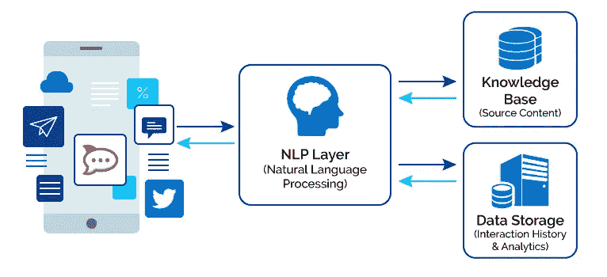

# 你在和谁通话？人类还是机器人？

> 原文：<https://medium.datadriveninvestor.com/who-are-you-calling-with-human-or-robot-ef94d5a54aa7?source=collection_archive---------6----------------------->

在美国，消费者平均每月收到 23 个垃圾邮件电话，高于 2017 年的 18.8 个。此外，这些电话中有一半以上是 robocalls。现在的问题是，你有没有意识到，到目前为止，你花了很多时间与机器人而不是真人交谈？

有些人可能拒绝相信，因为人说话的语气和速度是微妙的。你猜怎么着，在最近涌现的各种 AI 技术下，它们还是可以造假的。看看谷歌的人工智能助手如何给真人打电话:

# 背后的技术

这是怎么回事？下面是聊天机器人架构的概述。这种架构类似于一个会说话的机器人，实际上可以说话。

[https://bigdata-madesimple.com/how-do-chatbots-work-an-overview-of-the-architecture-of-a-chatbot/](https://bigdata-madesimple.com/how-do-chatbots-work-an-overview-of-the-architecture-of-a-chatbot/)

当你通过电话说话时，系统会处理你的声音并翻译成文本。基于生成的文本，它搜索用户文本中的关键信息，以发现用户想要传达的相关短语，通过遍历知识库(它还会自动纠正您的语法！).之后，系统会从其数据存储器中找到合适的响应，并使用模拟人声与您对话。

 [## 模式和机器人:一个复杂的现实数据驱动的投资者

### 哈耶克的名著《复杂现象理论》(哈耶克，1964)深入探讨了复杂性的话题，并断言…

www.datadriveninvestor.com](https://www.datadriveninvestor.com/2019/03/04/patterns-and-robotics-a-complex-reality/) 

# 谁会受到影响

肯定会冲击服务业。

因为，打电话本质上是一个人发出请求，另一个人处理的过程，这正是服务的本质。因此，这项技术将使双方受益匪浅。

[https://www.dephotos.cn/62664045/stock-illustration-business-customer-care-service-concept.html](https://www.dephotos.cn/62664045/stock-illustration-business-customer-care-service-concept.html)

从公司的角度来看，人工智能聊天机器人将大大提高生产力，节省资金，减少工作。例如，现在客服每天都会收到数千个类似的请求，那些重复的电话不断挑战我们“人类接收者”的患者，使他们感到沮丧甚至愤怒。然而，这可以通过使用人工智能聊天机器人来避免，因为机器有无限的耐心，最擅长做重复的工作。此外，它还降低了雇佣额外人员来忍受这一过程的成本。

从客户端来看，我们可以高效地发出请求。回到上面提到的谷歌助手，助手有能力完成我们订购的各种任务，比如预订房间、询问天气等。这样我们就不必花时间与服务端沟通，或者在搜索引擎中输入我们的问题。因此，它会给客户带来方便。

# 我们如何适应

对于客户来说，适应这种技术对我们来说很容易，因为它给我们带来了纯粹的好处，而没有坏处。

对于公司来说，当自动化过程被应用到工作流程中时，令人悲伤的事实是，它可能会导致失业，因为仍然有人依赖电话为生。

在这里，我看到了解决这个问题两个潜在的解决方案。

首先，为了自动化这个过程，我们需要人们为训练数据(客户端的声音)构建答案，以便我们的模型(AI 聊天机器人)可以从中学习。更具体地说，聊天机器人本身无法从纯人类的声音中理解任何东西，除非有人告诉它这是什么意思以及它应该如何回答。这个“教学”过程需要大量的人力，我们需要很多人来完成这样的任务。

第二，由于 AI 聊天机器人还有改进的空间，所以客服不能完全依赖它。因此，我们仍然需要人来监控人类和机器人之间的对话，并在必要时干预谈话。以自动驾驶为例，路测时总有一名后备安全驾驶员坐在驾驶座上，以防自动化系统失灵。类似地，我们应该总是有人来确保客户的请求得到适当的处理。