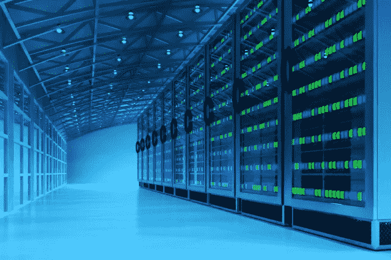
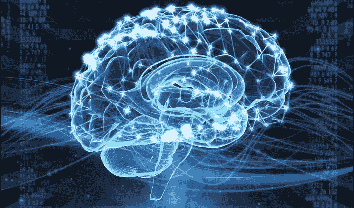
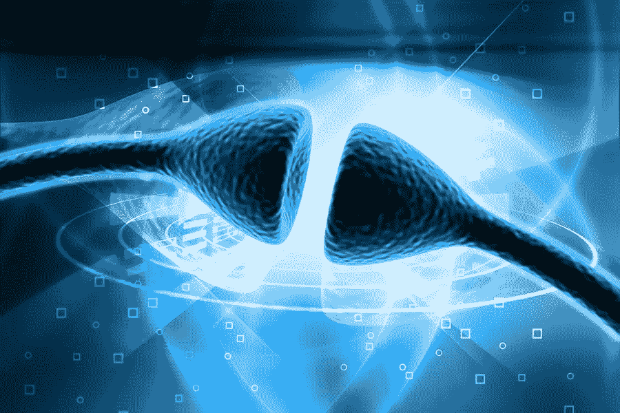

# 为什么人工智能可以保护你的隐私

> 原文：<https://medium.datadriveninvestor.com/why-ai-can-save-your-privacy-850c1672ebfa?source=collection_archive---------9----------------------->

看到马克·扎克伯格因剑桥分析公司不当[访问数百万脸书用户的个人数据](https://www.cnet.com/news/facebook-cambridge-analytica-data-mining-and-trump-what-you-need-to-know/)而被传唤到华盛顿，标志着 2018 年的一个强有力的决定性时刻，也是我们数字生活的一个关键时刻。两条战线发生了冲突:快速移动的互联网巨头收集和挖掘海量数据，以及静态、缓慢移动的政治和监管力量。这一切的核心是人工智能。

 [## 挑战你对人工智能和社会的看法的 4 本书——数据驱动的投资者

### 深度学习、像人类一样思考的机器人、人工智能、神经网络——这些技术引发了…

www.datadriveninvestor.com](https://www.datadriveninvestor.com/2019/02/28/4-books-on-ai/) 

没有人愿意交出他们的数据，除非他们觉得他们的数字足迹受到了保护。这一愿望现在也得到了立法的支持。欧洲新的《通用数据保护条例》( GDPR)明确规定，除其他事项外，公司应限制并最大限度地减少其收集和保留的数据量，重点关注满足明确规定的业务目的所绝对必要的数据。公司只能在有限的时间内保留数据，用户可以要求删除他们的数据。我们预计这种保护的某些方面将迅速扩展到包括美国在内的其他国家

对于人工智能目前的构建和训练方式来说，这是一个大问题。从历史上看，人工智能系统并没有以有利于保护隐私的方式进行设计:它们需要保留所有数据，以便能够更新和改进。但幸运的是，这可以通过一种新的人工智能技术来克服，这种技术直接存在于用户的设备上，并在那里执行所有功能，而不需要保存用户的敏感信息。

传统上，包括脸书在内的各种服务的用户积累了各种类型的数据，但公司没有有效的方式来收集这些数据。进入 AI 算法:从数据中学习并从中提取意义的数据驱动的数学模型。这就像这些公司坐在巨大的油藏上，只有一个手铲，现在他们得到了一个强大的机械化钻机。他们正在钻探。

从 20 世纪 60 年代的理论工作发展而来，今天的深度学习和神经网络(DNN)算法——为研究界带来最大胜利的人工智能子领域——是大规模数学系统，通过以简单的方式模拟可以训练来执行任务的互联神经元的巨大网络，捕捉大脑功能和组织的各个方面。这

se 从视觉和听觉感知到运动控制和更抽象的功能，如捕捉服务器上的网络攻击；将财务数据分类为欺诈数据或合法数据；或者将一件设备分类为正常、有缺陷或生锈。

虽然输入数据和任务的性质各不相同，但这些系统的能力来自于从数据中学习的能力(而不是被预编程来执行功能)，并且绝大多数情况下使用 20 世纪 80 年代形成的学习形式，称为“反向传播”

在反向传播方法中，一种从根本上背离人类和动物大脑工作方式的算法，大型神经网络中的神经元通过计算网络处理一批数据后每个神经元的误差贡献来改变它们的突触或连接系数。本质上，如果网络呈现一只“长颈鹿”并回答说，“我看到一只斑马”，数百万个神经元将根据它们对错误答案的贡献大小来改变数亿或数十亿个突触权重，使它们在下一次看到长颈鹿时，更有可能正确分类。

“反向传播”这个名称指的是这样一个事实，即网络的误差是在输出神经元上计算的，这些神经元对斑马和长颈鹿进行分类，并传播回网络中的所有神经元，这些神经元馈给这些输出神经元，一直到呈现输入图像的网络的第一个神经元。对错误答案做出贡献的神经元越多，其突触中的修正就越大。

虽然输入数据可以是图像、声音或其他更抽象的数据——如金融交易、网络流量或文本——但原理是相同的:该算法通过迭代调整每个神经元的权重来优化网络输出，对该数据完成数千次或数百万次的学习过程，直到误差小到足以称学习“完成”

这很棒，因为它使基于反向传播的人工智能系统能够在越来越多的任务中匹配甚至超越人类水平的表现，从下棋和围棋到理解交通标志和医疗数据。

然而，这种超级性能是有代价的:反向传播网络，因为它们倾向于根据当前的预测误差改变突触权重，所以对新信息非常敏感，容易受到灾难性的干扰:当学习到新的东西时，它会清除旧的信息。从某种意义上说，他们有一种学习障碍。

反向传播成为神经网络中事实上的标准学习算法，意想不到的后果是，今天整个庞大的人工智能行业都患有“记忆综合症”——正如受欢迎的电影所描述的那样，他们的人工智能只有在投入使用前才训练有素，在日常操作中无法学到任何新东西。

但是回到数据隐私，反向传播带来了另一个主要的缺点:所有的输入数据都必须保存，以便重新训练。例如，如果 DNN 已经在 1000 幅图像上被训练，并且需要学习额外的图像，那么 1001 幅图像需要被呈现数千或数百万次迭代。如果这 1000 张图片不能合法保存会怎么样？培训无法进行，网络无法更新。

本质上，今天的人工智能技术要求与 GDPR 等立法的要求是正交的。

虽然目前的 dnn 是大脑的超简化模型，但生物学有更丰富的工具可供其支配。让我们以一个人脑为例。DNNs 归入“连接”或“重量”的东西，大脑将其分解为大量的物质和结构——神经递质和突触——它们不同于针对不同类型受体和突触的小分子递质和神经肽。小分子传输器是其他神经元的直接参与者，并且以非常简单的方式更接近于传统人工智能和 DNN 今天正在做的事情。

另一方面，神经肽或“调节剂”在其目标中介导更微妙的作用。

我们大多数人都接受过某种标准化的教育，在那里我们去学校学习一系列重要的技能。当到了去找工作的时候，我们带着那些技能和知识，我们很快认识到日常学习是我们在工作中变得更好以及在工作场所和社会中进步的最重要的方式。作为人类，我们日复一日地这样做，甚至到了老年。更重要的是，我们做得很快:对于我们存储在记忆中的大部分内容，几个学习片段就足够了。这种学习方式与传统的 DNN 形成了鲜明的对比，在那里，对于人类来说，等同于我们所知道的一切都是在学校里学到的，之后什么也学不到。

在新的“终身”DNN ( [终身-DNN](https://www.neurala.com/press-releases/edge-deep-learning-without-cloud))架构中，小分子和神经肽递质的联合数学建模使它们能够有区别地表达两个时间尺度——快速和慢速学习——这两个时间尺度传统上被集中到一组方程中。这一重大创新使人工智能能够保持慢学习的优势，这一点已被反向传播所利用，同时也利用了快速学习的优势。

此外，由于它在数学上非常紧凑，终身 DNN 的新范式可以直接在设备上实现终身学习，其中芯片组可以像低端智能手机的芯片组一样便宜，可以在没有 Wi-Fi 或手机连接的情况下工作，也不需要在手机或设备上存储所有的训练数据。

这意味着每个数据点在学习过程中只使用一次:不需要数百万次迭代。当新数据出现时，它可以被丢弃。隐私不再是一个问题。

人工智能是一项相对年轻的技术，而且，作为一个领域，它只是触及了一切可能的表面。我们不应该忘记，从生物大脑中获得的知识中，只有极小一部分被编码到今天的最终用户和工作应用程序中。就信息处理而言，即使是 L-DNN 也远远达不到生物大脑所能达到的水平。但像 L-DNN 这样的创新是构建既有用又尊重人们隐私的人工智能的核心。