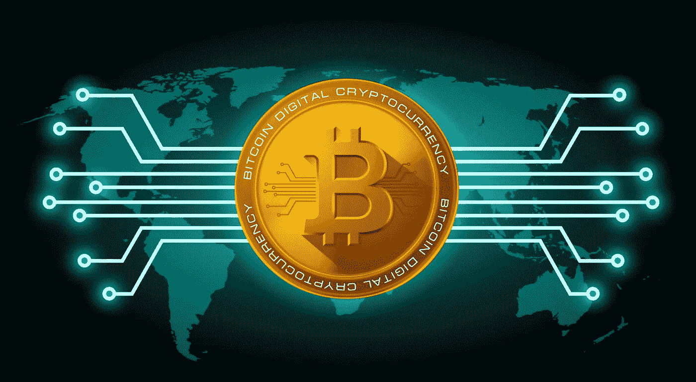

# 为什么比特币的基础层不能缩放

> 原文：<https://medium.datadriveninvestor.com/why-bitcoins-base-layer-can-t-be-scaled-ecaa79f6f3cb?source=collection_archive---------1----------------------->

在[分布式地平线](https://distributedhorizon.wordpress.com/)博客上阅读更多内容。

由于比特币社区在 2017 年的大部分时间里都在争论如何扩大受到高费用打击的网络，一群矿工和开发者决定通过分叉 BTC 和增加比特币的块大小来自己解决问题，创造比特币现金()。

为什么增加区块大小是扩展比特币系统的正确方式？当更多的矿工加入 BTC 网络时，人们可能会认为额外的处理能力会提高交易速度，但事实并非如此，因为更多的矿工只会增加网络的安全性。

事实上，BTC 的事务处理速度直接取决于系统对 1)块大小和 2)块创建速率的设置，这两项都是由社区决定的。

在下面几节中，我们将探讨为什么不能使用这些手段来扩展事务速度，而不增加遭受双重开销攻击的可能性(尽管还有其他问题，如更大的块大小带来的集中化风险和节点要求)。

在这个过程中，我们将尝试涵盖一些相关的比特币基础知识，但希望有许多其他伟大的来源，包括[白皮书](https://bitcoin.org/bitcoin.pdf)，其中涵盖了这一点。

**比特币的核心安全假设之一是有限的网络延迟**

在比特币白皮书中，一些基本假设确保了网络的安全性:

*   每个用户都保留一份“区块链”,通过总是更新到他们知道的“最长链”,为“诚实的”用户处理更新
*   矿工解决“工作证明”难题，将块添加到现有的链上，诚实的矿工通过总是添加到他们知道的“最长的链”来处理块添加
*   当网络延迟有限且诚实参与者控制网络总计算能力的 50%以上时，最长的链将由诚实参与者控制，并且将(极有可能)比攻击者的替代链增长得更快

在现实世界中，当至少有一些网络延迟时，我们将讨论越来越大的块大小和更快的块创建速率如何导致更多的“分叉”，从而降低网络的安全性。

**安全性(在本文中)意味着防止双重花费攻击**

当在比特币的背景下讨论安全性时，我们指的是防止双重消费攻击的能力。

在比特币网络上完成交易有两个阶段——A)用户 A 需要访问他们的比特币钱包，以声明他们正在向用户 B 汇款，B)网络确认这笔交易，并将其添加到最长链上的永久记录中。虽然步骤 A 的安全性实际上是关于钱包和钱包密码的安全性，但是步骤 B 的安全性是关于确保先前的“有效”交易不会在“双重花费”攻击中回滚。

什么是双重花费攻击？它涉及攻击者首先在当前最长的链上发出一个事务，然后使用他们的计算能力创建一个不包括该原始事务的替代更长的链。请注意，对于比特币来说，最长的链永远是“真理”——诚实的用户从中抽取数据来更新自己的记录，诚实的矿工在发现新块时会添加到最长的链中。

假设鲍勃让吉姆 1 BTC 去买比萨饼。在区块 10 中当前可用的最长的连锁店上确认了该交易之后，Jim 将他的比萨饼给了 Bob。然而，如果鲍勃想欺骗他的系统，他可以从块 9 开始，挖掘新的块 10 和块 11，这不仅不包括他对吉姆的付款，而且在另一笔付款中使用相同的 1 BTC 来支付鸡翅。

由于鲍勃已经创建了一个新的最长的链，该链不包括他对吉姆的付款，鲍勃现在已经为比萨饼和鸡翅花费了相同的 1 BTC 两次(“双重花费”)，而吉姆被骗走了他的付款，并且丢失了一个比萨饼。

**比特币的区块创建率和区块大小可以轻松更改……**

当我们讨论比特币的可扩展性时，需要注意的是，决定交易确认速度的“块”创建率和单个块的大小都是由网络决定的。值得注意的是，增加额外的计算能力将使网络对攻击者更加安全，但不会直接导致处理更多的事务。

因为(每秒处理的交易数)=(每秒创建的区块数)*(每个区块的交易数)，如果社区同意，比特币的可扩展性实际上是可以设置的。

那么，为什么比特币不能简单地通过增加区块创建率和区块大小来扩大规模呢(比如比特币现金的尝试)？

**…但以牺牲安全性为代价(降低安全门槛)**

这是因为增加这些变量中的任何一个都会降低网络的安全阈值。

> 安全阈值= %运行双重开销攻击所需的网络处理能力

比特币的核心安全性在于这样一个理念，即如果“诚实的”节点控制了超过 50%的计算能力，它们将能够挖掘区块，并以任何攻击者都无法创建攻击链的速度增长其最长的链。

让我们进行一些基本的计算，看看这是如何工作的。

*   H =由诚实参与者控制的主链增长率(以块数/秒为单位)
*   D =攻击者链的增长率
*   Z =成功创建一个块所需的平均计算能力

如果 H > D，那么诚实的最长链将增长得足够快，以避免双重花费。

在良好的网络条件下，如果网络的总计算能力为 **C** ，诚实节点控制的计算能力的分数为 **h** ，那么说(为简单起见) **H = C*h/Z** 。如果不诚实攻击者控制的计算能力的分数是 **d** ，那么 **D = C*d/Z** 。

在理想的网络条件下，如果 D>H，或者 d > h，攻击就会成功。由于所有节点要么诚实要么不诚实，d+h = 1，并且**安全阈值是 50%** 。

**更高的网络延迟意味着最长的诚实链增长得更慢**

之前，我们注意到比特币在其原始白皮书中的安全性假设了一个“同步”网络，参与者可以即时了解新的区块和当前最长的链。

假设有一个包含 5 个块(块= A、B、C、D、E)的区块链，考虑两种情况:

*   **A)网络/互联网速度快** -矿工快速了解新区块和新的最长链，并快速切换到在新的最长链上工作。在这里，一个新发现的块将是 F，它将紧跟在 e 之后。
*   网络/互联网很慢-矿工不能很快了解到新的区块。假设 Ted 当前的区块链只有 3 个区块，A 到 C。当他发现一个新的区块，称之为 D*，他将它添加到他的链(Blocks = A，B，C，D*)，才意识到最长的链现在是 A 到 e。他们新发现的“区块”现在被浪费了，不会在最长的链上。

此外，(A，B，C，D*)现在是(A，B，C，D，E)的“分支”，它比最长的链短，并且在更早的位置有不同的块。

实际上，当诚实的计算能力被浪费在不是最长的旧链之上创建块时，诚实节点的最长链增长得更慢，因为计算能力被浪费在未使用的块上。

所以如果浪费了一半的块，可能不是 H = C*h/Z，而是 **H = * (C*h/z)** 。所以现在即使诚实节点拥有 50%的计算能力，安全阈值也只有

攻击者要想获胜:

*   D > H → C*d/Z > C*h/Z → d > *h → d = 1/3
*   **安全阈值= 34%**

因此，当存在网络延迟时，仅靠 h > d 并不能保证安全性。事实上，只有 34%计算能力的攻击者也能成功攻击。

为什么分叉不会影响不诚实的攻击者？我们通常假设不诚实的攻击者可以更容易地在他们自己的节点之间进行通信(例如，通过直接网络连接)，并且总是将他们的努力集中在增长单个链上，因此浪费更少的块。

有关这个想法的更多细节，请参见此处的源代码 DW13:

[https://eprint.iacr.org/2016/454.pdf](https://eprint.iacr.org/2016/454.pdf)

> “事实上，Decker 和 Wattenhofer [DW13]已经通过实验观察到，增加 Nakamoto 协议中的网络延迟会导致分叉增加，并且他们(通过启发式计算)指出，攻击者可以利用这些延迟来破坏攻击的一致性，而攻击只需要不到 50%的挖掘能力。”

**块大小和块创建率如何影响“分叉”？**

增加数据块大小会使新数据块在整个网络中的传输速度变慢。这类似于降低网络速度的影响，因为新的数据块和最长的数据链需要更长的时间在网络中传播，从而增加了分叉的频率。

“数据块创建率”的影响也是类似的，新数据块创建得越快，最长的链增长得越快，节点发现自己在过时的较短链上工作而浪费“数据块”的情况也越多。

**最后的想法**

虽然为网络增加额外的挖掘能力会使比特币更加安全，但你能否在保持安全性不变的同时，增加块大小或创建率，以增加处理的交易量？

这在理论上可能行得通，但可能不是比特币的长期解决方案，因为比特币需要扩大几个数量级才能与其他集中式解决方案(如 Visa)竞争，假设目标是成为日常支付的一种方法。

与此同时，总会有[闪电网络](https://lightning.network/)让用户抱有希望。

来自[分布式地平线](https://distributedhorizon.wordpress.com/)博客